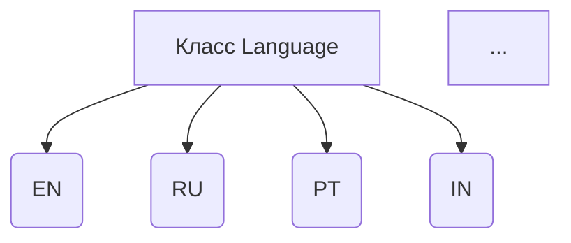
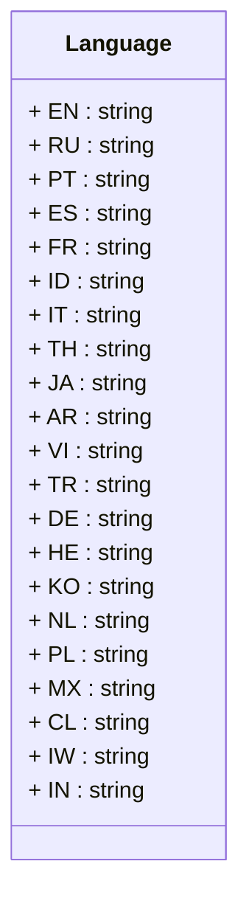

```MD
# Анализ кода файла `hypotez/src/suppliers/aliexpress/api/models/languages.py`

## <input code>

```python
## \file hypotez/src/suppliers/aliexpress/api/models/languages.py
# -*- coding: utf-8 -*-\
#! venv/Scripts/python.exe # <- venv win
## ~~~~~~~~~~~~~\
""" module: src.suppliers.aliexpress.api.models """
class Language:
    EN = 'EN'
    RU = 'RU'
    PT = 'PT'
    ES = 'ES'
    FR = 'FR'
    ID = 'ID'
    IT = 'IT'
    TH = 'TH'
    JA = 'JA'
    AR = 'AR'
    VI = 'VI'
    TR = 'TR'
    DE = 'DE'
    HE = 'HE'
    KO = 'KO'
    NL = 'NL'
    PL = 'PL'
    MX = 'MX'
    CL = 'CL'
    IW = 'IW'
    IN = 'IN'
```

## <algorithm>

Этот код определяет класс `Language`, содержащий константы, представляющие различные языки.  Алгоритм прост: он создает набор констант (атрибутов класса).  Не выполняется никаких вычислений или операций с данными, только объявление именованных значений.



Пример:
Доступ к константе `Language.EN` вернет строку `'EN'`.


## <mermaid>



## <explanation>

**Импорты:**

Нет импортов в этом файле.  Файл содержит только объявления класса и констант.

**Классы:**

* **`Language`**: Этот класс определяет набор констант (члены класса).  Константы представляют собой значения для разных языков (например, `'EN'`, `'RU'` и т.д.). Это позволяет использовать эти языки в коде более читаемым и организованным способом.

**Функции:**

Нет функций в этом файле.

**Переменные:**

Нет переменных в этом файле, только константы (атрибуты класса `Language`).

**Возможные ошибки или области для улучшений:**

* **Возможность использования enum:** Вместо прямого определения строк как констант, лучше было бы использовать `Enum` (если доступно в используемой версии Python), что сделало бы код более безопасным и читабельным, поскольку типы данных были бы явно определены, и были бы предотвращены ошибки при попытке присваивания неверного типа значений.


**Цепочка взаимосвязей:**

Этот файл (`languages.py`) является частью проекта `hypotez` и, скорее всего, будет использован другими модулями в `src/suppliers/aliexpress/api/` для работы с языками.  Например, другие части кода могут использовать эти константы для выбора языка в API вызовах или в пользовательских интерфейсах.  Он не зависит от внешних библиотек.


**Общее описание:**

Этот файл служит справочником по поддерживаемым языкам для API AliExpress.  Данные будут использоваться в других частях проекта для обработки запросов и ответов, связанных с языковыми параметрами.  Определенная в нём структура данных не требует сложного алгоритма обработки, но помогает в организации и поддержании кодовой базы.