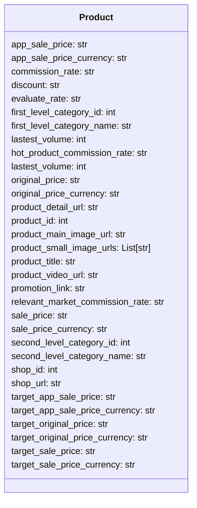

# <input code>

```python
## \file hypotez/src/suppliers/aliexpress/api/models/product.py
# -*- coding: utf-8 -*-
#! venv/Scripts/python.exe # <- venv win
## ~~~~~~~~~~~~
""" module: src.suppliers.aliexpress.api.models """
from typing import List


class Product:
    app_sale_price: str
    app_sale_price_currency: str
    commission_rate: str
    discount: str
    evaluate_rate: str
    first_level_category_id: int
    first_level_category_name: str
    lastest_volume: int
    hot_product_commission_rate: str
    lastest_volume: int
    original_price: str
    original_price_currency: str
    product_detail_url: str
    product_id: int
    product_main_image_url: str
    product_small_image_urls: List[str]
    product_title: str
    product_video_url: str
    promotion_link: str
    relevant_market_commission_rate: str
    sale_price: str
    sale_price_currency: str
    second_level_category_id: int
    second_level_category_name: str
    shop_id: int
    shop_url: str
    target_app_sale_price: str
    target_app_sale_price_currency: str
    target_original_price: str
    target_original_price_currency: str
    target_sale_price: str
    target_sale_price_currency: str
```

# <algorithm>

```mermaid
graph TD
    A[Product Data] --> B(Initialization);
    B --> C{Data Attributes};
    C -- app_sale_price, app_sale_price_currency, ... --> D[Product Object];
    D --> E[Data Access];
    E --> F[Operations (e.g., get_product_details)];
    F --> G[Return Product Data];
```

**Пример:**  Данные о продукте (например, с API AliExpress) поступают в класс `Product`. Класс инициализируется и сохраняет все полученные данные в своих атрибутах.  Позже, методы класса (если они будут реализованы) могут использоваться для обработки этих данных.


# <mermaid>



В данной диаграмме показано определение класса `Product` с его атрибутами, но без взаимодействий с другими классами. Это потому, что предоставленный код не содержит информации об использовании или взаимодействии с другими классами.


# <explanation>

**Импорты:**

- `from typing import List`:  Импортирует тип данных `List` из модуля `typing`.  Это позволяет явно указывать, что некоторые атрибуты класса `Product` (например, `product_small_image_urls`) являются списками строк.  Это важная часть типизации кода в Python, повышающая читаемость и безопасность.

**Классы:**

- `Product`:  Определяет класс для представления данных о продукте, полученного с AliExpress.  Класс содержит множество атрибутов, представляющих различные характеристики продукта (цена, изображения, категории и т.д.). В данном варианте кода, класс не содержит методов для работы с этими данными (например,  для вычисления скидки или получения списка изображений).

**Функции:**

- Нет функций.  В данном фрагменте кода нет определений функций.  Код описывает только структуру данных (класс `Product`).

**Переменные:**

- Атрибуты класса (например, `app_sale_price`, `product_id`) хранят данные о продукте. Все атрибуты имеют тип `str` (строка) или `int` (целое число), кроме `product_small_image_urls` -  `List[str]`.

**Возможные ошибки и улучшения:**

- **Отсутствие валидации данных:**  Код не содержит логики для валидации вводимых данных.  Например, `app_sale_price` может содержать нечисловые значения, что может вызвать ошибки при дальнейшей обработке.
- **Отсутствие методов:** Класс `Product` не имеет методов для обработки данных (например, для вычисления разницы в ценах). Необходимо добавить методы для работы с этими атрибутами.
- **Недостаточная ясность имен атрибутов:** Некоторые имена атрибутов (например, `lastest_volume`, `target_app_sale_price`) могут быть улучшены для большей ясности (например, `latest_volume`, `target_app_sale_price`).
- **Комментарии:** Добавьте более подробные комментарии к классу и его атрибутам для пояснения их назначения и типа.

**Взаимосвязи с другими частями проекта (предположительные):**

*  Этот класс скорее всего используется в других частях приложения (например, в модулях для обработки данных или в представлении для отображения информации) для хранения и работы с данными продуктов, полученными с API AliExpress.  Позже, эти данные будут использоваться для анализа, отображения, или для дальнейшей обработки в других частях системы.  На уровне системы, этот код скорее всего будет часть более крупной архитектуры, где происходят запросы к API AliExpress, обработка ответов и дальнейшее использование информации в системе.