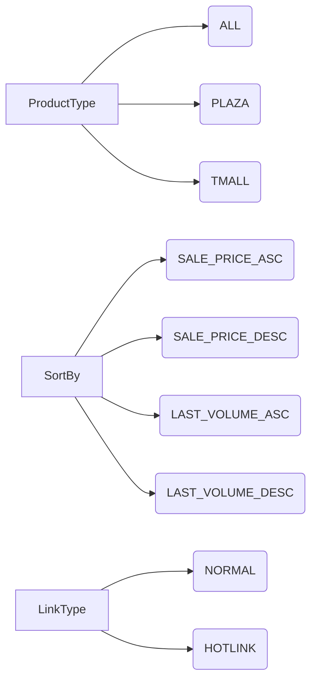

# <input code>

```python
## \file hypotez/src/suppliers/aliexpress/api/models/request_parameters.py
# -*- coding: utf-8 -*-
 # <- venv win
## ~~~~~~~~~~~~
""" module: src.suppliers.aliexpress.api.models """
class ProductType:
    ALL = 'ALL'
    PLAZA = 'PLAZA'
    TMALL = 'TMALL'

class SortBy:
    SALE_PRICE_ASC = 'SALE_PRICE_ASC'
    SALE_PRICE_DESC = 'SALE_PRICE_DESC'
    LAST_VOLUME_ASC = 'LAST_VOLUME_ASC'
    LAST_VOLUME_DESC = 'LAST_VOLUME_DESC'

class LinkType:
    NORMAL = 0
    HOTLINK = 2
```

# <algorithm>

Этот код определяет три класса, представляющие типы данных, используемые для параметров запроса к API AliExpress.  Алгоритм работы — это просто определение констант, которые представляют собой возможные значения для различных типов параметров.

**Пошаговая блок-схема:**

1. **Определение класса `ProductType`:** Определяет константы для типов продуктов: `ALL`, `PLAZA`, `TMALL`.
2. **Определение класса `SortBy`:** Определяет константы для способов сортировки: `SALE_PRICE_ASC`, `SALE_PRICE_DESC`, `LAST_VOLUME_ASC`, `LAST_VOLUME_DESC`.
3. **Определение класса `LinkType`:** Определяет константы для типов ссылок: `NORMAL`, `HOTLINK`.

**Примеры:**

- Можно использовать константу `ProductType.ALL`, чтобы указать, что нужно получить все типы продуктов.
- Можно использовать константу `SortBy.SALE_PRICE_DESC`, чтобы отсортировать результаты по цене по убыванию.

**Передача данных:**

Данные не передаются между функциями или классами, так как это всего лишь определения констант.  Эти константы будут использоваться при формировании параметров запроса к API.


# <mermaid>



# <explanation>

**Импорты:**

В данном файле нет импортов, так как он определяет собственные константы для параметров запроса.  Он использует стандартные типы данных Python.

**Классы:**

- `ProductType`:  Представляет типы продуктов, которые могут быть запрошены (ALL, PLAZA, TMALL).  Использование констант улучшает читаемость и делает код более понятным.
- `SortBy`:  Определяет типы сортировки для результатов поиска.  Это помогает обеспечить ясность и надежность при запросе данных.
- `LinkType`:  Представляет типы ссылок, такие как обычные ссылки (`NORMAL`) или ссылки на акции (`HOTLINK`).  Использование констант делает код более лаконичным и уменьшает вероятность ошибок.


**Функции:**

В этом файле нет функций, только классы, определяющие константы.

**Переменные:**

В данном случае переменные - это имена констант (`ALL`, `PLAZA`, `SALE_PRICE_ASC` и т.д.). Они являются строками или целыми числами, представляющими различные значения параметров.

**Возможные ошибки или улучшения:**

- Нет проверки типов значений, используемых для констант.  В будущем, при использовании этих констант в других частях кода, необходимо убедиться, что значения передаются корректно.
- Отсутствие документирования непосредственно у методов, хоть и сам модуль задокументирован (в документации к модулю). Добавление docstrings к классам и атрибутам улучшило бы читаемость и понимание кода.

**Взаимосвязи с другими частями проекта:**

Этот файл определяет данные, которые будут использованы при формировании запросов к API AliExpress, т.е. определяет параметры, используемые для `api` запроса к AliExpress.  Поэтому он тесно связан с другими частями кода, отвечающими за отправку запросов к API и обработку полученных данных.  Например, он будет использоваться в файлах, которые отвечают за формирование `request` объекта для взаимодействия с API AliExpress, в других моделях API.