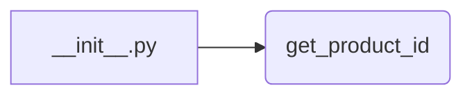

```MD
# <input code>

```python
## \file hypotez/src/suppliers/aliexpress/api/tools/__init__.py
# -*- coding: utf-8 -*-
 # <- venv win
## ~~~~~~~~~~~~
""" module: src.suppliers.aliexpress.api.tools """
from .get_product_id import get_product_id
```

# <algorithm>

Этот код представляет собой инициализирующий файл для модуля `tools` в пакете `aliexpress.api`.  Он не содержит значимой логики сам по себе.  Основное действие – импорт функции `get_product_id` из подмодуля `get_product_id`.  Блок-схема крайне проста:



Пример:

Файл `__init__.py` импортирует функцию `get_product_id`.  Если в другом модуле (например, в `aliexpress/api/main.py`) потребуется использовать `get_product_id`, то он будет импортирован через `from aliexpress.api.tools import get_product_id`.

# <mermaid>

```mermaid
graph LR
    subgraph init.py
        A[__init__.py] --> B{import get_product_id};
    end
    subgraph get_product_id
        B --> C[get_product_id()];
    end
```

# <explanation>

* **Импорты:**
   - `from .get_product_id import get_product_id`:  Этот импорт подключает функцию `get_product_id` из подмодуля `get_product_id`, который находится в той же директории (`./`).  Это стандартный подход для организации модулей Python.  Значок `.` указывает на текущую директорию.

* **Классы:**
   - Нет определенных классов в данном `__init__.py` файле.

* **Функции:**
   - Нет определенных функций в данном файле.  `get_product_id` - это функция, определенная в `get_product_id.py` (вероятно).

* **Переменные:**
   - Нет переменных в данном файле.

* **Возможные ошибки и улучшения:**
   - Код не содержит ни какой логики.  Он просто импортирует функцию.  Любые ошибки или улучшения будут зависеть от `get_product_id`.


* **Взаимосвязь с другими частями проекта:**
   - Файл `__init__.py` в `aliexpress/api/tools` служит точкой входа для использования функций, определенных в модулях этого подпакета.  Например, модуль `aliexpress/api/main.py` может импортировать `get_product_id` через `from aliexpress.api.tools import get_product_id` для использования в своих вычислениях.


**Вывод:**

Код выполняет простую задачу - делает доступной функцию `get_product_id` из подмодуля.  Это стандартная практика организации модулей Python для лучшей структуры и поддержки.  Следующим шагом анализа является изучение `get_product_id.py`, чтобы понять, как эта функция работает, какие данные она принимает и какие возвращает.