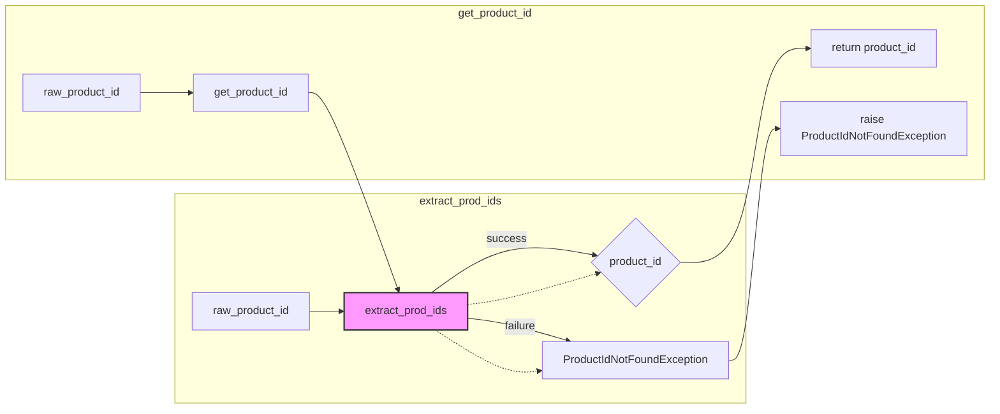

# <input code>

```python
## \file hypotez/src/suppliers/aliexpress/api/tools/get_product_id.py
# -*- coding: utf-8 -*-
 # <- venv win
## ~~~~~~~~~~~~
""" module: src.suppliers.aliexpress.api.tools """
"""Some useful tools."""

from ..errors import ProductIdNotFoundException
from src.suppliers.aliexpress.utils.extract_product_id import extract_prod_ids
import re

def get_product_id(raw_product_id: str) -> str:
    """Returns the product ID from a given text. Raises ProductIdNotFoundException on fail."""
    return extract_prod_ids(raw_product_id)
    # if re.search(r'^[0-9]*$', text):
    #     return text
    # # Extract product ID from URL
    # asin = re.search(r'(/)([0-9]*)(.)', text)
    # if asin:
    #     return asin.group(2)
    # else:
    #     raise ProductIdNotFoundException('Product id not found: ' + text)
```

# <algorithm>

**Шаг 1:** Функция `get_product_id` принимает строку `raw_product_id`.

**Шаг 2:** Она вызывает функцию `extract_prod_ids` из модуля `src.suppliers.aliexpress.utils.extract_product_id` со строкой `raw_product_id` в качестве аргумента.

**Шаг 3:** Функция `extract_prod_ids` возвращает извлеченный идентификатор продукта, если он найден.

**Пример:**

Если `raw_product_id` содержит "123456789", то `extract_prod_ids` возвращает "123456789".

**Пример ошибки:**

Если `raw_product_id` не содержит идентификатор продукта, то `extract_prod_ids` вызывает исключение `ProductIdNotFoundException`.

```mermaid
graph TD
    A[get_product_id(raw_product_id)] --> B{extract_prod_ids(raw_product_id)};
    B -- success --> C[return product_id];
    B -- failure --> D[ProductIdNotFoundException];
```

# <mermaid>



# <explanation>

**Импорты:**

* `from ..errors import ProductIdNotFoundException`: Импортирует класс `ProductIdNotFoundException` из модуля `errors` в текущем пакете (в подпапке `suppliers/aliexpress/api`).  Эта зависимость указывает на наличие модуля `errors` в иерархии пакетов.
* `from src.suppliers.aliexpress.utils.extract_product_id import extract_prod_ids`: Импортирует функцию `extract_prod_ids` из модуля `extract_product_id` в подпапке `utils` в пакете `aliexpress` в проекте.  Эта зависимость иллюстрирует структуру проекта, где утилиты для извлечения данных находятся отдельно.

**Функции:**

* `get_product_id(raw_product_id: str) -> str`: Функция, которая принимает строку `raw_product_id` (предположительно, содержащую данные о продукте) и возвращает строку, представляющую идентификатор продукта. Если идентификатор не найден, то функция поднимает исключение `ProductIdNotFoundException`.

**Переменные:**

* `raw_product_id`: Строковый тип данных, содержащий данные о продукте, например, URL или текст.

**Возможные ошибки и улучшения:**

* **Неопределённая обработка данных:** Функция `get_product_id` сейчас просто перенаправляет входящую строку `raw_product_id` в функцию `extract_prod_ids`.  Это предполагает, что `extract_prod_ids` уже содержит полную логику для извлечения идентификатора продукта. Необходимо понять, как `extract_prod_ids` извлекает ID и какие варианты входных данных она поддерживает.  Было бы целесообразно, чтобы `extract_prod_ids` могла принимать данные в разных форматах (URL, строка с ID) и правильно обрабатывать разные ситуации.

* **Нет проверки входных данных:**  Функция не проверяет, является ли входной параметр `raw_product_id` допустимым.

**Цепочка взаимосвязей:**

`get_product_id` является частью API для работы с поставщиком AliExpress.  Она зависит от `extract_prod_ids`, которая, в свою очередь, может содержать дополнительные функции или методы для работы с разными типами данных, и, вероятно, зависит от других модулей, обеспечивающих работу с конкретными структурами данных AliExpress.  В общем случае, `get_product_id` — это часть более широкой системы обработки данных о продуктах, работающей с API AliExpress.