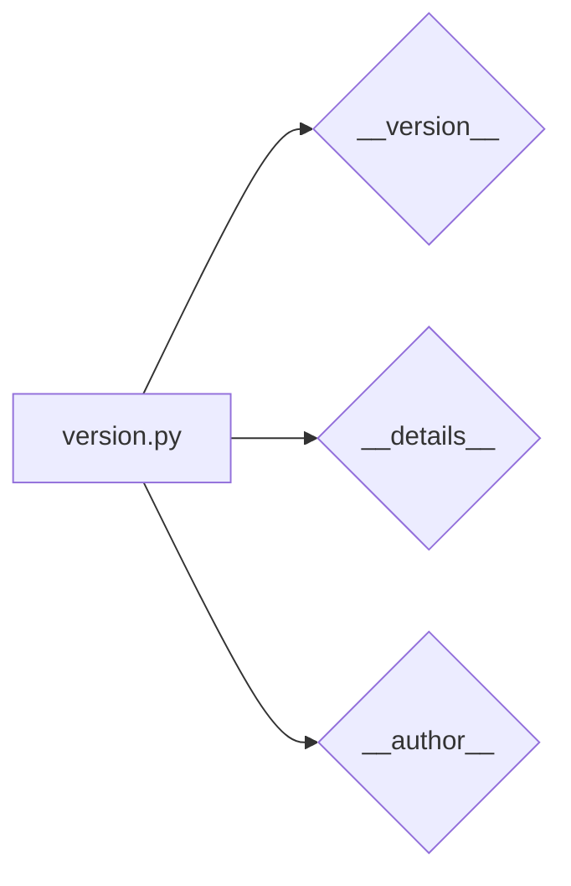

```MD
# Анализ файла `hypotez/src/suppliers/aliexpress/api/version.py`

## <input code>

```python
## \file hypotez/src/suppliers/aliexpress/api/version.py
# -*- coding: utf-8 -*-\
 # <- venv win
## ~~~~~~~~~~~~~\
""" module: src.suppliers.aliexpress.api """

"""
- `__version__`: This variable holds the version of the module or package.
- `__name__`: Contains the name of the module. If the script is being run directly, the value will be `"__main__"`.
- `__doc__`: The module's documentation string.
- `__details__`: This variable likely contains additional details about the module, but the exact purpose depends on the specific module or package.
- `__annotations__`: Contains type annotations for variables and functions in the module.
- `__author__`: The name(s) of the author(s) of the module.
"""
__name__:str
__version__="3.12.0.0.0.4"
__doc__:str
__details__:str="Details about version for module or class"
__annotations__

__author__='hypotez '
```

## <algorithm>

Этот код не содержит исполняемого алгоритма в классическом понимании. Это скорее файл конфигурации, или метаданных модуля.  В нем определены константы, описывающие версию модуля и другие атрибуты.  Алгоритм - это просто набор инструкций для создания и заполнения этих переменных.

**Шаг 1:** Определение переменных
```
__version__="3.12.0.0.0.4"
__details__="Details about version for module or class"
__author__='hypotez '
```


**Нет шагов взаимодействия с другими модулями или классами, так как это всего лишь файл конфигурации.**

## <mermaid>



## <explanation>

Этот файл `version.py` — это своего рода заголовочный файл для модуля `aliexpress.api`. Он содержит метаданные о модуле, в основном версию и имя автора.

**Импорты:**  Нет импортов, код содержит только определения строк.

**Классы:** Нет классов.

**Функции:** Нет функций.

**Переменные:**
* `__version__`: Строковая переменная, содержащая версию модуля (3.12.0.0.0.4).  Важно для управления версиями и совместимости.
* `__details__`: Строковая переменная, содержащая дополнительные детали о версии.  В данном случае, это просто комментарий.  Может хранить информацию о коммите, дате и т.д.
* `__author__`: Строковая переменная, содержащая имя автора (hypotez).  Стандартная практика в коде.
* `__name__`, `__doc__`, `__annotations__`:  Зарезервированные имена атрибутов Python.  `__name__` указывает имя файла, `__doc__` — описание, а `__annotations__` предназначены для хранения типов данных аргументов и возвращаемых значений функций, но в данном случае они пусты.

**Возможные ошибки/улучшения:**

* **Документация:** Уточнение значения `__details__`.  В идеале, здесь должна быть более подробная информация, например, описание изменений в этой версии.
* **Типизация:** Не используется типизация, но с помощью `__annotations__` это потенциально возможно.


**Взаимосвязи с другими частями проекта:**

Этот файл является частью структуры проекта, которая отвечает за хранение и доступ к API для AliExpress. Он не содержит действий по работе с данными, но его информация используется другими частями проекта, например, при загрузке API или в документации.  Он отвечает за корректное обозначение версии данного модуля.

**Важно:** Файлы `__init__.py` в структурах пакетов, как правило, содержат дополнительные метаданные, импорты и логику инициализации пакета, в отличие от файла `version.py`, который в данном случае содержит только атрибуты, относящиеся к версии.