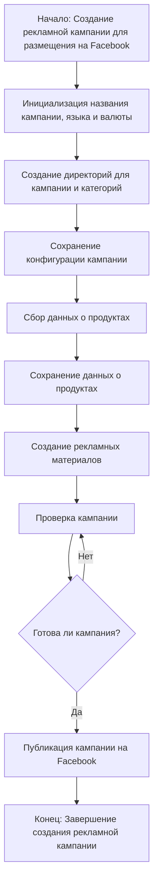

```MD
# Анализ кода модуля `campaign` из проекта `aliexpress`

## <input code>

```
### `campaign`  
**Описание**:  
Модуль `campaign` предназначен для управления процессом создания и публикации 
рекламных кампаний на Фейсбук. 
Он включает функционал для инициализации параметров кампании (название, язык, валюта), 
создания структуры директорий, сохранения конфигураций для новой кампании, 
сбора и сохранения данных о продуктах через `ali` или `html`, 
генерации рекламных материалов, проверки кампании и публикации ее на Facebook.




## <algorithm>

Блок-схема отражает циклический алгоритм.

1. **Начало**: Инициализация процесса создания кампании.
2. **Инициализация**: Установка названия, языка и валюты кампании.
3. **Создание директорий**:  Формирование структуры папок для кампании и категорий.
4. **Сохранение конфигурации**: Запись параметров кампании в файл или базу данных.
5. **Сбор данных о продуктах**: Чтение информации о продуктах из различных источников (али или html).
6. **Сохранение данных о продуктах**: Запись данных о продуктах в соответствующие файлы или базу данных.
7. **Создание рекламных материалов**: Генерация визуальных и текстовых элементов для кампании.
8. **Проверка кампании**: Валидация подготовленных данных и материалов на соответствие требованиям.
9. **Проверка готовности**: Проверка результата проверки кампании. Если кампания не готова, цикл возвращается к шагу 8. Если готова, переходим к публикации.
10. **Публикация**: Размещение кампании на Facebook.
11. **Конец**: Завершение процесса создания кампании.

**Пример:**  Если проверка показала, что кампания не соответствует требованиям (например, недостаточно данных о продуктах), процесс возвращается к шагу 5 для исправления.


## <mermaid>

```mermaid
graph LR
    subgraph Campaign Creation
        A[campaign.createCampaign()] --> B{Init data}
        B --> C[createDirectories()]
        C --> D[saveConfig()]
        D --> E[collectProducts()]
        E --> F[saveProducts()]
        F --> G[generateMaterials()]
        G --> H[validateCampaign()]
        H --> I[isCampaignReady?]
        I -- Yes --> J[publishCampaign()]
        I -- No --> H
        J --> K[End]
    end
    subgraph Facebook API
        J --> L[Facebook API call]
        L -- Success --> K
        L -- Error --> H
    end

```

## <explanation>

**Импорты**: В данном фрагменте кода импортов нет, поэтому детальный анализ импортов и взаимосвязей с другими пакетами невозможен.


**Классы**:  Отсутствуют классы.


**Функции**: Отсутствуют функции, но блок-схема предполагает наличие функций, например `createCampaign()`, `createDirectories()`, `saveConfig()`, `collectProducts()`, `saveProducts()`, `generateMaterials()`, `validateCampaign()`, `publishCampaign()`, которые реализуют логику создания и публикации кампании.


**Переменные**:  В данном фрагменте кода отсутствуют переменные, но блок-схема предполагает использование переменных для хранения данных о кампании, продуктах и других параметров.

**Возможные ошибки и области для улучшений**:

* **Отсутствует код**:  В представленном коде нет реализации функций и классов. Необходима  детализация логики выполнения каждой функции.
* **Недостаточно информации**: Отсутствие импортов и реализации функций затрудняет понимание взаимосвязей с другими частями проекта.

**Цепочка взаимосвязей**: Модуль `campaign` напрямую взаимодействует с внешним сервисом Facebook API для публикации кампании.  Также,  модуль скорее всего взаимодействует с модулями, отвечающими за сбор данных о продуктах (`ali` или `html`).


**Заключение**: Предоставленный код описывает алгоритм, но не содержит реализации. Для более детального анализа необходим полный код.