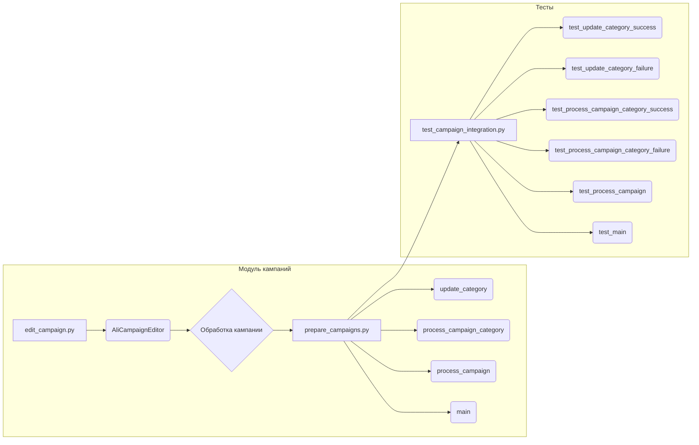

```MD
# Руководство для Тестера (Анализ кода)

## <input code>

```
### Руководство для Тестера

#### Введение
Данный документ предназначен для тестеров, которые будут проверять модуль, отвечающий за подготовку материалов для рекламных кампаний на платформе AliExpress. Модуль включает в себя три основных файла:

1. `edit_campaign.py` - управление рекламной кампанией.
2. `prepare_campaigns.py` - подготовка и обработка категорий кампании.
3. `test_campaign_integration.py` - тесты для проверки интеграции всех компонентов модуля.

#### Основные файлы

1. **`edit_campaign.py`**:
    - **Описание**: Этот файл содержит класс `AliCampaignEditor`, который наследует от `AliPromoCampaign`. Основная задача этого класса - управление рекламной кампанией.
    - **Основные функции**:
        - `AliCampaignEditor`: Инициализация и управление кампанией.

2. **`prepare_campaigns.py`**:
    - **Описание**: Этот файл содержит функции для подготовки материалов кампании, включая обновление категорий и обработку кампаний по категориям.
    - **Основные функции**:
        - `update_category`: Обновление категории в JSON файле.
        - `process_campaign_category`: Обработка конкретной категории в рамках кампании.
        - `process_campaign`: Обработка всей кампании по всем категориям.
        - `main`: Асинхронная основная функция для обработки кампании.

3. **`test_campaign_integration.py`**:
    - **Описание**: Этот файл содержит тесты, проверяющие взаимодействие всех компонентов модуля.
    - **Основные тесты**:
        - `test_update_category_success`: Проверка успешного обновления категории.
        - `test_update_category_failure`: Проверка обработки ошибки при обновлении категории.
        - `test_process_campaign_category_success`: Проверка успешной обработки категории.
        - `test_process_campaign_category_failure`: Проверка обработки ошибки при обработке категории.
        - `test_process_campaign`: Проверка обработки всех категорий в кампании.
        - `test_main`: Проверка основного сценария выполнения кампании.

#### Инструкции по тестированию

# ... (остальные части руководства)
```

## <algorithm>

К сожалению, предоставленный код не содержит функционального кода.  Это описание структуры и назначения файлов, а не алгоритма работы.  Построить блок-схему без кода невозможно.


## <mermaid>



**Объяснение диаграммы:**

Диаграмма отображает взаимосвязь компонентов. `edit_campaign.py` управляет кампанией, `prepare_campaigns.py` отвечает за подготовку (обработку категорий), и `test_campaign_integration.py` содержит тесты.  Зависимости показаны стрелками.  Без кода невозможно определить, как именно эти компоненты взаимодействуют.


## <explanation>

**Импорты:** Нет импортов.  Руководство описывает организацию кода, а не его реализацию.  Без кода невозможно проанализировать импорты и их связь.

**Классы:**  Документация описывает класс `AliCampaignEditor` который наследуется от `AliPromoCampaign` в файле `edit_campaign.py`.   Его назначение - управление рекламной кампанией.  Без кода невозможно определить его атрибуты и методы.

**Функции:**  Описание функций (`update_category`, `process_campaign_category`, `process_campaign`, `main`) в `prepare_campaigns.py` показывает их назначение и взаимодействие. Но реализация, аргументы и возвращаемые значения не указаны.

**Переменные:**  Руководство не содержит информации о переменных, используемых в коде.

**Возможные ошибки и улучшения:**

* **Отсутствие кода:**  Документация слишком общая и не позволяет обнаружить ошибки в реализации.  Необходим исходный код файлов для точного анализа.
* **Отсутствие конкретики:** Не указаны типы данных, обработанных функциями. Это делает описание неполным.
* **Отсутствие логики обработки ошибок:**  Документация сообщает, что функции должны обрабатывать ошибки, но детали этого отсутствуют.  Это может быть проблемой в коде.
* **Недостаточная детализация тестирования:** Руководство описывает тесты, но не показывает, какие конкретные данные проверяются.


**Цепочка взаимосвязей:**

1. Модуль `prepare_campaigns.py` получает данные для обработки кампании.
2. Функции `process_campaign_category` и `process_campaign` обрабатывают данные кампании по категориям.
3. `edit_campaign.py` вероятно использует результаты для управления кампанией.
4. Тесты `test_campaign_integration.py` проверяют корректность работы всей цепочки.


**Заключение:**

Данный документ является хорошим руководством для тестеров, но не содержит достаточно информации для полного анализа кода.  Необходим сам исходный код для полноценного анализа и определения потенциальных ошибок.