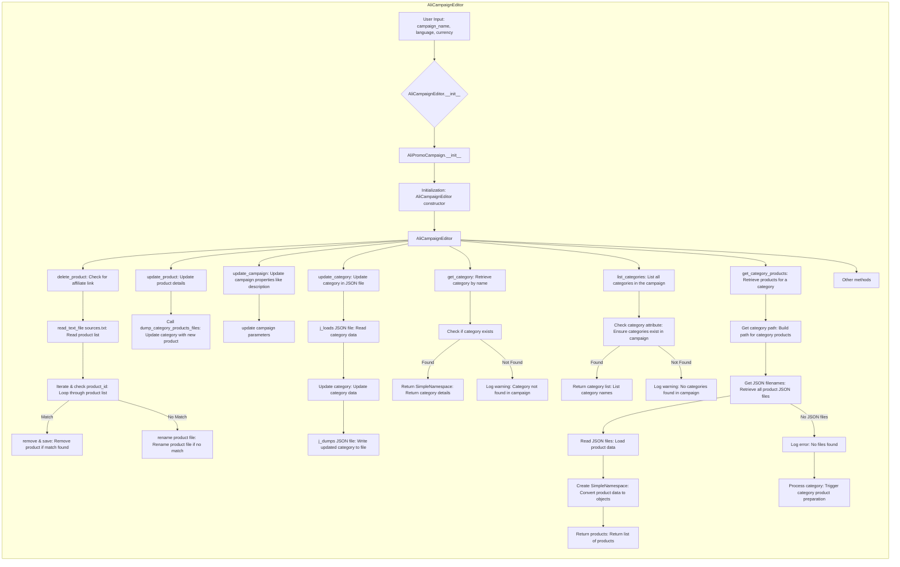

# <input code>

```python
## \file hypotez/src/suppliers/aliexpress/campaign/ali_campaign_editor.py
# -*- coding: utf-8 -*-\

#! venv/bin/python/python3.12

"""
.. module:: src.suppliers.aliexpress.campaign 
	:platform: Windows, Unix
	:synopsis: This module provides the editor for advertising campaigns


"""


import re
import shutil
from pathlib import Path
from types import SimpleNamespace
from typing import List, Optional

import header
from src import gs
from src.suppliers.aliexpress.campaign.ali_promo_campaign import AliPromoCampaign
from src.suppliers.aliexpress.campaign.gsheet import AliCampaignGoogleSheet
from src.suppliers.aliexpress.utils import extract_prod_ids, ensure_https
from src.utils.jjson import j_loads_ns, j_loads, j_dumps
from src.utils.convertors.csv import csv2dict
from src.utils.printer import pprint
from src.utils.file import read_text_file, save_text_file, get_filenames
from src.logger import logger

# ... (rest of the code)
```

# <algorithm>

The code defines a class `AliCampaignEditor` inheriting from `AliPromoCampaign`.  The algorithm can be broken down into the following steps:

1. **Initialization (`__init__`):**  Takes campaign name, language, and currency as input. Initializes base class `AliPromoCampaign` with these parameters.  Handles different input methods (e.g. passing campaign file).
2. **`delete_product`:**  
   - Extracts `product_id`.
   - Checks if the product ID matches any records in `sources.txt`.
   - Removes matching records and saves the updated list to `sources.txt`.
   - If no match is found, renames the corresponding product file in the `sources` directory to add a `_` prefix.
3. **`update_product`:** Updates product details in a specified category. The critical step is calling `dump_category_products_files`. This method likely handles the actual updating logic of the product data.
4. **`update_campaign`:** Updates the campaign's properties (description, etc.). This likely involves interacting with campaign-level data structures.
5. **`update_category`:** Updates the category in a JSON file. This method reads the JSON data, updates the category data using a `SimpleNamespace` object, and writes the updated data back to the file. 
6. **`get_category`:** Retrieves the category details for a given category name.  
7. **`list_categories`:** Returns a list of category names in the campaign, verifying the campaign object contains a `category` attribute.
8. **`get_category_products`:** Retrieves product data for a specific category.
   - Constructs the path to the category's JSON files.
   - Gets a list of JSON file names.
   - Iterates through the files: 
     - Loads each JSON file using `j_loads_ns`.
     - Creates `SimpleNamespace` objects for each product.
     - Appends the product objects to the `products` list.
   - If no JSON files are found, logs an error and triggers `process_category_products` (which is not defined in the code snippet).

Data flows between functions and classes by passing parameters (e.g., `product_id` to `delete_product`), returning values (e.g., `SimpleNamespace` from `get_category`), and modifying shared attributes (`self.campaign`).

# <mermaid>


# <explanation>

**Imports:**

- The code imports numerous modules for various tasks: file I/O, regular expressions, data structures, JSON handling, error handling, logging, and more. Most imports are from `src` subpackages (e.g., `src.suppliers.aliexpress`, `src.utils`, `src.logger`). This indicates a structured project with modularized components.  Import of `header` likely contains configuration or general-purpose functions.
- `gs`: Likely a package related to Google Sheets integration.
- `AliPromoCampaign`: A base class, suggesting a hierarchy of advertising campaign-related classes.
- `AliCampaignGoogleSheet`: Likely for interaction with Google Sheet functionalities specific to AliExpress campaigns.
- `extract_prod_ids`, `ensure_https`: Likely utility functions for AliExpress-specific data processing.
- `j_loads_ns`, `j_loads`, `j_dumps`: Functions for loading and saving JSON data, possibly with custom functionality for handling `SimpleNamespace` objects (a namedtuple-like data structure).
- `csv2dict`: A converter for CSV data.
- `pprint`:  Likely for pretty printing output.
- `read_text_file`, `save_text_file`, `get_filenames`: Functions for file I/O.
- `logger`: A custom logging facility.


**Classes:**

- `AliCampaignEditor`: This class extends `AliPromoCampaign` to provide methods for editing AliExpress advertising campaigns.  It's responsible for all campaign manipulation operations (deletion, update, retrieval). Its attributes likely include `campaign` (related to the campaign's metadata), `base_path` (location of relevant campaign files), `language`, and `currency`. The initialisation method allows instantiation from campaign parameters (campaign_name, language, currency), or by loading campaign data from an external file.


**Functions:**

- `delete_product`: Deletes a product from campaign data, handling cases where an affiliate link is not present and ensuring proper error handling.  Uses file-based product storage.
- `update_product`: Updates product details within a category (by calling `dump_category_products_files` which is not explicitly shown).
- `update_campaign`: Updates campaign-wide properties.
- `update_category`: Updates category details in a JSON file.
- `get_category`: Retrieves category information by name.
- `list_categories`: Lists all categories in the campaign.
- `get_category_products`: Retrieves product data for a specific category from JSON files.


**Variables:**

- `MODE`:  A constant likely to control the mode of operation (e.g., development, production).
- `json_filename`, `category_path`, etc.: Variables used for file management and data access.


**Possible Errors/Improvements:**

- Error handling in `delete_product` and `update_category` is generally good, but could be more specific in cases of invalid JSON format or file read errors.
- `process_category_products` is called in `get_category_products` if no JSON files are found, but its implementation is not provided. This should be a crucial function in the logic.
- The code assumes a consistent file structure (e.g., `sources.txt`, JSON files) for campaign data. Ensuring this structure through validation or using a more robust data model would be beneficial.
- Missing error handling regarding invalid input. For example, if the `campaign_name` is not valid.
- The `language` and `currency` parameters are optional; add input validation to ensure valid values for these.

**Relationships:**

- `AliCampaignEditor` relies on `AliPromoCampaign` for fundamental campaign operations.
- `AliCampaignEditor` interacts with various utility functions and classes in the `src` package for file handling, JSON processing, and logging.
- `AliCampaignGoogleSheet` is likely used for exporting or interacting with Google Sheets, but its use here is incomplete, as seen in the comment line `AliCampaignGoogleSheet(...)`.  The code snippet doesn't fully show how this class is used.
- The class `AliPromoCampaign` likely defines the structure and general methods related to managing advertising campaigns (data, storage, update), which are then extended by `AliCampaignEditor` to include more specific AliExpress editing methods.


This analysis provides a comprehensive overview of the code's functionality, data flow, and potential areas for improvement.