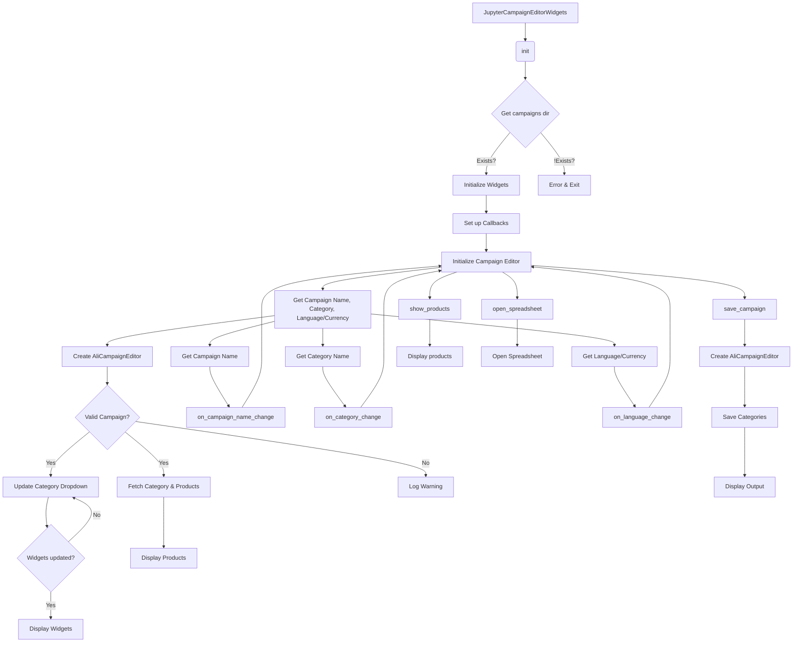

```MD
# <input code>

```python
## \file hypotez/src/suppliers/aliexpress/campaign/ali_campaign_editor_jupyter_widgets.py
# -*- coding: utf-8 -*-\
#! venv/Scripts/python.exe
#! venv/bin/python/python3.12

"""
.. module:: src.suppliers.aliexpress.campaign 
	:platform: Windows, Unix
	:synopsis: Jupyter widgets for the AliExpress campaign editor.

This module contains widgets for managing AliExpress campaigns in Jupyter notebooks.

Testfile:
    file test_ali_campaign_editor_jupyter_widgets.py

"""


from types import SimpleNamespace
import header
from pathlib import Path
from ipywidgets import widgets
from IPython.display import display
import webbrowser

from src import gs
from src.suppliers.aliexpress.campaign import AliCampaignEditor
from src.suppliers.aliexpress.utils import locales
from src.utils.printer import pprint, get_directory_names
from src.logger import logger

class JupyterCampaignEditorWidgets:
    """Widgets for the AliExpress campaign editor.

    This class provides widgets for interacting with and managing AliExpress campaigns,
    including selecting campaigns, categories, and languages, and performing actions such as
    initializing editors, saving campaigns, and showing products.

    Example:
        >>> editor_widgets: JupyterCampaignEditorWidgets = JupyterCampaignEditorWidgets()
        >>> editor_widgets.display_widgets()
    """

    # Class attributes declaration
    language: str = None
    currency: str = None
    campaign_name: str = None
    category_name: str = None
    category:SimpleNamespace = None
    campaign_editor: AliCampaignEditor = None
    products:list[SimpleNamespace] = None
    def __init__(self):
        """Initialize the widgets and set up the campaign editor.

        Sets up the widgets for selecting campaigns, categories, and languages. Also sets up
        default values and callbacks for the widgets.
        """
        self.campaigns_directory:str = Path(
            gs.path.google_drive, "aliexpress", "campaigns"
        )
        
        if not self.campaigns_directory.exists():
            raise FileNotFoundError(
                f"Directory does not exist: {self.campaigns_directory}"
            )

        #self.languages = {"EN": "USD", "HE": "ILS", "RU": "ILS"}
        self.campaign_name_dropdown = widgets.Dropdown(
            options = get_directory_names(self.campaigns_directory),
            description = "Campaign Name:",
        )
        self.category_name_dropdown = widgets.Dropdown(
            options=[], description="Category:"
        )
        self.language_dropdown = widgets.Dropdown(
            options=[f"{key} {value}" for locale in locales for key, value in locale.items()],
            description="Language/Currency:",
        )
        # ... (rest of the code)
```

# <algorithm>

The code implements a Jupyter widget-based interface for managing AliExpress campaigns.  The algorithm can be summarized as follows:

1. **Initialization (`__init__`)**:
    - Creates a `JupyterCampaignEditorWidgets` object.
    - Defines file paths for campaign data, including the campaigns directory.
    - Creates `Dropdown` widgets for selecting campaign names, categories, and language/currency.
    - Creates `Button` widgets for initializing the campaign editor, saving, showing products, and opening the spreadsheet.
    - Sets up callbacks for each widget.
    - Initializes campaign editor using the first campaign name selected.
2. **Initialization (internal `initialize_campaign_editor`)**:
    - Gets the selected campaign name, category, and language/currency from the widgets.
    - Creates an `AliCampaignEditor` instance using the selected data.
    - Updates the category dropdown based on the selected campaign.
    - If a valid campaign is selected, populates the category list.
    - Fetches category details and product lists from `AliCampaignEditor`.
    - Logs a warning if no campaign is selected.
3. **Update Category Dropdown (`update_category_dropdown`)**:
    - Updates the options available in the category dropdown based on the selected campaign.
4. **Callbacks (`on_campaign_name_change`, `on_category_change`, `on_language_change`)**:
    -  Update internal variables when corresponding dropdowns change.
    -  Re-initialize the campaign editor to reflect changes.
5. **Saving Campaigns (`save_campaign`)**:
    - Gets the selected campaign, category, and language/currency.
    - Creates an `AliCampaignEditor` instance.
    - Saves category information from the spreadsheet using `campaign_editor.save_categories_from_worksheet()`.
    - Logs warnings if necessary.
6. **Showing Products (`show_products`)**:
    - Creates an `AliCampaignEditor` instance.
    - Sets the product worksheet using `set_products_worksheet()`.
7. **Opening Spreadsheet (`open_spreadsheet`)**:
    - Opens the associated Google Spreadsheet in a browser.


# <mermaid>



**Dependencies Analysis:**

- `ipywidgets`, `IPython.display`, `webbrowser`: Necessary for Jupyter Notebook widget creation and display.
- `src.gs`: likely a module containing settings/path information (e.g., Google Drive).
- `src.suppliers.aliexpress.campaign.AliCampaignEditor`: The core campaign editing logic.
- `src.suppliers.aliexpress.utils.locales`: Contains locale/currency data.
- `src.utils.printer`, `src.logger`: Support for printing and logging messages.


# <explanation>

**Imports:**

- `types`, `pathlib`, `ipywidgets`, `IPython.display`, `webbrowser`: Standard Python packages for data types, path manipulation, Jupyter widgets, display utilities, and web browser interaction respectively.
- `header`: Likely a custom module or file for managing application headers, configurations, or initialization.
- `src import gs`: A package likely containing information regarding file paths and configurations of the Google Drive connection for campaign data.
- `src.suppliers.aliexpress.campaign.AliCampaignEditor`:  This is a custom module containing the logic for editing AliExpress campaigns.
- `src.suppliers.aliexpress.utils.locales`: Custom module containing locale-specific information (language and currency pairs).
- `src.utils.printer`: Custom module for printing formatted output.
- `src.logger`: Custom module for logging messages (error handling).

**Classes:**

- `JupyterCampaignEditorWidgets`: This class encapsulates the Jupyter widgets for interacting with the AliExpress campaign editor. 
    - `__init__`: Initializes the widgets, sets up callbacks, and automatically initalizes campaign editor with the first selected campaign.
    - `display_widgets`: Displays the widgets in a Jupyter notebook.
    - Other methods (`initialize_campaign_editor`, `update_category_dropdown`, `save_campaign`, `show_products`, `open_spreadsheet`): Provide functions to interact with the campaign editor. These handle button actions, widget updates, and interactions with `AliCampaignEditor`.

**Functions:**

- `get_directory_names`: (and other functions like `save_categories_from_worksheet`): Likely defined in `src.utils.printer` or `AliCampaignEditor`.  These functions are likely responsible for retrieving directory names from a given path, and for saving campaign information from Google Sheets.

**Variables:**

- `MODE`: A variable holding the application mode.
- `campaigns_directory`: The path to the directory containing campaign data on Google Drive.
-  `campaign_name`, `category_name`, `language`, `currency`, `campaign_editor`, `products`:  Instance variables holding data related to the current campaign being edited. These are dynamically updated through the various methods in `JupyterCampaignEditorWidgets`.

**Possible Errors/Improvements:**

- **Error Handling:** While the code includes `try...except` blocks, more specific error handling (e.g., for invalid file formats or issues with the Google Sheets API) would improve robustness.
- **Input Validation:** Ensuring that the entered data (campaign names, categories, etc.) conforms to expected formats and is not malicious could be improved.
- **Asynchronous Operations:** For interactions with external services (Google Sheets), the use of asynchronous operations (e.g., `asyncio` or libraries built around `async/await`) could lead to better responsiveness in the Jupyter interface.
- **Dependency management (`header`):**  The inclusion of a `header` module is unusual and might be due to some custom startup or application management. It would be beneficial to clarify its functionality and purpose.

**Relationships with other parts of the project:**

The code heavily depends on `AliCampaignEditor` and the components that provide its features (likely interacting with the Google Sheets API).   The use of `gs.path` suggests a broader project structure for managing file paths and dependencies. Also, it relies on `locales` to manage language/currency.  The various `logger` statements suggest this is a part of a larger system using logging to track events.