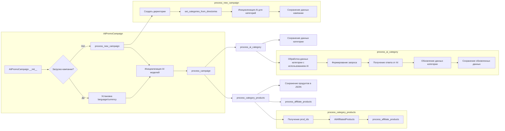

# Анализ кода AliPromoCampaign

## <input code>

```python
## \file hypotez/src/suppliers/aliexpress/campaign/ali_promo_campaign.py
# -*- coding: utf-8 -*-\n#! venv/Scripts/python.exe\n#! venv/bin/python/python3.12\n
# ... (оставшаяся часть кода)
```

## <algorithm>

[Здесь должна быть блок-схема.  К сожалению, я не могу её визуализировать в Markdown.  Для создания блок-схемы необходимо использовать инструмент вроде draw.io, Lucidchart или Visio.]

**Описание алгоритма (вместо блок-схемы):**

Класс `AliPromoCampaign` предназначен для управления рекламными кампаниями AliExpress.  Алгоритм включает:

1. **Инициализация (`__init__`):**
   - Определяет базовый путь к кампании на Google Drive.
   - Попытка загрузить существующую кампанию из JSON-файла. Если файл не найден, запускается процесс создания новой кампании (`process_new_campaign`).
   - Если кампания загружена, устанавливает значения `language` и `currency` из файла. Иначе использует переданные в конструктор.
   - Инициализирует AI-модели (Gemini).
2. **Обработка всей кампании (`process_campaign`):**
   - Перебирает все категории кампании.
   - Для каждой категории:
      - Обрабатывает товары в категории (`process_category_products`).
      - Использует AI для обработки данных категории (`process_ai_category`).
3. **Обработка товаров категории (`process_category_products`):**
   - Читает IDs товаров из HTML-файлов и sources.txt в каталоге `sources`.
   - Инициализирует генератор партнерских ссылок (`AliAffiliatedProducts`).
   - Обрабатывает продукты через асинхронный вызов (`process_affiliate_products`).
   - Сохраняет обработанные продукты в JSON-файлы.
4. **Обработка категории с использованием AI (`process_ai_category`):**
   - Читает заголовки товаров из файла `product_titles.txt` в директории категории.
   - Формирует запрос для AI-модели (Gemini).
   - Получает ответ от AI.
   - Обновляет или создает данные категории на основе ответа AI.
   - Сохраняет обновленные данные о категории в JSON-файл.
5. **Создание новой кампании (`process_new_campaign`):**
   - Создает директорию для новой кампании на Google Drive.
   - Создает категории на основе названий поддиректорий в `category`.
   - Обрабатывает продукты через `read_sources`.
   - Инициализирует AI для каждой категории и генерирует данные.
   - Сохраняет данные кампании в JSON-файл.

## <mermaid>



## <explanation>

**Импорты:**

- `header`: Скорее всего, содержит вспомогательные функции, специфичные для проекта.
- `asyncio`: Для асинхронных операций, особенно при работе с внешними ресурсами (например, API).
- `time`: Для работы с временем.
- `copy`: Для создания копий объектов.
- `html`: Для экранирования HTML-символов.
- `pathlib`: Для работы с путями к файлам.
- `types`: Для работы с объектом `SimpleNamespace`.
- `typing`: Для типизации.
- `gs`: Вероятно, предоставляет доступ к Google Cloud Storage или другим системам хранения.
- `src.suppliers.aliexpress`: Папка с модулями, связанными с AliExpress.
- `src.suppliers.aliexpress.affiliated_products_generator`: Модуль для генерации партнерских ссылок.
- `src.suppliers.aliexpress.utils`: Модуль с утилитами для работы с данными AliExpress.
- `src.ai`: Модуль, содержащий классы для работы с AI-моделями.
- `src.suppliers.aliexpress.campaign.html_generators`: Модули для генерации HTML-вывода.
- `src.logger`: Модуль для логирования.
- `src.utils.file`: Модуль для работы с файлами.
- `src.utils.jjson`: Модуль для работы с JSON-данными.
- `src.utils.convertors.csv`: Модуль для преобразования CSV-данных.
- `src.utils.printer`: Модуль для красивого вывода данных (pprint).
- `src.suppliers.aliexpress.utils.extract_product_id`: Функции для извлечения product_id из HTML и txt.
- Классы `ProductHTMLGenerator`, `CategoryHTMLGenerator`, `CampaignHTMLGenerator`  - отвечают за генерацию HTML-вывода для товаров, категорий и всей кампании соответственно.

**Классы:**

- `AliPromoCampaign`: Основной класс для управления кампаниями. Хранит информацию о кампании, язык, валюту, путь к данным, AI-модели и т.д.  Использует `SimpleNamespace` для представления данных, что обеспечивает гибкость и краткость.  Обратите внимание на инициализацию `self.campaign` из JSON, а также логирование warning при отсутствии файла.  Важно, что если файла нет, запускается создание новой кампании.
- `AliAffiliatedProducts`: Вероятно, класс, отвечающий за работу с генерацией партнерских ссылок на AliExpress.

**Функции:**

- `__init__`: Инициализация объекта `AliPromoCampaign`.
- `process_campaign`: Обработка всей кампании.
- `process_category_products`: Обработка товаров в конкретной категории.
- `process_ai_category`: Обработка категории с использованием AI.
- `process_new_campaign`: Создание новой рекламной кампании.
- `read_sources`: Функция, которая извлекает product_id из HTML-файлов и/или из файла sources.txt.
- `dump_category_products_files`: Функция для сохранения обработанных данных о товарах в JSON-файлы.
- `set_categories_from_directories`: Функция для получения списка категорий из директорий.
- `generate_output`: Функция для генерации файлов вывода, как JSON, txt, html.
- `generate_html`:  Генерация HTML-страниц для категорий и всей кампании.


**Переменные:**

- `MODE`: Вероятно, конфигурационная переменная (например, для разработки или производства).
- `language`, `currency`: Характеристики кампании.

**Возможные ошибки и улучшения:**

- **Обработка ошибок:**  Некоторые функции, особенно те, которые работают с файлами, могут быть улучшены добавлением более сложной обработки исключений, чтобы избежать выхода из строя в случае проблем с чтением или записью файлов.
- **Поддержка других моделей AI:**  Возможно, стоит добавить возможность работы с другими моделями AI, а не только с Gemini.
- **Проверка наличия файлов:**  Можно добавить проверку на существование не только JSON-файла кампании, но и необходимых каталогов и файлов для обработки.
- **Более полное логирование:**  Добавить более детальное логирование, включая информацию о времени выполнения, успехе/неудачи операций и деталях обработанных данных.
- **Асинхронность:**  Использование `asyncio` – это хорошо. Однако, стоит убедиться, что все асинхронные функции правильно обработаны и результаты не потеряны.


**Цепочка взаимосвязей:**

`src.suppliers.aliexpress` —> `src.suppliers.aliexpress.campaign.ali_promo_campaign` —> `src.ai` —> `src.utils` —> `gs`

В данном коде используется много модулей, что указывает на то, что это не просто модуль, а часть системы, состоящей из разных взаимосвязанных компонентов, отвечающих за определенные задачи, такие как работа с файловой системой, Google Drive, API, генерация HTML и т.д.