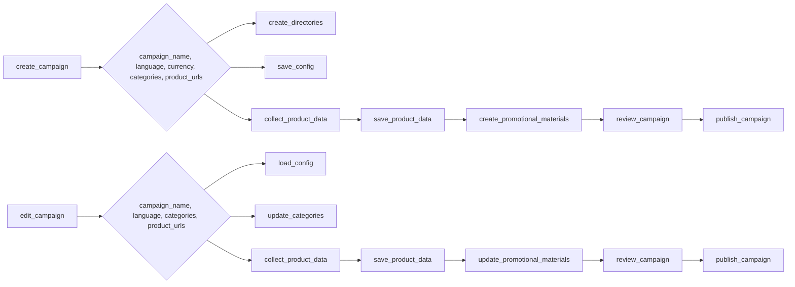

# Анализ кода для создания и редактирования рекламных кампаний

## 1. <input code>

```python
### Инструкция для программиста по поддержке кода для создания и редактирования рекламных кампаний

#### 1. Создание рекламной кампании

1. **Инициализация кампании**
   - Введите имя кампании, язык и валюту.
   - Пример: 
     ```python
     campaign_name = 'example_campaign'
     language = 'EN'
     currency = 'USD'
     ```

2. **Создание директорий для кампании**
   - Создайте директории для кампании и категорий.
   - Пример:
     ```python
     categories = ['electronics', 'fashion']
     create_directories(campaign_name, categories)
     ```

3. **Сохранение конфигурации кампании**
   - Создайте и сохраните конфигурационный файл кампании.
   - Пример:
     ```python
     campaign_config = {'name': campaign_name, 'language': language, 'currency': currency}
     save_config(campaign_name, campaign_config)
     ```

4. **Сбор данных о продуктах**
   - Введите URL или ID продуктов для кампании.
   - Пример:
     ```python
     product_urls = ['https://www.aliexpress.com/item/123.html', 'https://www.aliexpress.com/item/456.html']
     product_data = collect_product_data(product_urls)
     ```

5. **Сохранение данных о продуктах**
   - Сохраните собранные данные о продуктах.
   - Пример:
     ```python
     save_product_data(campaign_name, product_data)
     ```

6. **Создание рекламных материалов**
   - Создайте рекламные материалы на основе собранных данных.
   - Пример:
     ```python
     create_promotional_materials(campaign_name, product_data)
     ```

7. **Просмотр и публикация кампании**
   - Просмотрите и опубликуйте кампанию.
   - Пример:
     ```python
     review_campaign(campaign_name)
     publish_campaign(campaign_name)
     ```

#### 2. Редактирование рекламной кампании

... (остальной код)


### Примерный код

```python
def create_campaign(campaign_name, language, currency, categories, product_urls):
    create_directories(campaign_name, categories)
    campaign_config = {'name': campaign_name, 'language': language, 'currency': currency}
    save_config(campaign_name, campaign_config)
    product_data = collect_product_data(product_urls)
    save_product_data(campaign_name, product_data)
    create_promotional_materials(campaign_name, product_data)
    review_campaign(campaign_name)
    publish_campaign(campaign_name)

def edit_campaign(campaign_name, language, categories, product_urls):
    campaign_config = load_config(campaign_name)
    campaign_config['language'] = language
    save_config(campaign_name, campaign_config)
    update_categories(campaign_name, categories)
    updated_product_data = collect_product_data(product_urls)
    save_product_data(campaign_name, updated_product_data)
    update_promotional_materials(campaign_name, updated_product_data)
    review_campaign(campaign_name)
    publish_campaign(campaign_name)
```
```

## 2. <algorithm>

(Блок-схема здесь невозможна в текстовом формате. Требуется графический редактор, например, draw.io или Visio.)

**Описание алгоритма (словесно):**

Код описывает процесс создания и редактирования рекламных кампаний.  Он предполагает существование функций `create_directories`, `save_config`, `collect_product_data`, `save_product_data`, `create_promotional_materials`, `review_campaign`, `publish_campaign`, `load_config`, `update_categories`, `update_promotional_materials`.  Функции `create_campaign` и `edit_campaign`  являются основными, управляя последовательностью действий для создания и редактирования кампаний соответственно.  Внутри этих функций данные о кампании (имя, язык, валюта, категории, URL-адреса продуктов) передаются между функциями для выполнения необходимых операций.


## 3. <mermaid>




## 4. <explanation>

**Импорты:**

Код не содержит импортов.  Предполагается, что необходимые модули (например, для работы с файловой системой, логирования, HTTP-запросов) импортированы в подключаемых модулях (`src.*`).

**Классы:**

В коде отсутствуют классы.  Все функциональности реализованы в функциях.

**Функции:**

* `create_campaign`, `edit_campaign`:  Главные функции для управления созданием и редактированием кампаний. Принимают набор параметров, вызывая другие функции для выполнения конкретных задач.
* `create_directories`, `save_config`, `collect_product_data`, `save_product_data`, `create_promotional_materials`, `review_campaign`, `publish_campaign`, `load_config`, `update_categories`, `update_promotional_materials`:  Функции, отвечающие за выполнение конкретных операций (создание директорий, сохранение данных, сбор данных, обновление материалов и т.д.).


**Переменные:**

Все переменные имеют явные типы данных (строки, списки, словари) или предполагаемый тип данных.  Используются стандартные имена переменных, что повышает читабельность кода.

**Возможные ошибки и улучшения:**

* **Обработка ошибок:** Хотя в примере упоминается обработка ошибок, сам код ее не реализует.  Необходимо добавить `try-except` блоки вокруг потенциально проблемных операций (например, при чтении/записи файлов, отправке HTTP-запросов).
* **Логирование:**  Для отслеживания хода выполнения и обнаружения ошибок необходимо включить логирование.
* **Управление ресурсами:** Необходимо правильно управлять открытыми файлами и другими ресурсами.
* **Документация:**  Добавить подробную документацию к функциям и классам.
* **Модульная структура:** Разделить код на отдельные модули или пакеты для лучшей организации и повторного использования кода.
* **Тестирование:**  Необходимо добавить тесты для проверки корректности работы функций.

**Взаимосвязи с другими частями проекта:**

Предполагается, что функции `create_directories`, `save_config`, `collect_product_data`, `save_product_data`, `create_promotional_materials`, `review_campaign`, `publish_campaign`, `load_config`, `update_categories`, `update_promotional_materials` - это части более сложного проекта, взаимодействующие через передачу данных.  Они могут быть импортированы из модулей в `src.*`.  Также важно понимать, что  эти функции должны взаимодействовать с базами данных, файловой системой и др. компонентами проекта.