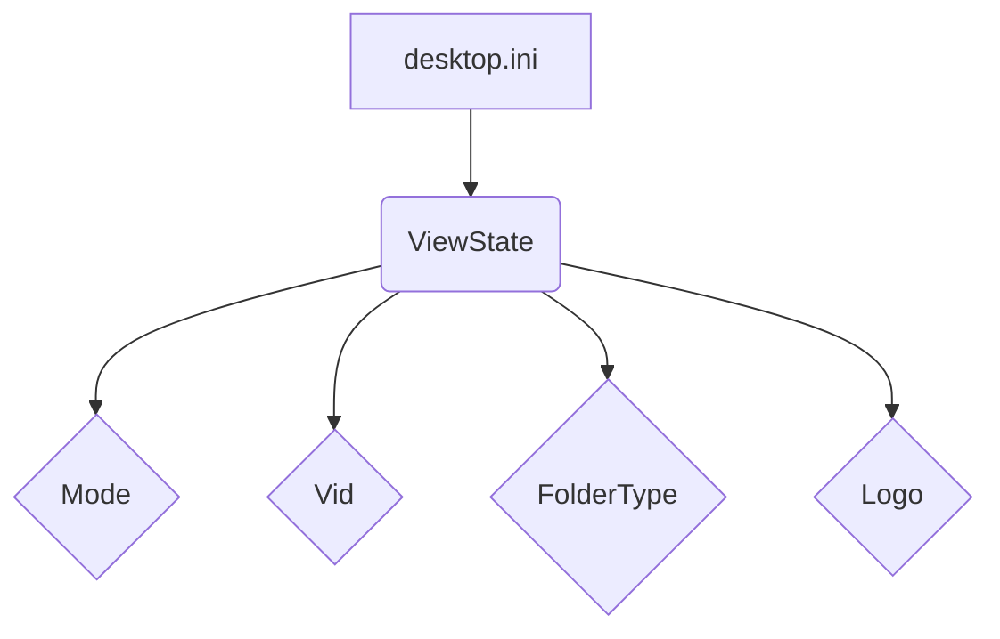

```MD
# Анализ кода desktop.ini

## <input code>

```
[ViewState]
Mode=
Vid=
FolderType=Generic
Logo=E:\\Users\\user\\images\\LOGOS\\R.png
```

## <algorithm>

Этот код представляет собой фрагмент файла `desktop.ini`, используемого в Windows для управления отображением папок.  Он не является самостоятельным программным кодом, а скорее метаданными.  Поскольку это файл, а не код программы, алгоритма в классическом смысле нет.  Он содержит ключ `[ViewState]` и ряд параметров, устанавливающих визуальные свойства папки.  В данном случае, нет логических ветвлений или итераций.

* **Пример:**  Файл `desktop.ini` определяет параметры для отображения папки в проводнике Windows.

## <mermaid>



**Объяснение диаграммы:** Диаграмма показывает, что файл `desktop.ini` содержит раздел `ViewState`, а этот раздел содержит различные параметры.  В данном случае нет сложных взаимосвязей, т.к. это всего лишь набор настроек.

## <explanation>

Файл `desktop.ini` — это специальный файл, используемый в Windows для управления свойствами отображения папок. Он содержит информацию о расположении иконок, вида папки, и других данных.  Этот файл *не* является исполняемым кодом, а скорее набором метаданных.

* **Импорты:**  Отсутствуют. Это не программный код, поэтому нет импортов.
* **Классы:** Отсутствуют. Это не программный код, поэтому нет классов.
* **Функции:** Отсутствуют. Это не программный код, поэтому нет функций.
* **Переменные:** `Mode`, `Vid`, `FolderType`, `Logo` - являются именами параметров.  Их значения (в данном примере) задают свойства папки.
* **Возможные ошибки или области для улучшений:**  Этот файл просто описывает параметры отображения, поэтому потенциальных ошибок в нем нет.  Возможно, проблема могла бы возникнуть в пути к изображению, если бы он был неправильным.

**Цепочка взаимосвязей:** Файл `desktop.ini` используется операционной системой Windows, чтобы отображать папку с соответствующим дизайном и изображением.  Этот файл может использоваться различными программами или инструментами, которые работают с файлами Windows.  В данном примере, это папка, которая задаёт внешний вид и расположение данных в операционной системе Windows.  Его функциональность очень тесно связана с отображением в проводнике Windows.