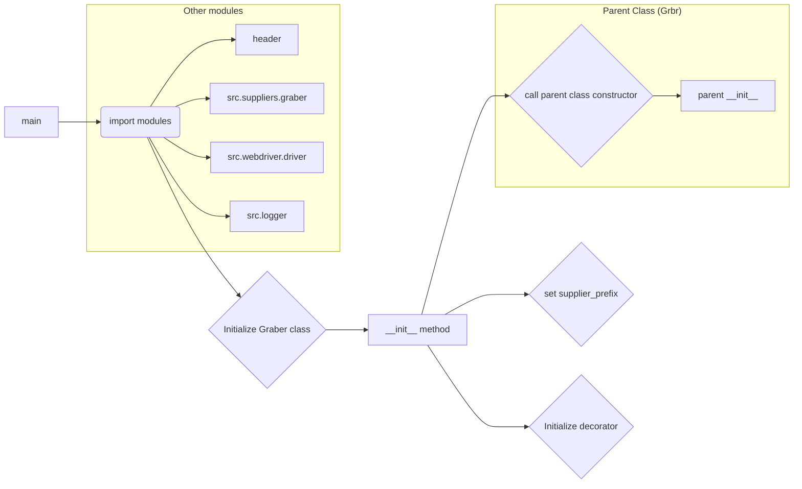

# <input code>

```python
## \file hypotez/src/suppliers/aliexpress/graber.py
# -*- coding: utf-8 -*-

#! venv/bin/python/python3.12

"""
.. module:: src.suppliers.aliexpress 
	:platform: Windows, Unix
	:synopsis: Класс собирает значение полей на странице  товара `aliexpress.com`. 
    Для каждого поля страницы товара сделана функция обработки поля в родительском классе.
    Если нужна нестандертная обработка, функция перегружается в этом классе.
    ------------------
    Перед отправкой запроса к вебдрайверу можно совершить предварительные действия через декоратор. 
    Декоратор по умолчанию находится в родительском классе. Для того, чтобы декоратор сработал надо передать значение 
    в `Context.locator`, Если надо реализовать свой декоратор - раскоментируйте строки с декоратором и переопределите его поведение

"""


from typing import Any
import header
from src.suppliers.graber import Graber as Grbr, Context, close_pop_up
from src.webdriver.driver import Driver
from src.logger import logger


# def close_pop_up(value: Any = None) -> Callable:
#     """Создает декоратор для закрытия всплывающих окон перед выполнением основной логики функции.

#     Args:
#         value (Any): Дополнительное значение для декоратора.

#     Returns:
#         Callable: Декоратор, оборачивающий функцию.
#     """
#     def decorator(func: Callable) -> Callable:
#         @wraps(func)
#         async def wrapper(*args, **kwargs):
#             try:
#                 if Context.locator_for_decorator.close_pop_up:
#                     await Context.driver.execute_locator(Context.locator.close_pop_up)  # Await async pop-up close 
#                 ...
#             except ExecuteLocatorException as ex:
#                 logger.debug(f'Ошибка выполнения локатора: ',ex)
#             return await func(*args, **kwargs)  # Await the main function
#         return wrapper
#     return decorator


class Graber(Grbr):
    """Класс для операций захвата Morlevi."""
    supplier_prefix: str

    def __init__(self, driver: Driver):
        """Инициализация класса сбора полей товара."""
        self.supplier_prefix = 'aliexpress'
        super().__init__(supplier_prefix=Context.supplier_prefix, driver=driver)
        
        Context.locator_for_decorator = None # <- если будет уастановлено значение - то оно выполнится в декораторе `@close_pop_up`
```

# <algorithm>

**Блок-схема алгоритма:**

1. **Импорт модулей:** Импортируются необходимые модули, включая `header`, классы `Graber` и `Context` из модуля `src.suppliers.graber`, `Driver` из `src.webdriver.driver` и `logger` из `src.logger`.

2. **Определение класса `Graber`:** Наследуется от класса `Grbr` (вероятно, из `src.suppliers.graber`).

3. **Инициализация:** В методе `__init__` устанавливается `supplier_prefix` и вызывается конструктор родительского класса.

4. **Инициализация декоратора:** `Context.locator_for_decorator` устанавливается в `None`. Это важный шаг, так как он указывает, какой декоратор использовать (если он будет переопределен).

**Пример данных, перемещаемых между функциями/классами:**

- `driver`: Объект вебдрайвера передается в конструктор класса `Graber`.
- `Context.locator_for_decorator`:  Переменная, содержащая информацию о декораторе, управляет работой декоратора.
- `supplier_prefix`: Строка, обозначающая поставщика ('aliexpress').


# <mermaid>



**Объяснение зависимостей:**

- `header`: Скорее всего, содержит вспомогательные функции или константы, специфичные для проекта.
- `src.suppliers.graber`: Содержит базовый класс `Graber` и, возможно, другие классы и функции для работы с поставщиками данных.
- `src.webdriver.driver`: Содержит класс `Driver`, отвечающий за взаимодействие с веб-драйвером (Selenium, Playwright и т.п.).
- `src.logger`:  Модуль для регистрации событий и сообщений об ошибках.

# <explanation>

**Импорты:**

- `header`:  Вспомогательный модуль, скорее всего содержащий константы или функции, общие для всей системы, возможно, для работы с конфигурацией.
- `src.suppliers.graber`: Импортирует базовый класс `Graber`, в который наследованы функции для парсинга данных, а также `Context` и `close_pop_up` - вероятно, контекст приложения и декоратор для работы с вебдрайвером.
- `src.webdriver.driver`:  Модуль, отвечающий за взаимодействие с веб-драйвером (Selenium, Playwright или аналогичным инструментом).
- `src.logger`: Модуль для логирования, необходимый для отслеживания событий и ошибок в приложении.


**Классы:**

- `Graber`: Наследуется от `Grbr` (предположительно из `src.suppliers.graber`) и специализируется на сборе данных с `aliexpress.com`.
    - `supplier_prefix`: Строковое поле, хранящее префикс поставщика (в данном случае 'aliexpress').
    - `__init__`:  Инициализирует объект, устанавливает `supplier_prefix` и вызывает конструктор родительского класса, передавая `driver` и `supplier_prefix`.


**Функции:**

- `close_pop_up` (комментирована): Декоратор для закрытия всплывающих окон.  (Не реализован в текущем коде).

**Переменные:**

- `MODE`: Вероятно, строковая константа, определяющая режим работы приложения ('dev' в данном случае).
- `Context.locator_for_decorator`:  Служебная переменная, управляющая запуском декоратора.

**Возможные ошибки и улучшения:**

- **Отсутствует реализация `close_pop_up` декоратора:** Код содержит комментарии, которые показывают, что декоратор `close_pop_up` планируется. Важно его реализовать для повышения надежности работы скрипта.
- **Не описан механизм работы с `Context`:**  Необходимо уточнить, как используется `Context`, где определяется `Context.locator` и `Context.supplier_prefix`.
- **Отсутствует обработка исключений:**  Внутри декоратора отсутствует полноценная обработка `ExecuteLocatorException`.
- **Взаимодействие с другими частями проекта:** Приложение имеет зависимости от модулей `src.suppliers.graber`, `src.webdriver.driver` и `src.logger`.


**Цепочка взаимосвязей:**

1. Запрос к сервису по сбору данных.
2. Вызов класса `Graber`.
3. Инициализация класса `Graber` с драйвером.
4.  (Если реализован) Выполнение декоратора `close_pop_up`.
5. Обработка полей на странице товара.
6. Возврат данных из класса `Graber`.


В целом, код имеет хорошее структурирование и комментарии, но нуждается в реализации функциональности обработки всплывающих окон и описании механизма работы с `Context`.