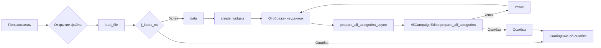

# <input code>

```python
## \file hypotez/src/suppliers/aliexpress/gui/category.py
# -*- coding: utf-8 -*-\

#! venv/bin/python/python3.12

"""
.. module:: src.suppliers.aliexpress.gui 
	:platform: Windows, Unix
	:synopsis:

"""


""" Window interface for preparing advertising campaigns """


import header
import sys
import asyncio
from pathlib import Path
from types import SimpleNamespace
from PyQt6 import QtWidgets, QtGui, QtCore
from qasync import QEventLoop, asyncSlot
from src.utils.jjson import j_loads_ns, j_dumps
from src.suppliers.aliexpress.campaign import AliCampaignEditor
```

```markdown
# <algorithm>

**Шаг 1: Инициализация**

- Создается объект `CategoryEditor`.
- Вызывается `setup_ui` для настройки пользовательского интерфейса.
- Вызывается `setup_connections` для настройки соединений.

**Шаг 2: Настройка пользовательского интерфейса (setup_ui)**

- Устанавливается заголовок окна ("Category Editor").
- Устанавливаются размеры окна (1800x800).
- Добавляются кнопки ("Open JSON File", "Prepare All Categories", "Prepare Category").
- Добавляется метка для отображения имени файла.
- Создается макет (`QVBoxLayout`) и добавляются элементы в него.


**Шаг 3: Обработка открытия файла (open_file)**

- Открывается диалог выбора файла.
- Если файл выбран, то функция `load_file` загружает его.

**Шаг 4: Загрузка файла (load_file)**

- Файл загружается с помощью `j_loads_ns`.
- Данные из файла сохраняются в атрибуте `data`.
- Обновляется имя файла в метке.
- Создается объект `AliCampaignEditor`.
- Вызывается `create_widgets`, чтобы отобразить загруженные данные.


**Шаг 5: Создание виджетов (create_widgets)**

- Удаляются все виджеты, кроме "Open JSON File" и метки имени файла.
- Добавляются виджеты, содержащие данные из загруженного JSON файла (например, title, campaign_name, categories).

**Шаг 6: Подготовка всех категорий (prepare_all_categories_async)**

- Выполняется асинхронно с помощью `@asyncSlot`.
- Вызывается `prepare_all_categories` из `AliCampaignEditor`.
- Обрабатываются успехи и ошибки.

**Шаг 7: Подготовка одной категории (prepare_category_async)**

- Выполняется асинхронно с помощью `@asyncSlot`.
- Вызывается `prepare_category` из `AliCampaignEditor` с именем кампании.
- Обрабатываются успехи и ошибки.

**Пример:**

Пользователь открывает JSON файл, содержащий информацию о кампании.  Данные загружаются в объект `data`.  `create_widgets` отображает заголовок, имя кампании и список категорий из `data.categories`. Далее пользователь нажимает "Prepare All Categories".  `prepare_all_categories_async` вызывает `prepare_all_categories` в `AliCampaignEditor`, который обрабатывает данные из файла и сохраняет результаты.

```markdown
# <mermaid>


**Объяснения к диаграмме:**

Диаграмма отображает основные этапы работы программы. Пользователь открывает файл, данные из файла загружаются с помощью `j_loads_ns`.  Данные обрабатываются и отображаются, затем происходит асинхронное выполнение `prepare_all_categories` в `AliCampaignEditor`.  Результаты обработки данных отображаются в виде сообщений об успехе или ошибках.


```markdown
# <explanation>

**Импорты:**

- `header`:  Вероятно, содержит вспомогательные функции или конфигурацию, специфичные для данного проекта. Необходимо проверить, если модуль существует и как он взаимодействует с кодом.
- `sys`: Стандартный модуль Python, используется для доступа к системам-зависимым функциям.  В этом случае скорее всего не нужен и может быть удален.
- `asyncio`: Модуль для асинхронного программирования.
- `pathlib`: Модуль для работы с путями к файлам.
- `types`: Модуль, содержащий типы данных, в том числе `SimpleNamespace`.
- `PyQt6`: Библиотека для разработки графических интерфейсов.
- `qasync`: Библиотека для асинхронного программирования с PyQt.
- `src.utils.jjson`: Модуль для работы с JSON-данными, возможно, для обработки или парсинга, содержит функции `j_loads_ns` и `j_dumps`.
- `src.suppliers.aliexpress.campaign`: Модуль, вероятно, содержит классы и функции для обработки данных кампании AliExpress.  Зависимость между этими модулями важна для понимания общей функциональности.


**Классы:**

- `CategoryEditor`: Класс, представляющий окно для редактирования категорий рекламных кампаний. Атрибуты (`campaign_name`, `data`, `language`, `currency`, `file_path`, `editor`) хранят информацию о кампании, загруженном JSON файле, языке и валюте. Методы (`__init__`, `setup_ui`, `setup_connections`, `open_file`, `load_file`, `create_widgets`, `prepare_all_categories_async`, `prepare_category_async`) управляют интерфейсом, открытием файлов, обработкой данных и асинхронной подготовкой категорий.


**Функции:**

- `open_file`: Открывает диалог выбора JSON-файла и загружает его в `load_file`.
- `load_file`: Загружает JSON-файл, проверяет корректность загрузки и создаёт `AliCampaignEditor`.
- `create_widgets`: Создаёт виджеты на основе данных загруженного файла и обновляет интерфейс.
- `prepare_all_categories_async`: Асинхронно подготавливает все категории.
- `prepare_category_async`: Асинхронно подготавливает определенную категорию.


**Переменные:**

- `MODE`: Переменная, вероятно, определяет режим работы программы (например, 'dev' или 'prod').
- `campaign_file`: Хранит путь к загруженному JSON файлу.
- `language`, `currency`: Хранят язык и валюту кампании.

**Возможные ошибки/улучшения:**

- Обработка ошибок при чтении JSON файла (например, неверный формат JSON).  Проверьте `try...except` блок.
- Непонятный модуль `header`. Определите его назначение и зависимость.
- Обработка `None` значений в методах `prepare_all_categories_async` и `prepare_category_async`. Добавьте проверку, чтобы исключить ошибки при вызове методов `self.editor`.
- Возможно, не используется `QEventLoop`. Если в `prepare_all_categories` и `prepare_category` есть долговременные операции (например, API запросы), то важно правильно использовать асинхронное программирование.


**Взаимосвязи с другими частями проекта:**

- `AliCampaignEditor`: Класс, видимо, из другого модуля (`src.suppliers.aliexpress.campaign`), отвечает за подготовку категорий. Есть зависимость между `CategoryEditor` и `AliCampaignEditor`.  Необходимо проверить логику взаимодействий между этими классами.
- `j_loads_ns` и `j_dumps`: Функции, вероятно, из модуля `src.utils.jjson`. Определяют взаимодействие с JSON данными и общий формат данных для всей системы.


В целом, код хорошо структурирован, но требуется более глубокий анализ связанных модулей и обработка ошибок.