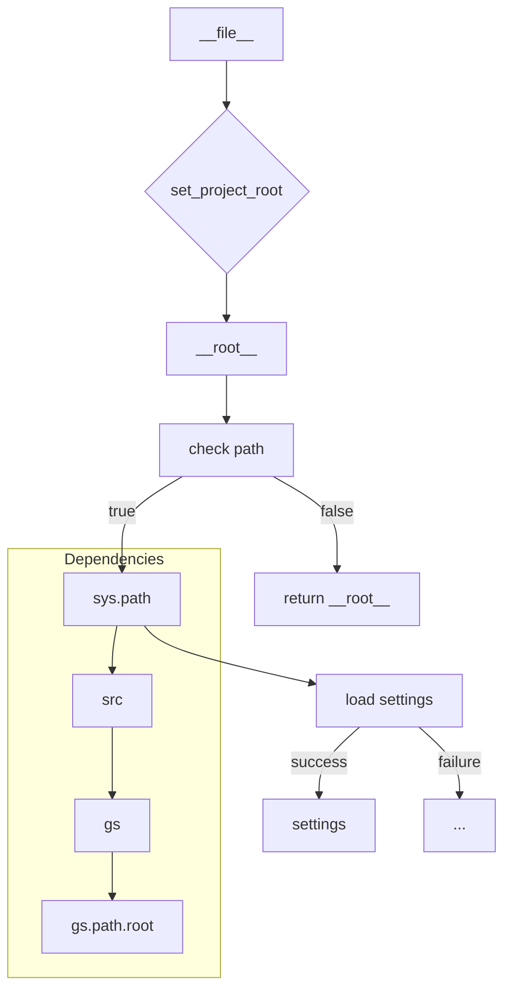

# <input code>

```python
## \file hypotez/src/suppliers/aliexpress/gui/header.py
# -*- coding: utf-8 -*-\
#! venv/Scripts/python.exe
#! venv/bin/python/python3.12

"""
.. module:: src.suppliers.aliexpress.gui 
	:platform: Windows, Unix
	:synopsis:

"""
MODE = 'dev'

import sys
import json
from packaging.version import Version

from pathlib import Path
def set_project_root(marker_files=('pyproject.toml', 'requirements.txt', '.git')) -> Path:
    """
    Finds the root directory of the project starting from the current file's directory,
    searching upwards and stopping at the first directory containing any of the marker files.

    Args:
        marker_files (tuple): Filenames or directory names to identify the project root.
    
    Returns:
        Path: Path to the root directory if found, otherwise the directory where the script is located.
    """
    __root__:Path
    current_path:Path = Path(__file__).resolve().parent
    __root__ = current_path
    for parent in [current_path] + list(current_path.parents):
        if any((parent / marker).exists() for marker in marker_files):
            __root__ = parent
            break
    if __root__ not in sys.path:
        sys.path.insert(0, str(__root__))
    return __root__


# Get the root directory of the project
__root__ = set_project_root()
"""__root__ (Path): Path to the root directory of the project"""

from src import gs

settings:dict = None
try:
    with open(gs.path.root / 'src' / 'settings.json', 'r') as settings_file:
        settings = json.load(settings_file)
except (FileNotFoundError, json.JSONDecodeError):
    ...
```

# <algorithm>

**Шаг 1:** Определение корневой директории проекта (`set_project_root`).

*   **Вход:** кортеж `marker_files` с файлами/директориями, которые указывают на корень проекта.
*   **Выход:** Объект `Path` к корневой директории проекта.
*   **Логика:** Начинает поиск с текущего каталога файла (`__file__`) и перебирает родительские каталоги. Проверяет наличие файлов/директорий из `marker_files` в каждом родительском каталоге. Как только находим какой-либо из них, поиск заканчивается, и корневая директория сохраняется в переменной `__root__`. Если корень не найден, `__root__` сохраняет текущий каталог. Если корень не в `sys.path`, добавляет его в начало списка.

**Пример:** Если `__file__` находится в `hypotez/src/suppliers/aliexpress/gui/header.py`, поиск будет проходить вверх по иерархии (`hypotez/src/suppliers/aliexpress/gui`, `hypotez/src/suppliers/aliexpress`, `hypotez/src/suppliers`, `hypotez/src`, `hypotez`). Если `pyproject.toml` находится в каталоге `hypotez`, то `__root__` будет `hypotez`.

**Шаг 2:** Чтение настроек из файла `settings.json`.

*   **Вход:** Путь к файлу настроек (`gs.path.root / 'src' / 'settings.json`).
*   **Выход:** Словарь настроек (`settings`).
*   **Логика:** Используется `try-except` блок для обработки возможных ошибок:
    *   `FileNotFoundError`: если файл `settings.json` не найден.
    *   `json.JSONDecodeError`: если файл `settings.json` поврежден или имеет неверный формат JSON.
*   **Результат:** В переменную `settings` записываются данные из `settings.json`. Если произошла ошибка, `settings` остается `None`.


# <mermaid>



**Описание зависимостей:**

* `Path`: модуль для работы с путями.
* `json`: модуль для работы с JSON-форматом данных.
* `packaging.version`: модуль для работы с версиями пакетов.
* `sys`: модуль для доступа к системным переменным.
* `src.gs`: модуль, который, вероятно, содержит класс `gs`, определяющий функцию `path` и атрибут `root` для получения корневого пути проекта.  


# <explanation>

**Импорты:**

* `sys`:  Используется для добавления корневого пути проекта в `sys.path`, что позволяет импортировать модули из корневой директории проекта.
* `json`: Используется для загрузки настроек из файла `settings.json`.
* `packaging.version`:  Предположительно для проверки версий пакетов (хотя в данном коде не используется).
* `pathlib`: Используется для работы с путями к файлам и каталогам, обеспечивая платформонезависимый способ работы с файловой системой.
* `src.gs`: Импортируется, предположительно, для получения информации о корневом пути проекта.

**Классы:**

* Нет явных классов в данном коде.

**Функции:**

* `set_project_root(marker_files)`:  Находит корневую директорию проекта.  Важно для организации модулей и импортов, когда файлы проекта могут быть расположены в различных подкаталогах. `marker_files` – это кортеж, содержащий файлы/директории, которые указывают на проект. 


**Переменные:**

* `__root__`: Содержит объект `Path`, представляющий корневую директорию проекта. 
* `settings`:  Словарь, который хранит настройки проекта, загруженные из файла `settings.json`. Может быть `None`, если файл не найден или поврежден.
* `MODE`: Переменная, хранящая режим работы программы (`dev`).
* `current_path`: Хранит путь к файлу, из которого был вызван скрипт.


**Возможные ошибки и улучшения:**

* **Обработка ошибок:** Обработка `FileNotFoundError` и `json.JSONDecodeError` в блоке `try-except` – важная мера предосторожности.  Можно добавить вывод сообщений об ошибке для лучшей диагностики.
* **Вариативность `marker_files`:** В `set_project_root` можно добавить проверку на пустоту `marker_files`.
* **Документация `gs`:** Было бы полезно прокомментировать, что именно делает модуль `gs` и что означает `gs.path.root`. 
* **Типизация:** Использование типов (например, через аннотации) – это хорошая практика, делает код более читаемым и позволяет IDE предоставлять полезную информацию о типах переменных.

**Связи с другими частями проекта:**

Код взаимодействует с файлом `settings.json`, который, скорее всего, содержит настройки для приложения. Также, зависимость от модуля `src.gs` подразумевает, что существует другая часть проекта (или модуль), которая предоставляет доступ к корневому пути проекта.