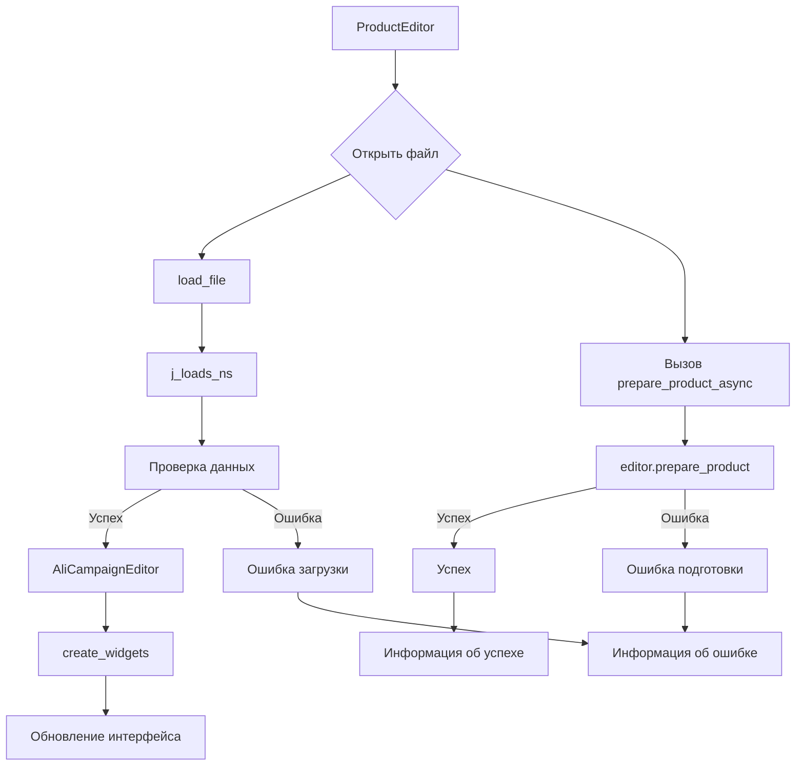

# <input code>

```python
## \file hypotez/src/suppliers/aliexpress/gui/product.py
# -*- coding: utf-8 -*-\
#! venv/Scripts/python.exe
#! venv/bin/python/python3.12

"""
.. module:: src.suppliers.aliexpress.gui 
	:platform: Windows, Unix
	:synopsis:

"""
MODE = 'dev'


""" Window editor for products """


import header
import sys
from pathlib import Path
from types import SimpleNamespace
from PyQt6 import QtWidgets, QtGui, QtCore
from src.utils.jjson import j_loads_ns, j_dumps
from src.suppliers.aliexpress.campaign import AliCampaignEditor

class ProductEditor(QtWidgets.QWidget):
    data: SimpleNamespace = None
    language: str = 'EN'
    currency: str = 'USD'
    file_path: str = None
    editor: AliCampaignEditor

    def __init__(self, parent=None, main_app=None):
        """ Initialize the ProductEditor widget """
        super().__init__(parent)
        self.main_app = main_app  # Save the MainApp instance

        self.setup_ui()
        self.setup_connections()

    def setup_ui(self):
        """ Setup the user interface """
        self.setWindowTitle("Product Editor")
        self.resize(1800, 800)

        # Define UI components
        self.open_button = QtWidgets.QPushButton("Open JSON File")
        self.open_button.clicked.connect(self.open_file)

        self.file_name_label = QtWidgets.QLabel("No file selected")
        
        self.prepare_button = QtWidgets.QPushButton("Prepare Product")
        self.prepare_button.clicked.connect(self.prepare_product_async)

        layout = QtWidgets.QVBoxLayout(self)
        layout.addWidget(self.open_button)
        layout.addWidget(self.file_name_label)
        layout.addWidget(self.prepare_button)

        self.setLayout(layout)

    def setup_connections(self):
        """ Setup signal-slot connections """
        pass

    def open_file(self):
        """ Open a file dialog to select and load a JSON file """
        file_path, _ = QtWidgets.QFileDialog.getOpenFileName(
            self,
            "Open JSON File",
            "c:/user/documents/repos/hypotez/data/aliexpress/products",
            "JSON files (*.json)"
        )
        if not file_path:
            return  # No file selected

        self.load_file(file_path)

    def load_file(self, file_path):
        """ Load a JSON file """
        try:
            self.data = j_loads_ns(file_path)
            self.file_path = file_path
            self.file_name_label.setText(f"File: {self.file_path}")
            self.editor = AliCampaignEditor(file_path=file_path)
            self.create_widgets(self.data)
        except Exception as ex:
            QtWidgets.QMessageBox.critical(self, "Error", f"Failed to load JSON file: {ex}")

    def create_widgets(self, data):
        """ Create widgets based on the data loaded from the JSON file """
        layout = self.layout()

        # Remove previous widgets except open button and file label
        for i in reversed(range(layout.count())):
            widget = layout.itemAt(i).widget()
            if widget not in [self.open_button, self.file_name_label, self.prepare_button]:
                widget.deleteLater()

        title_label = QtWidgets.QLabel(f"Product Title: {data.title}")
        layout.addWidget(title_label)

        # Additional product-specific details
        product_details_label = QtWidgets.QLabel(f"Product Details: {data.details}")
        layout.addWidget(product_details_label)

    @QtCore.pyqtSlot()
    async def prepare_product_async(self):
        """ Asynchronously prepare the product """
        if self.editor:
            try:
                await self.editor.prepare_product()
                QtWidgets.QMessageBox.information(self, "Success", "Product prepared successfully.")
            except Exception as ex:
                QtWidgets.QMessageBox.critical(self, "Error", f"Failed to prepare product: {ex}")
```

# <algorithm>

**Шаг 1: Инициализация ProductEditor.**

* При создании объекта ProductEditor вызывается метод `__init__`.
* Сохраняется ссылка на `main_app`.
* Вызываются методы `setup_ui` и `setup_connections`.

**Пример:**

```
editor = ProductEditor(main_app=some_main_app)
```

**Шаг 2: Настройка пользовательского интерфейса (setup_ui).**

* Устанавливается заголовок окна, размер.
* Создаются виджеты: кнопка "Открыть JSON", метка для имени файла, кнопка "Подготовить продукт".
*  Устанавливаются обработчики кликов для кнопок.
* Выполняется компоновка виджетов в вертикальном layout.

**Пример:**

```
open_button.clicked.connect(open_file)
```


**Шаг 3: Обработка открытия файла (open_file).**

* Открывается диалоговое окно для выбора файла.
* Если файл выбран, выполняется метод `load_file`.

**Пример:**

```
file_path = "path/to/file.json"
load_file(file_path)
```

**Шаг 4: Загрузка JSON файла (load_file).**

* Используя `j_loads_ns`, загружается данные из файла.
* Если загрузка успешна, выводится имя файла, создаётся экземпляр `AliCampaignEditor`,  и вызывается `create_widgets` для обновления интерфейса.
* Обработка ошибок при загрузке.


**Шаг 5: Создание виджетов (create_widgets).**

* Удаляются предыдущие виджеты, кроме open_button и file_label.
* Создаются метки с заголовком и описанием продукта из загруженных данных.

**Пример:**

```
data.title = "Product Title"
data.details = "Product Details"

title_label = QtWidgets.QLabel(f"Product Title: {data.title}")
layout.addWidget(title_label)
```

**Шаг 6: Асинхронная подготовка продукта (prepare_product_async).**

*  Если `editor` существует, запускается асинхронная подготовка продукта с помощью `editor.prepare_product()`.
* Обработка возможных исключений.

# <mermaid>



**Объяснение зависимостей:**

* `ProductEditor`: Основной класс для редактирования продукта.
* `j_loads_ns`, `j_dumps`: Функции из `src.utils.jjson` для работы с JSON данными.
* `AliCampaignEditor`: Класс из `src.suppliers.aliexpress.campaign`, вероятно, отвечающий за бизнес-логику подготовки продукта.
* `QtWidgets`, `QtGui`, `QtCore`: Компоненты PyQt6 для построения графического интерфейса.


# <explanation>

**Импорты:**

* `header`: Скорее всего, импортирует необходимые для проекта константы или настройки.  Необходимость уточняется, если файл header существует в проекте.  Связь с `src` неясна, без примера невозможно установить зависимость.
* `sys`: Предоставляет доступ к системным переменным и функциям.
* `pathlib`:  Обеспечивает удобный способ работы с путями к файлам.
* `types`:  Для использования `SimpleNamespace`.
* `QtWidgets`, `QtGui`, `QtCore`: Библиотеки PyQt6 для создания графического интерфейса (GUI) в приложении. Связь с `src` — части `src.supplier` скорее всего использует библиотеки PyQt.
* `j_loads_ns`, `j_dumps`:  Из `src.utils.jjson`, вероятно, для работы с JSON данными. `utils` – скорее всего вспомогательные функции для работы с JSON.
* `AliCampaignEditor`:  Из `src.suppliers.aliexpress.campaign`, скорее всего содержит бизнес-логику подготовки кампаний на АлиЭкспресс.


**Классы:**

* `ProductEditor`:  Класс, создающий виджет для редактирования продуктов.  Атрибуты `data`, `language`, `currency`, `file_path`, `editor` хранят информацию о загруженном продукте, языке, валюте и экземпляре класса `AliCampaignEditor` соответственно. Методы `__init__`, `setup_ui`, `setup_connections`, `open_file`, `load_file`, `create_widgets`, `prepare_product_async` управляют жизненным циклом виджета и взаимодействием с другими компонентами.

* `AliCampaignEditor`:  (внешний класс, функциональность не развёрнута) Класс, вероятно, отвечает за бизнес-логику подготовки продукта с АлиЭкспресс.
    *  Необходимы дополнительные сведения, чтобы проанализировать его назначение, атрибуты и методы.


**Функции:**

* `__init__`: Инициализирует объект `ProductEditor`, устанавливая начальные значения и создавая пользовательский интерфейс.
* `setup_ui`:  Создаёт пользовательский интерфейс.
* `setup_connections`: Устанавливает связи между элементами графического интерфейса (не реализовано в этом примере).
* `open_file`: Открывает диалоговое окно для выбора файла JSON.
* `load_file`: Загружает данные из файла JSON и создаёт виджеты на основе данных.
* `create_widgets`: Обновляет интерфейс с новым содержимым, удаляя старые виджеты.
* `prepare_product_async`: Асинхронно выполняет подготовку продукта.

**Переменные:**

* `MODE`: Строковая константа, возможно, используемая для определения режима работы приложения.
* `data`: Объект `SimpleNamespace`, содержащий загруженные данные из файла JSON (заполняется после успешной загрузки).
* `language`, `currency`: Строковые переменные для хранения языка и валюты продукта.
* `file_path`: Путь к загруженному файлу JSON.
* `editor`: Экземпляр класса `AliCampaignEditor`, используемый для подготовки продукта.

**Возможные ошибки и улучшения:**

* Отсутствие обработки ошибок в `open_file`.
* Отсутствие валидации данных из `file_path`.
* Недокументированные параметры класса `AliCampaignEditor`.
* Проблемы с асинхронным программированием при использовании `@asyncSlot`. Рекомендуется использовать `asyncio` для более надёжной и корректной работы с `@asyncSlot`.
* Дополнительная валидация загруженных данных JSON.

**Взаимосвязь с другими частями проекта:**

* `ProductEditor` напрямую взаимодействует с `AliCampaignEditor` для подготовки продукта.
* `ProductEditor` использует `j_loads_ns` и, вероятно, другие функции из `src.utils.jjson` для обработки JSON данных.
* Непосредственная зависимость от других частей проекта не указана.