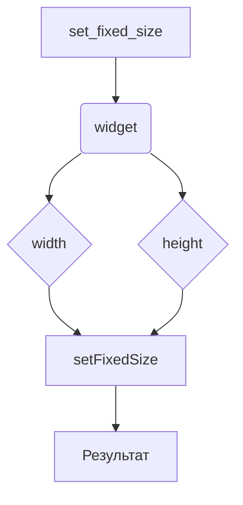

# <input code>

```python
## \file hypotez/src/suppliers/aliexpress/gui/styles.py
# -*- coding: utf-8 -*-\

#! venv/bin/python/python3.12

"""
.. module:: src.suppliers.aliexpress.gui 
	:platform: Windows, Unix
	:synopsis:

"""


""" Common styling functions for UI elements """

from PyQt6 import QtWidgets

def set_fixed_size(widget: QtWidgets.QWidget, width: int, height: int):
    """ Set a fixed size for a given widget """
    widget.setFixedSize(width, height)
```

# <algorithm>

**Алгоритм работы функции set_fixed_size:**

1. **Ввод:** Функция принимает в качестве аргументов `widget` (объект типа `QtWidgets.QWidget`), `width` (целое число - ширина) и `height` (целое число - высота).

2. **Обработка:**  Функция использует метод `setFixedSize` объекта `widget`, чтобы установить его размер на заданные `width` и `height`.

3. **Возврат:** Функция не возвращает никакого значения (None).


**Пример:**

Предположим, у нас есть объект `my_widget` типа `QtWidgets.QPushButton`.  Вызов функции `set_fixed_size(my_widget, 100, 50)` установит размер `my_widget` на 100 пикселей по ширине и 50 пикселей по высоте.


# <mermaid>



**Объяснение диаграммы:**

Функция `set_fixed_size` получает на вход объект `widget` и значения `width` и `height`.  Эти значения передаются методу `setFixedSize` объекта `widget`, который изменяет его размер.  В результате функция не возвращает никаких значений.


# <explanation>

**Импорты:**

- `from PyQt6 import QtWidgets`: Этот импорт необходим для работы с виджетами PyQt6.  `PyQt6` - это библиотека для создания графического интерфейса пользователя в Python, используемая, вероятно, для создания пользовательских интерфейсов в проекте `hypotez`. Модуль `QtWidgets` предоставляет классы для создания и управления виджетами (кнопки, поля ввода и т.д.). Связь с другими частями проекта:  `PyQt6` - это внешняя библиотека, используемая во многих приложениях, а `QtWidgets` - ее подмодуль, который используется внутри проекта.


**Классы:**

- `QtWidgets.QWidget`: Это базовый класс для всех виджетов в PyQt6.  В данном коде он используется как тип аргумента функции, означая, что функция `set_fixed_size` может работать с любым объектом, который наследует от `QtWidgets.QWidget`.


**Функции:**

- `set_fixed_size(widget: QtWidgets.QWidget, width: int, height: int)`: Эта функция устанавливает фиксированный размер указанному виджету.
    - **Аргументы:**
        - `widget`: Объект типа `QtWidgets.QWidget`, для которого необходимо установить размер.
        - `width`: Целое число, представляющее ширину.
        - `height`: Целое число, представляющее высоту.
    - **Возвращаемое значение:**  `None` (функция ничего не возвращает).
    - **Пример использования:** `set_fixed_size(my_button, 100, 50)`  - устанавливает размер кнопки `my_button` на 100x50 пикселей.


**Переменные:**

- ``:  Это константа, вероятно, определяющая режим работы приложения (например, "dev" - для разработки, "prod" - для производства).  Значение не используется внутри этой функции, но может использоваться в других частях проекта.


**Возможные ошибки и улучшения:**

- **Проверка типов:**  Проверка того, что `width` и `height` являются положительными целыми числами, могла бы улучшить устойчивость кода.
- **Документация:** Добавление более подробной документации к функции (например, примеров использования) могло бы упростить ее понимание.
- **Обработка исключений:**  В идеале функция должна обрабатывать потенциальные ошибки, например, если `widget` является None или не поддерживает `setFixedSize`.

**Взаимосвязь с другими частями проекта:**

Функция `set_fixed_size` предназначена для использования в других частях проекта `hypotez`, где создаются и настраиваются пользовательские интерфейсы. Скорее всего, эта функция вызывается из функций или методов, отвечающих за построение и оформление элементов графического интерфейса (например, для кнопок, текстовых полей и т. д.).