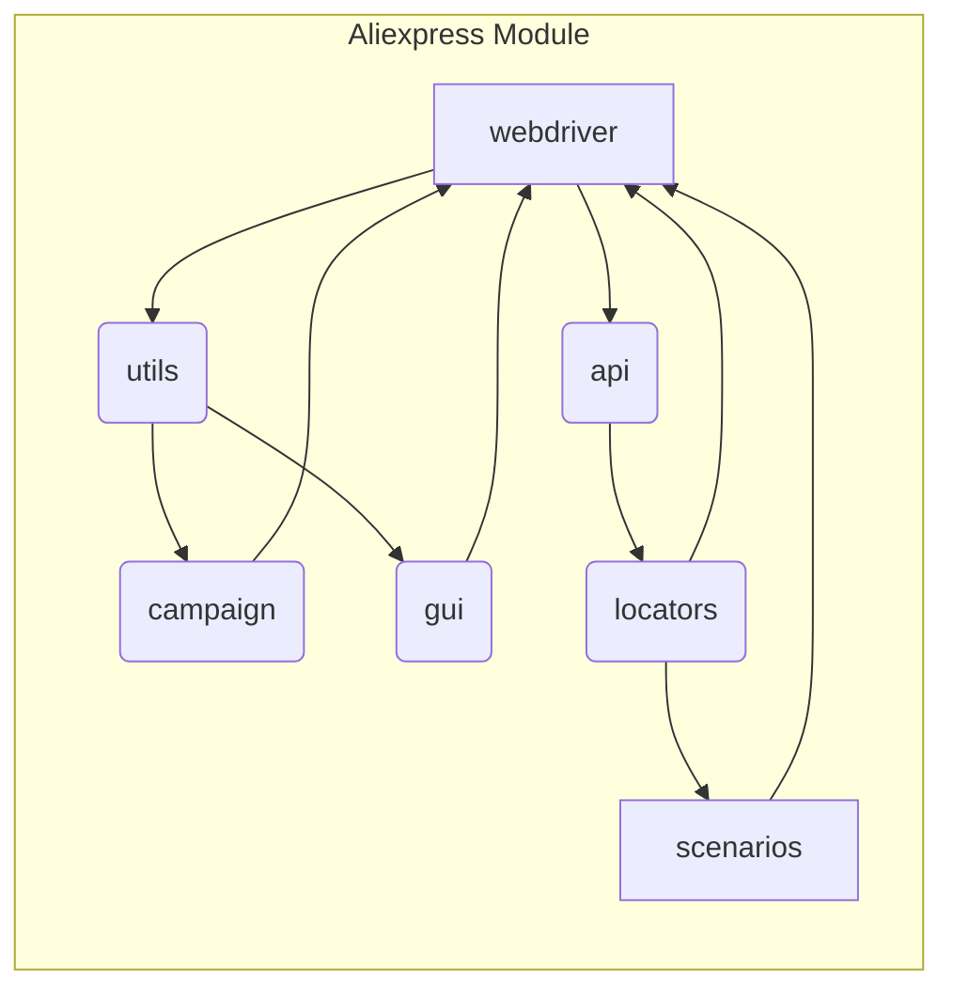

# <input code>

```
# Aliexpress
## Module for interactions with the supplier `aliexpress.com`

This module provides access to supplier data via the `HTTPS` (webdriver) and `API` protocols.

**webdriver**
- Direct access to the product's `html` pages via `Driver`. It allows executing data collection scripts, including navigating through categories.

**api**
- Used to obtain `affiliate links` and brief product descriptions.

## Internal Modules:
### `utils`
Contains helper functions and utility classes for performing common operations in the AliExpress integration. It likely includes tools for data formatting, error handling, logging, and other tasks that simplify interaction with the AliExpress ecosystem.

---

### `api`
Provides methods and classes for direct interaction with the AliExpress API. Likely includes functionality for sending requests, processing responses, and managing authentication, simplifying interaction with the API for retrieving or sending data.

---

### `campaign`
Designed for managing marketing campaigns on AliExpress. It likely includes tools for creating, updating, and tracking campaigns, as well as methods for analyzing their effectiveness and optimizing based on provided metrics.

---

### `gui`
Provides graphical user interface elements for interacting with AliExpress functionality. It likely includes implementations of forms, dialogs, and other visual components that allow users to more intuitively manage AliExpress operations.

---

### `locators`
Contains definitions for locating elements on AliExpress web pages. These locators are used in conjunction with WebDriver tools to perform automated interactions, such as data collection or executing actions on the AliExpress platform.

---

### `scenarios`
Defines complex scenarios or sequences of actions for interacting with AliExpress. It likely includes combinations of tasks (e.g., API requests, GUI interactions, and data processing) as part of larger operations, such as product synchronization, order management, or campaign execution.
```

# <algorithm>

No specific algorithm can be determined from the provided code.  This is a description of the module, not code implementing any particular logic.  It describes the components and their general purpose.  A step-by-step algorithm would need the actual code for those components.


# <mermaid>



# <explanation>

The provided text describes a module (`aliexpress`) designed for interacting with the AliExpress website and API. It doesn't contain any code, just a high-level overview.  It's a module design document rather than executable code.

* **Purpose:** The module aims to provide various ways to interact with AliExpress, encompassing web scraping using webdriver, API calls for data retrieval, campaign management, GUI interaction (presumably for user interfaces), locator definitions for web elements, and complex scenarios combining these tasks.

* **Modules:** The `utils`, `api`, `campaign`, `gui`, `locators`, and `scenarios` components are all parts of this module. They are likely submodules, classes, or files that each handle specific tasks relevant to AliExpress interactions.
    * **utils:** Contains general-purpose functions and classes for the project.
    * **api:** Dedicated to interacting with the AliExpress API.
    * **campaign:** Designed to manage marketing campaigns.
    * **gui:** Facilitates interactions through a GUI.
    * **locators:** Stores selectors for web page elements.
    * **scenarios:** Structures complex tasks for interaction.

* **Dependencies (implicit):** The `aliexpress` module depends on a web driver library (likely Selenium), API libraries for making requests, and potentially a GUI framework for the `gui` module.  There's also likely a dependency on the `locators` module to make use of the selectors within the other components, especially the `webdriver` part. The `utils` module likely provides functions related to logging, error handling, data manipulation, and so on, which will be shared amongst all components.

* **Missing Information:** The `README` file is not executable code. It describes the structure of the component and its functionality, but lacks the actual code implementations for each component or function.  No specific variables, classes, or data structures are defined.

* **Possible Improvements:**  A more detailed `README` could include example usage within the `scenarios` part, showing how the components interact to achieve a specific task, such as retrieving a product and adding it to a campaign.


**Relationships with other parts of the project (implied):**

The `aliexpress` module would likely be used within a larger project that manages e-commerce data or marketing campaigns.  The `utils`, `api`, `campaign`, and `gui` modules would need to interact with each other within the larger system to perform specific tasks.  `locators` and `scenarios` would likely be part of the `aliexpress` module itself, or some larger package,  defined in some higher-level module to define the overall project architecture.