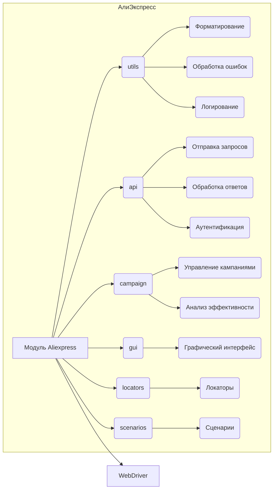

```MD
# Анализ кода модуля Aliexpress

## 1. <input code>

```
# Aliexpress
## Модуль для  интеракций с поставщиком `aliexpress.com`

Модуль педоставляет доступ к данным поставщика по протоколам `HTTPS` (webdriver) и `API`  

**webdriver**
 - Прямой доступ к `html` страницам  товара через `Driver` . Позволяет исполнять сценарии сбора информации включая
переход по категориям.

**api**
 - Используется для получения `affiliate link` и кратких характеристик товара. 


## Внутернние модули:
 ### `utils`   
содержит вспомогательные функции и утилитарные классы для выполнения общих операций в интеграции с AliExpress. Вероятно, включает инструменты для форматирования данных, обработки ошибок, логирования и других задач, которые упрощают взаимодействие с экосистемой AliExpress.

---

### `api`    
предоставляет методы и классы для прямого взаимодействия с API AliExpress. Вероятно, включает функциональность для отправки запросов, обработки ответов и управления аутентификацией, упрощая взаимодействие с API для получения или отправки данных.

---

### `campaign`    
предназначен для управления маркетинговыми кампаниями на AliExpress. Вероятно, включает инструменты для создания, обновления и отслеживания кампаний, а также методы для анализа их эффективности и оптимизации на основе предоставленных метрик.

---

### `gui`    
предоставляет графические элементы пользовательского интерфейса для взаимодействия с функциональностью AliExpress. Вероятно, включает реализации форм, диалогов и других визуальных компонентов, которые позволяют пользователям более интуитивно управлять операциями AliExpress.

---

### `locators`    
содержит определения для поиска элементов на веб-страницах AliExpress. Эти локаторы используются вместе с инструментами WebDriver для выполнения автоматизированных взаимодействий, таких как сбор данных или выполнение действий на платформе AliExpress.

---

### `scenarios`    
определяет сложные сценарии или последовательности действий для взаимодействия с AliExpress. Вероятно, включает комбинацию задач (например, API-запросов, взаимодействий с GUI и обработки данных) в рамках более крупных операций, таких как синхронизация товаров, управление заказами или выполнение кампаний.
```

## 2. <algorithm>

(Блок-схема отсутствует, так как код представляет собой описание, а не код программы)

## 3. <mermaid>



## 4. <explanation>

**Описание:**

Данный текст описывает модуль `Aliexpress` для взаимодействия с веб-сайтом AliExpress. Он структурирован и разделен на функциональные части, которые отвечают за различные аспекты интеграции.

**Импорты:**

Список импортов отсутствует, так как это описание, а не код.  В реальном коде присутствовали бы импорты, указывающие на взаимодействие с другими модулями проекта (`src.utils`, `src.api`, `src.campaign` и т.д.).

**Классы:**

Текст описывает вероятную структуру классов, но не содержит их реализации. Классы (`utils`, `api`, `campaign`, `gui`, `locators`, `scenarios`) скорее всего отвечают за выполнение определенных задач.


**Функции:**

Описание функций также отсутствует. В реальном коде были бы реализованы функции для взаимодействия с API, управления WebDriver и т.д.


**Переменные:**

Тип переменных в реальном коде определен в зависимости от данных, которые они хранят.

**Возможные ошибки и улучшения:**

* Отсутствие кода затрудняет более детальный анализ и выявление потенциальных проблем.
* Для конкретизации необходимо изучить реализацию.

**Взаимосвязь с другими частями проекта:**

Текст указывает на взаимосвязь с другими модулями, такими как `utils`, `api`, `campaign`, `gui`, `locators` и `scenarios`.


**Заключение:**

Данный документ описывает архитектуру модуля для взаимодействия с AliExpress, но не содержит подробной информации о реализации. Для более глубокого анализа необходимо просмотреть исходный код.