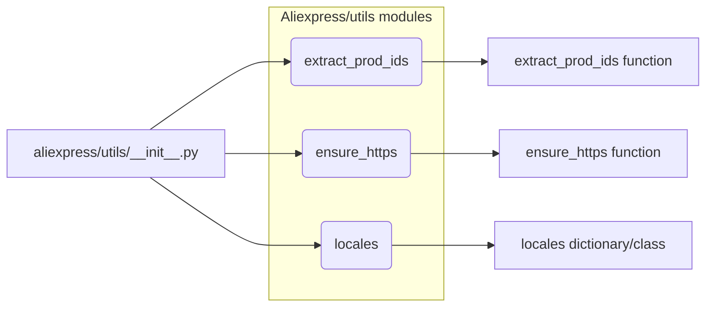

# <input code>

```python
## \file hypotez/src/suppliers/aliexpress/utils/__init__.py
# -*- coding: utf-8 -*-

#! venv/bin/python/python3.12

"""
.. module:: src.suppliers.aliexpress.utils 
	:platform: Windows, Unix
	:synopsis:

"""


from .extract_product_id import extract_prod_ids
from .ensure_https import ensure_https
from .locales import locales
```

# <algorithm>

Этот код представляет собой инициализационный файл для модуля `aliexpress.utils`.  Он импортирует функции и классы из других файлов в подпапке `aliexpress.utils`, делая их доступными в других частях проекта.  В данном случае это:

1. `extract_prod_ids`: вероятно, функция для извлечения идентификаторов продуктов с сайта AliExpress.
2. `ensure_https`: функция, которая преобразует URL-адреса в HTTPS, если необходимо.
3. `locales`: вероятно, содержит информацию о локалях или языках.


Пошаговая блок-схема:

1. **Импорт:** Модуль `__init__.py` импортирует функции и классы из подмодулей.  В процессе выполнения скрипта Python траектория поиска импортов проходит по файловой системе.
2. **Инициализация:** Переменная `MODE` задает режим работы (в данном примере, 'dev'). Этот параметр может использоваться в других модулях для определения поведения приложения.
3. **Доступность:**  Импортированные функции и классы становятся доступными для использования другими модулями через этот модуль `__init__.py`.


# <mermaid>



**Объяснение диаграммы:**

*   `aliexpress/utils/__init__.py` - главный модуль, который импортирует другие модули.
*   `extract_prod_ids`, `ensure_https` и `locales` - это подмодули (файлы), содержащие функции или классы. Стрелки обозначают зависимость: `__init__.py` использует эти подмодули.  
*   Стрелки в виде `-->` показывают направленность импорта.


# <explanation>

* **Импорты:**
    * `from .extract_product_id import extract_prod_ids`: Импортирует функцию `extract_prod_ids` из модуля `extract_product_id` в текущей подпапке (`aliexpress/utils`). Это позволяет использовать эту функцию в других модулях этого пакета.
    * `from .ensure_https import ensure_https`: Импортирует функцию `ensure_https` из модуля `ensure_https` в текущей подпапке. Вероятно, отвечает за проверку и преобразование URL-адресов в HTTPS.
    * `from .locales import locales`: Импортирует переменную (вероятно, словарь или объект) `locales` из модуля `locales`. Скорее всего, эта переменная содержит данные о локалях (языках) для сайта AliExpress.

* **Классы:** Нет явных определений классов в данном коде.

* **Функции:**
    * `extract_prod_ids`: Скорее всего, эта функция принимает данные (например, HTML-код страницы) и извлекает из них идентификаторы продуктов.
    * `ensure_https`: Вероятно, эта функция принимает URL-адрес и, если он не начинается с `https`, добавляет префикс `https` для обеспечения безопасного доступа.
    * Подробности о функциях `extract_prod_ids`, `ensure_https` и `locales` не могут быть определены без просмотра соответствующих модулей.

* **Переменные:**
    * `MODE`: Строковая переменная, вероятно, содержащая строку, указывающую режим работы приложения ('dev').  Это позволяет конфигурировать поведение программы.

* **Возможные ошибки или области для улучшений:**
    * Отсутствует явное описание типов данных (`extract_prod_ids`, `ensure_https`).
    * Отсутствует документация для функций и переменных (`extract_prod_ids`, `ensure_https`, `MODE`, `locales`).  Необходимы строковые комментарии, описывающие аргументы, возвращаемые значения и назначение.
    * Непонятно, как данные передаются между функциями. Это ключевой момент для понимания архитектуры.  Без кода функций трудно предсказать дальнейшие шаги.
    * Недостаточно информации для анализа связей с другими частями проекта.


**Цепочка взаимосвязей:**

`aliexpress/utils/__init__.py` предоставляет доступ к функциям `extract_prod_ids`, `ensure_https` и `locales` для других модулей в проекте, особенно в модулях, которые обрабатывают данные с AliExpress.  Например, модули, отвечающие за парсинг, сбор данных или визуализацию, могут импортировать и использовать эти функции.