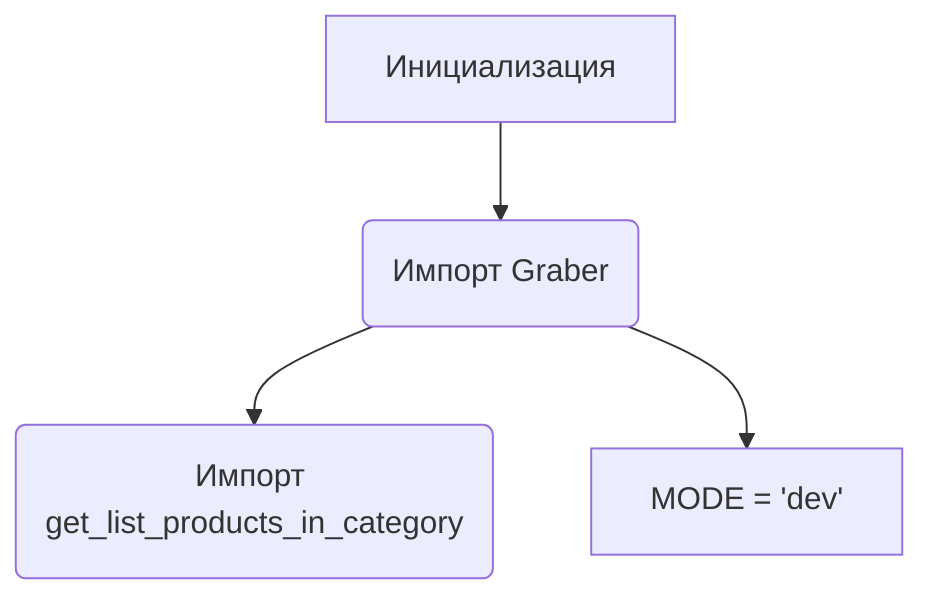
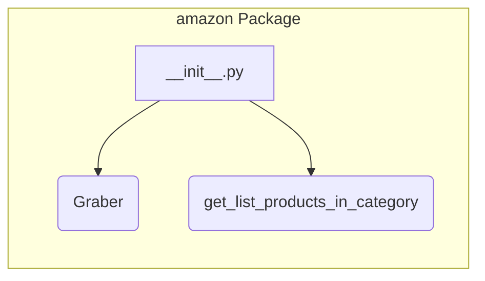

# <input code>

```python
## \file hypotez/src/suppliers/amazon/__init__.py
# -*- coding: utf-8 -*-\
#! venv/Scripts/python.exe
#! venv/bin/python/python3.12

"""
.. module:: src.suppliers.amazon 
	:platform: Windows, Unix
	:synopsis:

"""
MODE = 'dev'

from .graber import Graber
from .scenario import get_list_products_in_category
```

# <algorithm>

Этот код представляет собой инициализационный модуль для пакета `amazon` в подпакете `suppliers` проекта `hypotez`.  Он импортирует необходимые классы и функции из других модулей внутри пакета.  Блок-схема проста:



Пример: При запуске программы, этот файл будет импортирован, и в переменной `MODE` будет храниться значение 'dev'.  Функции `Graber` и `get_list_products_in_category` будут доступны для использования в других частях проекта.


# <mermaid>



Описание диаграммы:
- Вложенный блок `amazon Package`  показывает, что `__init__.py` управляет импортом из других файлов в этом пакете.
- `Graber` и `get_list_products_in_category` - это модули, которые содержат классы или функции, связанные с сбором данных с Amazon и обработкой результатов соответственно.


# <explanation>

* **Импорты:**
    - `from .graber import Graber`: Импортирует класс `Graber` из модуля `graber.py` внутри пакета `amazon`. Это указывает на возможность работы с данными Amazon, вероятно, для получения и обработки информации о продуктах.  Связь: `src.suppliers.amazon.graber`
    - `from .scenario import get_list_products_in_category`: Импортирует функцию `get_list_products_in_category` из модуля `scenario.py` внутри пакета `amazon`. Эта функция, вероятно, отвечает за получение списка продуктов из определенной категории на Amazon. Связь: `src.suppliers.amazon.scenario`.
* **Классы:**
    - `Graber`: Этот класс, вероятно, содержит методы для взаимодействия с API Amazon.  Нет конкретной информации о его реализации.  Без доступа к `graber.py` нельзя сказать наверняка.

* **Функции:**
    - `get_list_products_in_category`: Эта функция, предположительно, принимает параметры для указания категории и возвращает список продуктов, соответствующих этой категории.  Дополнительные детали требуют просмотра исходного кода `scenario.py`.

* **Переменные:**
    - `MODE = 'dev'`: Эта переменная, вероятно, определяет режим работы программы (например, 'dev' для разработки, 'prod' для производства).  Назначение переменной зависит от контекста остального проекта.

* **Возможные ошибки или области для улучшений:**
    - Нет информации о проверке корректности данных, которые могут возвращаться из вызовов API, что может привести к исключениям и проблемам в работе.
    - Код не содержит логики, отвечающей за обработку ошибок.  Проверка результатов работы API очень важна.
    - Необходимо пояснить, что подразумевает `scenario.py` (логику получения данных).


**Цепочка взаимосвязей:**

Модуль `__init__.py` в пакете `amazon` служит входом для использования функций и классов, связанных с Amazon, в других частях проекта `hypotez`.  Это означает, что другие модули в `hypotez`, вероятно, импортируют `Graber` и `get_list_products_in_category` из этого файла.  Без доступа к остальному коду `hypotez` детали взаимодействия с другими частями проекта пока не ясны.

**Дополнительные комментарии:**

Файл `__init__.py` в Python является ключевым для управления пакетами.  Он определяет, какие модули доступны при импорте пакета. Правильная структура файлов  (`__init__.py` вложенных пакетов) крайне важна для структуры проекта.