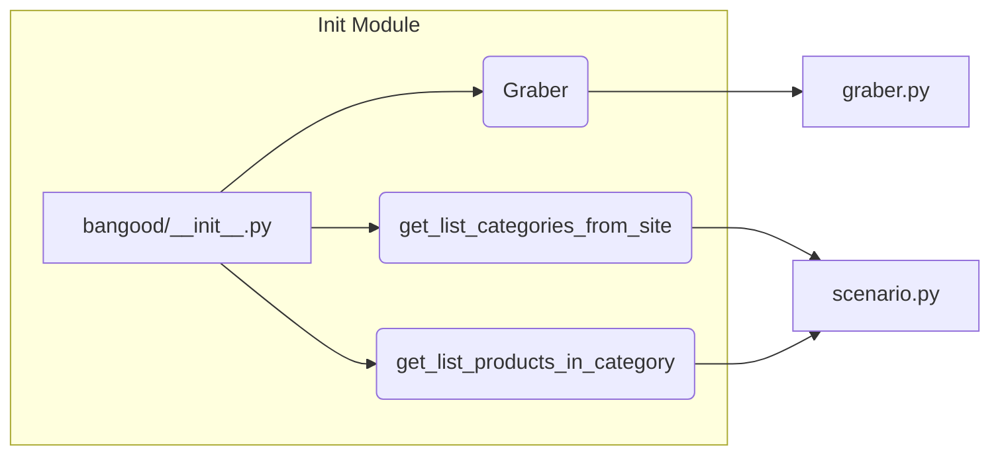

```MD
# <input code>

```python
## \file hypotez/src/suppliers/bangood/__init__.py
# -*- coding: utf-8 -*-\

#! venv/bin/python/python3.12

"""
.. module:: src.suppliers.bangood 
	:platform: Windows, Unix
	:synopsis:

"""


from .graber import Graber
from .scenario import get_list_categories_from_site, get_list_products_in_category
```

# <algorithm>

Этот код является инициализационным модулем для подсистемы, отвечающей за взаимодействие с сайтом Bangood. Он импортирует необходимые классы и функции из других модулей внутри пакета `src.suppliers.bangood`.  Пошаговой блок-схемы здесь нет, так как код лишь импортирует, а не выполняет какие-либо действия.


# <mermaid>



# <explanation>

* **Импорты**:
    * `from .graber import Graber`: Импортирует класс `Graber` из модуля `graber.py` в текущем пакете (`src.suppliers.bangood`).  `Graber` предположительно отвечает за получение данных с сайта Bangood.  `.` указывает на поиск в подпапках.
    * `from .scenario import get_list_categories_from_site, get_list_products_in_category`: Импортирует функции `get_list_categories_from_site` и `get_list_products_in_category` из модуля `scenario.py` в текущем пакете. Эти функции, скорее всего, реализуют логику получения списков категорий и продуктов с Bangood.
* **Переменные**:
    * ``:  Переменная, вероятно, определяет режим работы (например, `dev`, `prod`).  Это конфигурационная переменная, её значение может быть использовано в других частях кода для настройки поведения.
* **Классы**:
    * `Graber`:  Класс, реализующий взаимодействие с сайтом Bangood (например, парсинг, отправку запросов).  Подробности реализации скрыты в `graber.py`.
* **Функции**:
    * `get_list_categories_from_site`:  Получает список категорий с сайта Bangood.
    * `get_list_products_in_category`: Получает список продуктов в заданной категории с сайта Bangood.
* **Структура пакета**:
    Этот код находится в файле `hypotez/src/suppliers/bangood/__init__.py`. Это стандартный подход для организации Python-проектов, где `__init__.py` файлы используются для инициализации пакетов.  `hypotez/src/suppliers/bangood/` - это подпапка внутри проекта, содержащая код для взаимодействия с поставщиком Bangood.  `graber.py` и `scenario.py` находятся внутри этой подпапки и содержат классы и функции для работы с конкретными задачами.

**Возможные ошибки и улучшения**:

* Отсутствует явное описание возвращаемых типов для функций. Для повышения читабельности и удобства использования рекомендуется указывать типы возвращаемых значений.
* Отсутствие обработки ошибок.  В реальной программе необходимо добавить обработку исключений (например, `try...except`) для ситуаций, когда запрос к сайту Bangood не удается или возвращает неверные данные.
* В `graber.py` и `scenario.py` должны быть описания API методов и функций, чтобы было понятно, что они принимают, что возвращают и как их использовать.
* Необходимо проанализировать код, чтобы понять, как данные перемещаются между `Graber` и функциями `get_list_categories_from_site`, `get_list_products_in_category`.  Отсутствует описание алгоритма, который выполняют эти функции.

**Цепочка взаимосвязей**:

Этот модуль является частью более крупной системы,  вероятно, для сбора данных о товарах из разных поставщиков. Код из `graber.py` и `scenario.py` будет использоваться другими частями проекта для извлечения и обработки данных о продуктах с Bangood.  Следующий этап может включать в себя обработку полученных данных, их хранение и использование в бизнес-логике проекта (например, в рекомендательных системах, администрировании товара и т.п.).