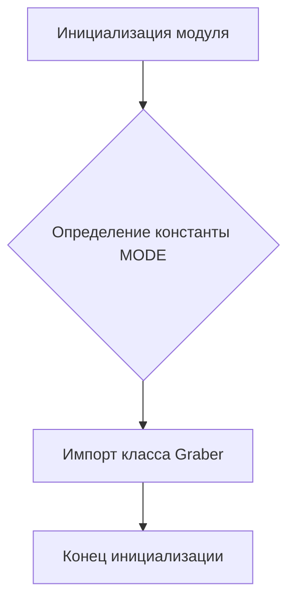

```MD
# <input code>

```python
## \file hypotez/src/suppliers/cdata/__init__.py
# -*- coding: utf-8 -*-
#! venv/Scripts/python.exe
#! venv/bin/python/python3.12

"""
.. module:: src.suppliers.cdata 
	:platform: Windows, Unix
	:synopsis:

"""


from .graber import Graber
```

# <algorithm>

Этот код представляет собой инициализирующий модуль для пакета `cdata` в проекте `hypotez`.  Он определяет константу `MODE` и импортирует класс `Graber` из модуля `graber`.  Блок-схема очень простая:



В этом примере нет сложной логики.  `MODE` – это константа, хранящая строку 'dev'.  Импорт `Graber` позволяет другим частям проекта использовать этот класс.

# <mermaid>

```mermaid
graph LR
    subgraph Модуль cdata
        A[cdata/__init__.py] --> B();
        A --> C[from .graber import Graber];
    end
    subgraph Модуль graber
        D[graber.py] -- содержит класс Graber;
    end
```

**Объяснение диаграммы:**

Диаграмма иллюстрирует структуру модулей. `cdata/__init__.py` импортирует `Graber` из `graber.py`.  Никаких зависимостей от внешних библиотек не видно.

# <explanation>

* **Импорты:**
    `from .graber import Graber`: Этот импорт подключает класс `Graber` из подмодуля `graber` в том же каталоге.  Символ `.` указывает на поиск в текущем пакете. Это типичный способ организации кода, где логически связанные классы и функции группируются в отдельных файлах, но при этом все они доступны в рамках одного пакета.

* **Классы:**
    `Graber`: Этот класс (определённый в `graber.py`) – центральная часть, видимо, отвечающая за сбор данных (grabbing).  Подробности о его структуре (атрибутах и методах) неизвестны, так как сам класс здесь не определен.  Мы знаем лишь, что он доступен для использования в `cdata`.  Для полноценного анализа необходимо ознакомиться с `graber.py`.


* **Функции:**
    В `__init__.py` нет функций.

* **Переменные:**
    ``: Это константа, скорее всего, используемая для определения режима работы программы (например, "development" или "production").  Значение этой константы может влиять на поведение других частей приложения.


* **Возможные ошибки или области для улучшений:**
    - Не хватает комментариев, поясняющих назначение константы `MODE`.
    - Необходимо определить `__all__` в `__init__.py` для того, чтобы импортировать только нужные компоненты.

* **Взаимосвязи с другими частями проекта:**
    Код предполагает существование модуля `graber.py` в подпапке `cdata` и, возможно, других модулей, которые будут использовать класс `Graber` из `graber.py`.  Для полноценной картины взаимосвязей необходимо рассмотреть код других модулей.  Вероятно, код, использующий  `cdata` и `Graber`, находится в других файлах проекта (например, в `hypotez/src/main.py`).