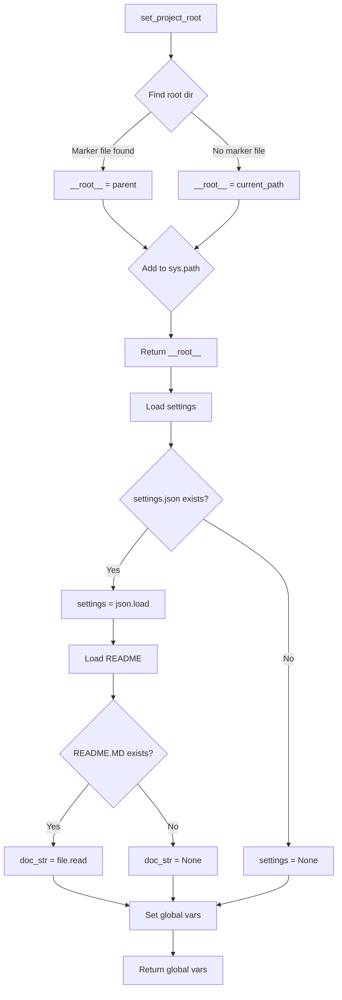

# <input code>

```python
## \file hypotez/src/suppliers/cdata/header.py
# -*- coding: utf-8 -*-\
#! venv/Scripts/python.exe
#! venv/bin/python/python3.12

"""
.. module:: src.suppliers.cdata 
	:platform: Windows, Unix
	:synopsis:

"""
MODE = 'dev'


import sys
import json
from packaging.version import Version

from pathlib import Path
def set_project_root(marker_files=('__root__')) -> Path:
    """
    Finds the root directory of the project starting from the current file's directory,
    searching upwards and stopping at the first directory containing any of the marker files.

    Args:
        marker_files (tuple): Filenames or directory names to identify the project root.
    
    Returns:
        Path: Path to the root directory if found, otherwise the directory where the script is located.
    """
    __root__:Path
    current_path:Path = Path(__file__).resolve().parent
    __root__ = current_path
    for parent in [current_path] + list(current_path.parents):
        if any((parent / marker).exists() for marker in marker_files):
            __root__ = parent
            break
    if __root__ not in sys.path:
        sys.path.insert(0, str(__root__))
    return __root__


# Get the root directory of the project
__root__ = set_project_root()
"""__root__ (Path): Path to the root directory of the project"""

from src import gs

settings:dict = None
try:
    with open(gs.path.root / 'src' / 'settings.json', 'r') as settings_file:
        settings = json.load(settings_file)
except (FileNotFoundError, json.JSONDecodeError):
    ...

doc_str:str = None
try:
    with open(gs.path.root / 'src' / 'README.MD', 'r') as settings_file:
        doc_str = settings_file.read()
except (FileNotFoundError, json.JSONDecodeError):
    ...


__project_name__ = settings.get("project_name", 'hypotez') if settings  else 'hypotez'
__version__: str = settings.get("version", '')  if settings  else ''
__doc__: str = doc_str if doc_str else ''
__details__: str = ''
__author__: str = settings.get("author", '')  if settings  else ''
__copyright__: str = settings.get("copyrihgnt", '')  if settings  else ''
__cofee__: str = settings.get("cofee", "Treat the developer to a cup of coffee for boosting enthusiasm in development: https://boosty.to/hypo69")  if settings  else "Treat the developer to a cup of coffee for boosting enthusiasm in development: https://boosty.to/hypo69"
```

# <algorithm>

**Шаг 1:**  `set_project_root()` определяет корневой каталог проекта.
* **Вход:** Кортеж `marker_files` с именами файлов/каталогов, указывающих на корень.
* **Обработка:** Начиная с текущего каталога, функция рекурсивно проверяет родительские каталоги, пока не найдет каталог, содержащий хотя бы один из файлов/каталогов из `marker_files`.
* **Выход:** Путь к корневому каталогу проекта (`Path`) или текущему каталогу, если корень не найден.  **Пример:** `marker_files` - ('pyproject.toml', 'requirements.txt'), текущий каталог - `/path/to/project/src/suppliers/cdata`, корневой каталог - `/path/to/project`.
**Шаг 2:**  Корневой каталог `__root__` добавляется в `sys.path`.
**Шаг 3:** `settings` и `doc_str` загружаются из файлов `settings.json` и `README.MD` соответственно, расположенных в корневом каталоге `src`.
* **Вход:** Путь к файлам.
* **Обработка:**  Если файлы найдены, их содержимое загружается с помощью `json.load` (для `settings`) или `file.read` (для `doc_str`).  Если файлы не найдены, происходит обработка исключений.
* **Выход:** Загруженные данные.  **Пример:** `settings` - словарь с настройками проекта.  `doc_str` - строка с содержанием файла `README.MD`.
**Шаг 4:**  Данные из `settings` (если `settings` не пустой) используются для заполнения глобальных переменных `__project_name__`, `__version__`, `__author__`, `__copyright__`, `__cofee__`.
**Шаг 5:** Если `doc_str` не пуст, он записывается в `__doc__`.  
**Шаг 6:**  Глобальные переменные представляют собой конфигурационные параметры проекта.


# <mermaid>



**Объяснение диаграммы:**

* `set_project_root` ищет корень проекта.
* `Load settings`, `Load README` --  загружает настройки проекта и README, если файлы найдены.
* `Set global vars` -- заполняет глобальные переменные (`__project_name__`, etc.).  Возвращает глобальные переменные из `settings`.
* В случае ошибок `FileNotFoundError`, `json.JSONDecodeError`  возвращает значение по умолчанию.


# <explanation>

**Импорты:**
* `sys`: Используется для управления путем поиска модулей (`sys.path`).
* `json`:  Для работы с JSON-файлами (`settings.json`).
* `packaging.version`: (Возможно) для работы с версиями пакетов (хотя в данном примере не используется напрямую).
* `pathlib`: Обеспечивает объектно-ориентированный способ работы с файловыми путями (`Path`).
* `src.gs`: Модуль, который используется для получения доступа к корневому каталогу проекта.  Связь неясна без контекста `src.gs` (необходимо посмотреть код `src/gs.py`).

**Классы:**
Код не содержит классов.

**Функции:**
* `set_project_root(marker_files)`: Находит корневой каталог проекта, используя список `marker_files` для определения корня. Аргументы: кортеж `marker_files` с файлами/директориями для поиска. Возвращает: `Path` к корневому каталогу проекта или текущему каталогу, если корень не найден. Важно, что функция изменяет `sys.path`, добавляя найденный путь в начало списка.


**Переменные:**
* `MODE`, `__root__`, `settings`, `doc_str`, `__project_name__`, `__version__`, `__doc__`, `__details__`, `__author__`, `__copyright__`, `__cofee__`: Глобальные переменные, хранящие информацию о проекте.  `__root__` представляет собой путь к корневому каталогу проекта, `settings` -- словарь с настройками,  `doc_str` -- содержимое файла `README.MD` и т.д.


**Возможные ошибки и улучшения:**

* **Обработка ошибок:**  Обработка исключений `FileNotFoundError` и `json.JSONDecodeError` является хорошей практикой, но стоит дополнить проверку на `TypeError` для `json.load` в случае некорректного JSON.
* **Документация:** Добавьте более подробные комментарии к коду. Особенно важны комментарии для каждого блока `try-except`.
* **Типизация:** Используйте аннотации типов (`-> Path`) для всех функций и переменных, которые возвращают/получают значения, чтобы сделать код более читаемым и понятным.
* **Уровень логирования:** Можно использовать логирование (например, `logging`) для более подробного отслеживания выполнения кода.
* **Изменчивость `sys.path`:**  Добавление в `sys.path` может приводить к проблемам, если скрипт используется в более сложных средах, где доступ к `sys.path` могут иметь другие части кода. Рассмотрите альтернативные методы поиска модулей, такие как использование `importlib` или `importlib.util`.


**Взаимосвязи с другими частями проекта:**

Код зависит от `src.gs` (для получения пути к корневому каталогу), `settings.json` (для получения настроек) и `README.MD` (для получения описания).  Чтобы полностью понять взаимосвязи, необходимо изучить код `src.gs`.