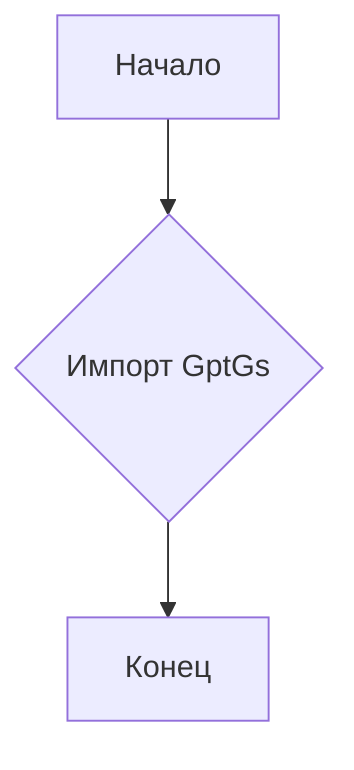
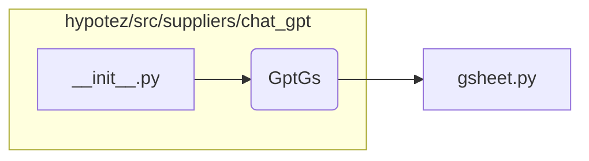

# <input code>

```python
## \file hypotez/src/suppliers/chat_gpt/__init__.py
# -*- coding: utf-8 -*-

#! venv/bin/python/python3.12

"""
.. module:: src.suppliers.chat_gpt 
	:platform: Windows, Unix
	:synopsis:

"""


from .gsheet import GptGs
```

# <algorithm>



Пример:
Этот код выполняется, когда импортируется модуль `chat_gpt`. В нём задаётся переменная `MODE` со значением 'dev'.  Затем импортируется класс `GptGs` из подмодуля `gsheet`.  После выполнения этих действий, код завершается.


# <mermaid>



**Описание зависимостей:**

Модуль `__init__.py` в директории `hypotez/src/suppliers/chat_gpt` импортирует класс `GptGs` из модуля `gsheet.py`, который расположен в том же подкаталоге.  Это стандартный подход для структурирования Python-проектов, где модули вложены друг в друга и имеют взаимозависимости.  Связь происходит внутри одной папки `chat_gpt`.


# <explanation>

* **Импорты**:
   - `from .gsheet import GptGs`:  Этот импорт подключает класс `GptGs` из модуля `gsheet.py`, который находится в той же директории (`./gsheet.py`).  Символ `.` указывает на поиск файла в текущем подмодуле.  Это типичная практика для организации кода в Python.  Эта зависимость показывает, что код в `__init__.py` использует функциональность, определённую в `gsheet.py`.

* **Классы**:
   - `GptGs`:  Этот класс определён в файле `gsheet.py` и, судя по имени, связан с обработкой данных Google Sheets, которые используются для взаимодействия с чат-ботом GPT.  Информация о нём  неизвестна без просмотра `gsheet.py`.

* **Функции**:
   -  Нет функций.  Этот код  содержит только переменную и импорт.

* **Переменные**:
   - ``: Это переменная, которая, вероятно, используется для настройки режима работы (например, для разработки, тестирования или производства). Это довольно типичная практика в программном обеспечении для разных режимов работы.

* **Возможные ошибки или области для улучшений**:
   - Отсутствие документации для переменной `MODE`.  Стоит добавить комментарий, описывающий назначение этой переменной.
   - Недостаточно информации о классе `GptGs`. Без анализа кода `gsheet.py` невозможно дать подробное описание.
   - Нет информации о взаимодействии с другими частями проекта.


**Взаимосвязи с другими частями проекта:**

Модуль `chat_gpt`  (конкретно, класс `GptGs`) скорее всего взаимодействует с другими частями проекта, которые отвечают за инициализацию, использование и контроль над API чат-бота GPT.  Вероятно, это `hypotez/src/suppliers/__init__.py`,  или какие-то другие файлы, в которых происходит вызов `GptGs`.  Без дополнительного контекста (других файлов) сложно определить точный характер этой связи.   Влияние `MODE` ощутится во взаимодействии с другими частями проекта, которые будут его учитывать в своей логике.