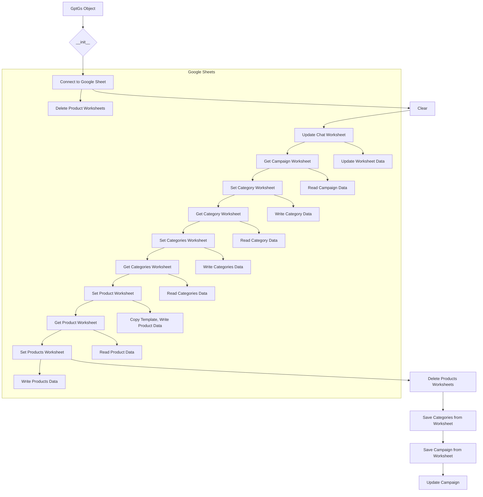

```MD
# <input code>

```python
## \file hypotez/src/suppliers/chat_gpt/gsheet.py
# -*- coding: utf-8 -*-\
#! venv/Scripts/python.exe
#! venv/bin/python/python3.12

"""
.. module:: src.suppliers.chat_gpt 
	:platform: Windows, Unix
	:synopsis:

"""
MODE = 'dev'


"""
	:platform: Windows, Unix
	:synopsis:

"""


"""
	:platform: Windows, Unix
	:synopsis:

"""


"""
  :platform: Windows, Unix

"""
"""
  :platform: Windows, Unix
  :platform: Windows, Unix
  :synopsis:
"""MODE = 'dev'

""" module: src.suppliers.chat_gpt """


""" AliExpress Campaign Editor via Google Sheets """


from lib2to3.pgen2.driver import Driver
import time
from types import SimpleNamespace
from typing import List
from gspread.worksheet import Worksheet
from src.goog.spreadsheet.spreadsheet import SpreadSheet

from src.utils.jjson import j_dumps
from src.utils.printer import pprint
from src.logger import logger


class GptGs(SpreadSheet):
    """ Class for managing Google Sheets within AliExpress campaigns.

    Inherits from `SpreadSheet` and `AliCampaignEditor` to manage Google Sheets,
    write category and product data, and format sheets.
    """
    ...

    def __init__(self):
        """ Initialize AliCampaignGoogleSheet with specified Google Sheets spreadsheet ID and additional parameters.
        @param campaign_name `str`: The name of the campaign.
        @param category_name `str`: The name of the category.
        @param language `str`: The language for the campaign.
        @param currency `str`: The currency for the campaign.
        """
        # Initialize SpreadSheet with the spreadsheet ID
        super().__init__('1nu4mNNFMzSePlggaaL_QM2vdKVP_NNBl2OG7R9MNrs0')


    def clear(self):
        """ Clear contents.
        Delete product sheets and clear data on the categories and other specified sheets.
        """
        try:
            self.delete_products_worksheets()
            # ws_to_clear = ['category','categories','campaign']
            # for ws in self.spreadsheet.worksheets():
            #     self.get_worksheet(ws).clear()

        except Exception as ex:
            logger.error("Ошибка очистки", ex)

    # ... (rest of the code)
```

# <algorithm>

The code manages Google Sheets data for AliExpress campaigns.  The `GptGs` class handles interactions with the spreadsheet, including creating, updating, and reading data from different worksheets (e.g., "campaign", "category", "categories", product-specific sheets).

**1. Initialization (`__init__`)**: Creates a `GptGs` object connected to a specific Google Sheet using the provided spreadsheet ID.

**2. Data Clearing (`clear`)**: Deletes all product worksheets (except `product_template`) and clears specified sheets.

**3. Updating Chat Worksheet (`update_chat_worksheet`)**: Writes data to a specified worksheet (e.g., "conversation_name"). The function extracts data from a `SimpleNamespace` object or dictionary, formats it and appends it to the worksheet.

**4. Getting Campaign Data (`get_campaign_worksheet`)**: Reads data from the "campaign" worksheet.  Creates a `SimpleNamespace` to structure the output.

**5. Setting Category Data (`set_category_worksheet`)**: Writes category data to the "category" worksheet in a vertical format (one column per attribute).

**6. Getting Category Data (`get_category_worksheet`)**: Reads and parses category data from the "category" worksheet, returning a `SimpleNamespace`.

**7. Setting Categories Data (`set_categories_worksheet`)**: Writes data from a `SimpleNamespace` to the "categories" worksheet, handling multiple categories (e.g., multiple `SimpleNamespace` objects representing different categories) by adding them as new rows.

**8. Getting Categories Data (`get_categories_worksheet`)**: Reads data from columns A to E, starting from the second row, in the "categories" worksheet.

**9. Setting Product Data (`set_product_worksheet`)**: Copies the "product_template" sheet to a new sheet with the given category name, populates the header row with product data attributes and sets the row data.

**10. Getting Product Data (`get_product_worksheet`)**: Reads product data from a specific worksheet, creating a `SimpleNamespace` to structure the output.


**11. Setting Products Data (`set_products_worksheet`)**: Writes product data to a worksheet based on category, creating new rows for each product.


**12. Deleting Product Worksheets (`delete_products_worksheets`)**: Deletes all product-related worksheets.

**13. Saving Categories from Worksheet (`save_categories_from_worksheet`)**: Reads category data from the worksheet, converts it into a `SimpleNamespace` representing categories, and updates the campaign object's category data.

**14. Saving Campaign from Worksheet (`save_campaign_from_worksheet`)**:  Calls `save_categories_from_worksheet` to update category data and then reads campaign data. Updates the campaign object with the read data.


**Example Data Flow (update_chat_worksheet):**

1.  `data` (SimpleNamespace with campaign attributes) is passed.
2.  Data (name, title, description, etc.) is extracted from `data`.
3.  `updates` list is created, containing dictionaries for the Google Sheets API.
4. The `ws.update` method is called with this prepared data.


# <mermaid>



**Dependencies:**

*   `lib2to3.pgen2.driver`:  Part of Python's 2to3 toolset, likely not directly used in the current application.
*   `time`: For pausing execution.
*   `types.SimpleNamespace`:  Used to structure data objects.
*   `typing.List`: For type hinting.
*   `gspread.worksheet`: Google Sheets API library for interacting with worksheets.
*   `src.goog.spreadsheet.spreadsheet`:  Custom class/module for handling Google Sheets interaction (likely).
*   `src.utils.jjson`: Custom module for JSON serialization.
*   `src.utils.printer`:  Custom module for printing data.
*   `src.logger`:  Custom logger for logging messages, warnings, and errors.

# <explanation>

*   **Imports:** The code imports necessary libraries for various purposes. `gspread` interacts with Google Sheets, `src.goog.spreadsheet.spreadsheet` likely contains the base Google Sheets handling, `src.utils.jjson` and `src.utils.printer` handle JSON and data display, and `src.logger` provides logging functionalities. The imports indicate that the code is part of a larger project (`src`) with its own modules for utility functions.

*   **Classes:** `GptGs` inherits from `SpreadSheet` (likely defined in `src.goog.spreadsheet.spreadsheet`). This inheritance suggests a common base for interacting with Google Sheets, enabling code reuse.  `GptGs` specifically handles the Google Sheet operations required for campaign management.

*   **Functions:** Functions like `clear`, `update_chat_worksheet`, `get_campaign_worksheet`, `set_category_worksheet`, etc., are used to perform specific actions like clearing the sheet, writing data, reading data and so on.  Notice the typing hints (e.g., `data: SimpleNamespace|dict|list`) and docstrings that clearly define expected parameters and return types.

*   **Variables:** The `MODE` variable controls the operation mode, `ws` is a `Worksheet` object for access to sheets and `data` is used to hold the fetched information. The use of `SimpleNamespace` to structure data is a common approach for flexible data passing and access. `updates` lists are used to efficiently batch update Google Sheet data.


* **Possible Improvements and Errors:**

    *   **Error Handling:** While the code includes `try...except` blocks to catch exceptions, the error handling could be more specific. Adding more descriptive error messages within the `logger.error` calls would improve debugging.
    *   **Data Validation:** The code lacks thorough data validation (e.g., checking for valid data types or ranges within the data). Input validation before passing to Google Sheets would prevent potential errors.  Data validation can prevent unexpected behaviors or errors.
    *   **`category_name` Argument:** The use of `category_name` in `set_products_worksheet` is questionable. If it should be required to fetch data for the specific category and if this is not passed through then the result is a warning rather than a crash.
    *   **`self.campaign` and  `self.campaign.category`:** The use of `self.campaign` and `self.campaign.category` suggests a dependence on another class/component (`AliCampaignEditor`).  The code assumes these objects exist and have the necessary attributes. This could lead to errors if `self.campaign` is not properly initialized.


*   **Relationships with other parts of the project:** The `GptGs` class strongly relies on the `SpreadSheet` class from `src.goog.spreadsheet.spreadsheet`, and likely the `campaign` object and the categories and products contained within.  The code needs to be integrated with data management and processing logic handled by classes or modules beyond this `GptGs` class.  This illuStartes that this code is a component of a larger system responsible for managing and displaying data.


The code is generally well-structured and well-commented, but improvements in error handling, input validation, and potentially clearer separation of concerns (if dealing with large volumes of data) are possible for enhancing its robustness and maintainability.