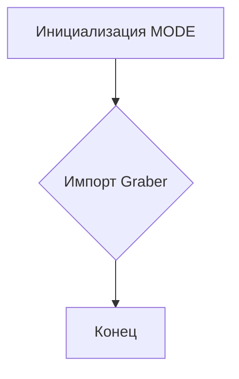

# <input code>

```python
## \file hypotez/src/suppliers/ebay/__init__.py
# -*- coding: utf-8 -*-
#! venv/Scripts/python.exe
#! venv/bin/python/python3.12

"""
.. module:: src.suppliers.ebay 
	:platform: Windows, Unix
	:synopsis:

"""


from .graber import Graber
```

# <algorithm>

В данном файле `__init__.py` из пакета `ebay` в модуле `suppliers` определяется константа `MODE` и импортируется класс `Graber` из модуля `graber`.  

**Пошаговая блок-схема:**

1. **Инициализация:** Модуль устанавливает константу `MODE` со значением 'dev'.
2. **Импорт:** Из подпапки `.graber` импортируется класс `Graber`.



**Примеры:**

* Инициализация `MODE`:  ``
* Импорт `Graber`: `from .graber import Graber`

Данные не передаются между функциями или классами в этом файле.  Он просто задаёт настройки и импортирует необходимый класс.


# <mermaid>

```mermaid
graph LR
    subgraph eBay Module
        A[__init__.py] --> B();
        B --> C[from .graber import Graber];
        C --> D[Graber Class];
    end
```

**Объяснение диаграммы:**

Диаграмма показывает, что файл `__init__.py` в модуле `ebay` устанавливает переменную `MODE` и импортирует класс `Graber` из модуля `graber`.  `Graber` — это предполагаемый класс, который выполняет какую-то функцию сбора данных.  Все зависимости находятся внутри пакета `hypotez/src/suppliers/ebay`.


# <explanation>

**Импорты:**

* `from .graber import Graber`:  Этот импорт подключает класс `Graber` из модуля `graber`, который находится в той же директории (`./graber`).  Это стандартный способ импорта модулей внутри одного пакета.  `.` в `from .graber import Graber` указывает, что нужно искать файл `graber.py` в текущей директории.

**Классы:**

* `Graber`:  Этот класс (описанный в файле `graber.py`) отвечает за сбор данных с eBay.  Подробный анализ этого класса требует просмотра его кода.

**Функции:**

В этом файле нет функций.  Это всего лишь файл инициализации модуля, который определяет настройки и импортирует необходимые классы.

**Переменные:**

* `MODE`:  Строковая переменная, которая, скорее всего, используется для определения режима работы программы (например, 'dev' для разработки, 'prod' для производства).

**Возможные ошибки и улучшения:**

* **Отсутствует документация:** Нет явной документации (например, `docstrings`) для переменной `MODE`, что усложняет понимание её назначения.  Добавление docstrings к `MODE` и классу `Graber` улучшит читаемость кода.
* **Отсутствует импорт:**  В файле отсутствует явная спецификация кодировки, хотя `# -*- coding: utf-8 -*-` является распространённым способом.
* **Плохая структура импорта:** Необходимо использовать  импорт в формате `from hypotez.src.suppliers.ebay.graber import Graber`, чтобы избежать проблем с относительными путями при использовании модуля в других частях проекта.


**Взаимосвязь с другими частями проекта:**

Этот файл является частью пакета `hypotez/src/suppliers`, который, предположительно, отвечает за взаимодействие с различными источниками данных (магазинами).  Модуль `graber` внутри пакета `ebay` отвечает за непосредственный сбор данных с сайта eBay.  Позже в проекте, при вызове функции из `graber` (`Graber`) будут передаваться необходимые параметры, такие как фильтры, параметры поиска и другие.  Следующий уровень абстракции (возможно, `src/main.py`) будет использовать класс `Graber` для получения данных с eBay.