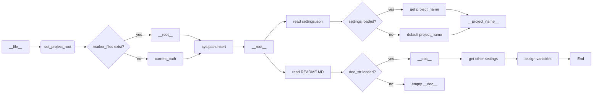

```MD
# <input code>

```python
## \file hypotez/src/suppliers/ebay/header.py
# -*- coding: utf-8 -*-

#! venv/bin/python/python3.12

"""
.. module:: src.suppliers.ebay 
	:platform: Windows, Unix
	:synopsis:

"""


import sys
import json
from packaging.version import Version

from pathlib import Path
def set_project_root(marker_files=('__root__','.git')) -> Path:
    """
    Finds the root directory of the project starting from the current file's directory,
    searching upwards and stopping at the first directory containing any of the marker files.

    Args:
        marker_files (tuple): Filenames or directory names to identify the project root.
    
    Returns:
        Path: Path to the root directory if found, otherwise the directory where the script is located.
    """
    __root__:Path
    current_path:Path = Path(__file__).resolve().parent
    __root__ = current_path
    for parent in [current_path] + list(current_path.parents):
        if any((parent / marker).exists() for marker in marker_files):
            __root__ = parent
            break
    if __root__ not in sys.path:
        sys.path.insert(0, str(__root__))
    return __root__


# Get the root directory of the project
__root__ = set_project_root()
"""__root__ (Path): Path to the root directory of the project"""

from src import gs

settings:dict = None
try:
    with open(gs.path.root / 'src' /  'settings.json', 'r') as settings_file:
        settings = json.load(settings_file)
except (FileNotFoundError, json.JSONDecodeError):
    ...

doc_str:str = None
try:
    with open(gs.path.root / 'src' /  'README.MD', 'r') as settings_file:
        doc_str = settings_file.read()
except (FileNotFoundError, json.JSONDecodeError):
    ...


__project_name__ = settings.get("project_name", 'hypotez') if settings  else 'hypotez'
__version__: str = settings.get("version", '')  if settings  else ''
__doc__: str = doc_str if doc_str else ''
__details__: str = ''
__author__: str = settings.get("author", '')  if settings else ''
__copyright__: str = settings.get("copyrihgnt", '')  if settings else ''
__cofee__: str = settings.get("cofee", "Treat the developer to a cup of coffee for boosting enthusiasm in development: https://boosty.to/hypo69")  if settings else "Treat the developer to a cup of coffee for boosting enthusiasm in development: https://boosty.to/hypo69"
```

# <algorithm>

**Шаг 1:**  Функция `set_project_root`.
* На вход получает кортеж `marker_files` с именами файлов/каталогов для определения корня проекта.
* Получает текущий путь к файлу.
* Итерируется по родительским каталогам текущего файла, начиная с текущего каталога.
* Проверяет существование файлов/каталогов из `marker_files` в каждом родительском каталоге.
* Если найдена папка содержащая один из файлов из `marker_files`, функция возвращает путь к этому родительскому каталогу и добавляет его в `sys.path`.
* Если ни один из файлов не найден, возвращает путь текущего файла.

**Пример:**
Если `__file__` указывает на файл `hypotez/src/suppliers/ebay/header.py`, поиск `marker_files` пойдет вверх по иерархии:
`hypotez/src/suppliers/ebay`, `hypotez/src/suppliers`, `hypotez/src`, `hypotez` и т.д.

**Шаг 2:** `__root__ = set_project_root()`.
Вызов функции для получения корня проекта.

**Шаг 3:** Чтение `settings.json` и `README.MD`.
* Используется `try-except` для обработки ошибок `FileNotFoundError` и `json.JSONDecodeError`.
* Чтение `settings.json` из корня проекта в переменную `settings`. Если файл не найден или невалидный JSON, то `settings` останется `None`.
* Аналогично читается `README.MD` в `doc_str`.


**Шаг 4:** Получение переменных из `settings`.
* Извлечение значений из словаря `settings` с использованием метода `get()`.
* Использование значений по умолчанию, если ключ не найден или `settings` равен `None`.

**Пример:**
Если в `settings.json` есть поле `project_name`, то значение будет присвоено `__project_name__`. В противном случае будет использовано значение по умолчанию `'hypotez'`.


# <mermaid>



**Объяснение зависимостей:**

* `pathlib`: для работы с путями к файлам.
* `json`: для работы с файлом `settings.json`.
* `packaging.version`: (предполагается) для работы с версиями пакетов.
* `src.gs`: для получения пути к корню проекта.  Судя по имени, `gs` - это модуль, содержащий вспомогательные функции для работы с проектом.


# <explanation>

**Импорты:**

* `sys`:  для доступа к системным переменным, в т.ч. `sys.path`, что позволяет импортировать модули из других частей проекта.
* `json`: для парсинга файла `settings.json`.
* `packaging.version`:  вероятно, для работы с версиями пакетов. В данном примере не используется.
* `pathlib`: для работы с путями к файлам, каталогам и т. д.,  обеспечивает более современный и удобный способ работы с путями.
* `src.gs`: Импортируется модуль `gs` из пакета `src`, скорее всего, содержащий вспомогательные функции для работы с файлами проекта, особенно для определения пути к корню проекта.


**Классы:**

Нет явных классов.


**Функции:**

* `set_project_root(marker_files=...)`:  Находит корень проекта, ища файлы/каталоги в списке `marker_files` в родительских директориях текущего файла. Возвращает `Path` до корневой директории или текущей директории, если корень не найден.   Это важная функция для обеспечения правильной работы import-ов приложений.

**Переменные:**

* `MODE`: Строковая константа, вероятно, для определения режима работы.
* `__root__`:  `Path`-объект, содержащий путь к корневой директории проекта.
* `settings`: Словарь, загруженный из `settings.json`, содержащий настройки проекта.
* `doc_str`: Строка, содержащая содержимое файла `README.MD` (или пустая строка, если файл не найден).
* `__project_name__`, `__version__`, `__doc__`, `__details__`, `__author__`, `__copyright__`, `__cofee__`: Переменные, хранящие значения из `settings.json`.

**Возможные ошибки/улучшения:**

* **Проверка на `None`:** В коде используется `settings.get(...) if settings else ...`, что предотвращает ошибку `AttributeError` в случае, если `settings` не был загружен. Однако,  лучше бы было обрабатывать ситуацию, когда `settings` не содержит требуемых полей.
* **Обработка исключений:** `try-except` блоки обрабатывают `FileNotFoundError` и `json.JSONDecodeError`, но полезно было бы добавить `TypeError` для проверки, что `settings` является словарем.
* **Дополнения для `gs`:**  Неизвестно, что делает модуль `src.gs` и как именно он связан с `path.root`. Потенциально, его можно улучшить, если добавить документацию или логику для более эффективной работы с путями и файлами проекта.
* **Документация:**  Документация для модуля могла бы быть расширена, чтобы объяснить, как работает поиск корня проекта, и что означают определенные значения констант (`MODE`).


**Взаимосвязи с другими частями проекта:**

Код зависит от модуля `gs` из пакета `src`, который, по всей видимости, предоставляет функции для получения пути к корню проекта.


**Рекомендации:**

Вместо

```python
__project_name__ = settings.get("project_name", 'hypotez') if settings  else 'hypotez'
```

лучше использовать

```python
__project_name__ = settings.get("project_name") or "hypotez"
```

Это более кратко и, возможно, читабельнее.


Этот код является хорошим началом для организации проекта и получения необходимых метаданных.