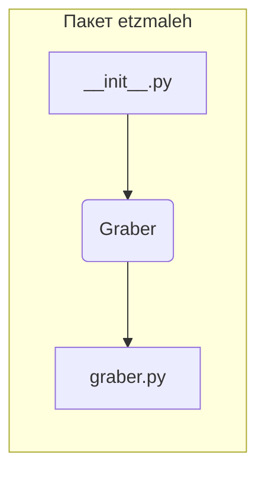

1. **<input code>**:

```python
## \file hypotez/src/suppliers/etzmaleh/__init__.py
# -*- coding: utf-8 -*-\

#! venv/bin/python/python3.12

"""
.. module:: src.suppliers.etzmaleh 
	:platform: Windows, Unix
	:synopsis:

"""


from .graber import Graber
```

2. **<algorithm>**:

Этот код представляет собой модуль `__init__.py` для пакета `etzmaleh` внутри пакета `suppliers` в проекте `hypotez`.  Он не содержит логики, которая выполняется непосредственно. Вместо этого, он импортирует другие компоненты.  Пошаговая блок-схема в данном случае упрощена, так как в нём нет собственных функций, только импорт.

* **Шаг 1:** Импорт `Graber`.  Модуль `__init__.py` импортирует класс `Graber` из подпапки `graber`.


3. **<mermaid>**:



4. **<explanation>**:

* **Импорты**:
    * `from .graber import Graber`:  Этот импорт подключает класс `Graber` из файла `graber.py` внутри папки `etzmaleh`. Значок `.` в начале пути означает, что модуль `graber.py` находится в той же директории, что и `__init__.py`.  Этот импорт позволяет другим частям проекта использовать класс `Graber` без указания полного пути к файлу.  Этот импорт критически важен, поскольку он устанавливает связь между модулями.

* **Классы**:
    * `Graber`:  Этот класс, определённый в `graber.py` (не представлен в этом файле), вероятно, содержит методы для работы с источником данных (возможно, веб-скрэйпинг или чтение данных). Взаимодействие с `Graber` происходит через его методы, которые будут вызываться из других частей проекта.  Отсутствие кода класса `Graber` затрудняет дальнейшую детализацию.


* **Функции**:
   В данном `__init__.py` нет собственных функций. Функциональность связана с классом `Graber`, который определяется в `graber.py` (не представлен).


* **Переменные**:
    * ``:  Эта переменная, вероятно, определяет режим работы приложения (например, `dev`, `prod`).  Её значение может быть использовано другими частями кода для корректировки поведения, например, для включения или выключения определенных функций в разработке.  Значение `dev` указывает на режим разработки, что обычно подразумевает дополнительные проверки или функциональность для отладки.


* **Возможные ошибки или области для улучшений**:
    * Отсутствие кода `graber.py` затрудняет полное понимание функциональности пакета.
    *  Нет указаний на то, как и когда `Graber` будет использоваться.
    *  Переменная `MODE` не используется в этом файле, это может быть использовано в другом месте. Необходимо проанализировать весь проект.


* **Цепочка взаимосвязей**:
    Этот `__init__.py` импортирует `Graber` и создаёт возможность для использования класса `Graber` в других модулях `hypotez`.  Это может быть часть более крупного проекта, где `Graber` предоставляет данные для дальнейшей обработки.  Для полного анализа потребуется проанализировать другие части проекта (`hypotez`) для определения того, как `Graber` используется.