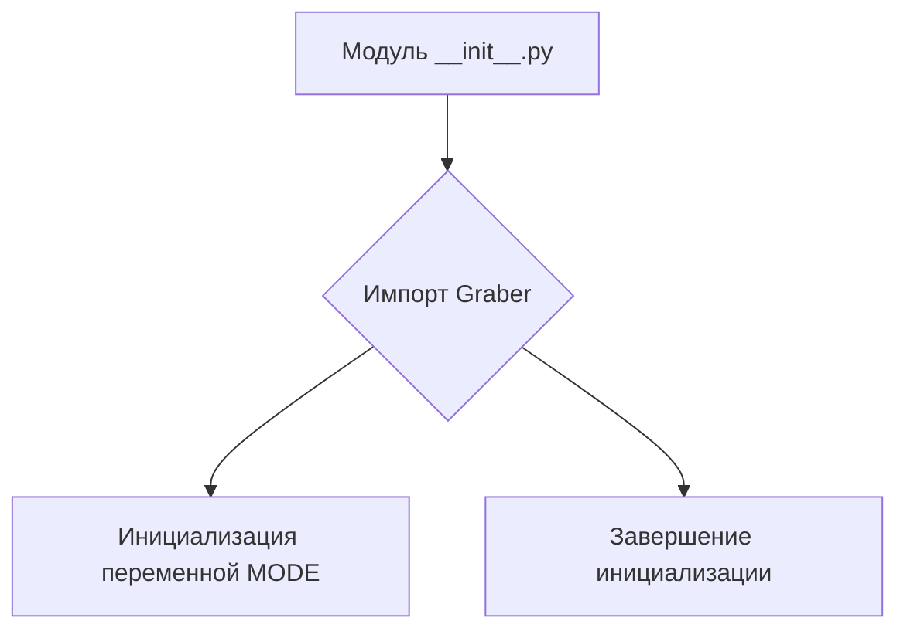
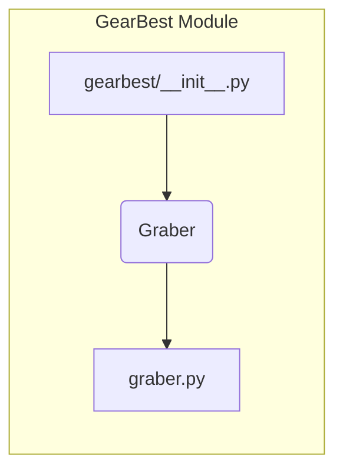

# <input code>

```python
## \file hypotez/src/suppliers/gearbest/__init__.py
# -*- coding: utf-8 -*-

#! venv/bin/python/python3.12

"""
.. module:: src.suppliers.gearbest 
	:platform: Windows, Unix
	:synopsis:

"""


from .graber import Graber
```

# <algorithm>

Этот код представляет собой модуль инициализации для подсистемы сбора данных с сайта GearBest.  В нем происходит импорт класса `Graber`.

**Блок-схема:**



**Пример:**

Модуль `__init__.py` в папке `gearbest` импортирует класс `Graber` из подмодуля `graber.py` внутри того же пакета. Это позволяет использовать класс `Graber` в других частях проекта, связанных с данным поставщиком.

# <mermaid>



**Описание диаграммы:**

Диаграмма показывает, что модуль `gearbest/__init__.py` импортирует класс `Graber` из файла `graber.py` в той же папке. Это стандартная практика для организации модулей в Python.

# <explanation>

**Импорты:**

- `from .graber import Graber`: Этот импорт подключает класс `Graber` из подмодуля `graber.py` в папке `gearbest`. Символ `.` означает, что модуль `graber.py` находится в той же папке, что и текущий файл `__init__.py`. Это типичный способ импорта модулей внутри иерархии пакетов Python.

**Классы:**

- `Graber`:  Этот класс (определенный в файле `graber.py`) отвечает за сбор данных с сайта GearBest.  Подробности о его функциональности требуют анализа исходного кода файла `graber.py`.  Доступ к функциональности этого класса обеспечивается импортом из `__init__.py`.

**Функции:**

В данном `__init__.py` нет определенных функций,  все действия сводятся к импорту, и созданию глобальной переменной.

**Переменные:**

- ``: Глобальная переменная, скорее всего, определяет режим работы (например, 'dev' для разработки, 'prod' для производства).  Это позволяет изменять поведение программы в зависимости от режима.

**Возможные ошибки и улучшения:**

- **Отсутствие документации:**  Хотя есть комментарий, это не полная документация. Добавьте описания к `Graber`, его методам и другим значимым элементам кода.
- **Недостаток проверки на существование файла `graber.py`:**  Код не проверяет, существует ли файл `graber.py`, что может привести к ошибке `ImportError`, если файла нет.
- **Зависимости**: Необходимо рассмотреть зависимости от внешних библиотек, которые используются внутри класса `Graber`, и убедиться, что они установлены.
- **Проверка режима работы**:  Необходимо добавить проверку на корректность значения `MODE`, чтобы избежать непредсказуемого поведения в зависимости от того, какие методы используются внутри `Graber` в разных режимах.

**Взаимосвязи с другими частями проекта:**

Этот модуль `__init__.py` служит посредником между кодом, работающим с данными GearBest, и остальными частями проекта.  Чтобы проследить взаимосвязи, нужно проанализировать вызовы и использования `Graber` в других модулях.  Например, в модуле `main.py` или другом модуле сбора данных.

**Выводы:**

Код представляет собой простую инициализацию модуля `gearbest`.  Дальнейший анализ требует исследования `graber.py` для понимания логики сбора данных с сайта GearBest.