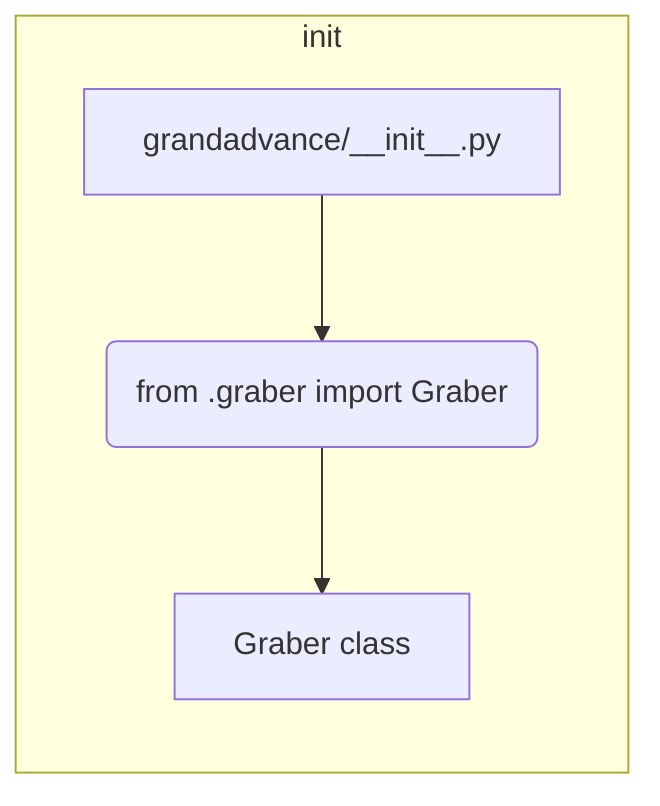

```MD
# <input code>

```python
## \file hypotez/src/suppliers/grandadvance/__init__.py
# -*- coding: utf-8 -*-

#! venv/bin/python/python3.12

"""
.. module:: src.suppliers.grandadvance 
	:platform: Windows, Unix
	:synopsis:

"""


from .graber import Graber
```

# <algorithm>

Этот код представляет собой инициализационный модуль для пакета `grandadvance` внутри модуля `suppliers` проекта `hypotez`.

Он не содержит сложной логики, а только импортирует класс `Graber` из подмодуля `graber`.  С точки зрения алгоритма, действия сводятся к одному шагу:

1. Импорт: Модуль импортирует класс `Graber` из файла `graber.py` в текущем каталоге (`.graber`).

**Пример:**

Представьте, что `graber.py` содержит класс `Graber` с методами для работы с данными от поставщика `GrandAdvance`. Тогда импорт обеспечит доступ к этому классу в текущем модуле.


# <mermaid>



**Описание диаграммы:**

Диаграмма показывает, что модуль `grandadvance/__init__.py` импортирует класс `Graber` из подмодуля `graber`.  Никаких дополнительных вычислений или обработки данных в самом файле `__init__.py` нет.  Зависимость между `grandadvance/__init__.py` и `graber.py` является прямой и выполняется при импорте.


# <explanation>

- **Импорты:**
    - `from .graber import Graber`:  Этот импорт позволяет использовать класс `Graber` из файла `graber.py` внутри текущего модуля (`grandadvance/__init__.py`).  Символ `.` указывает на поиск файла `graber.py` в текущем каталоге (подпапке `grandadvance`). Это стандартная практика организации импорта в Python.  Связь - прямое использование класса `Graber` из подмодуля.

- **Классы:**
    - `Graber`: Этот класс (предположительно) содержит методы для взаимодействия с API или базами данных поставщика `GrandAdvance`.  Подробная информация о его методах и атрибутах недоступна, так как сам код класса `Graber` не показан.  На данном этапе, `grandadvance/__init__.py` просто предоставляет доступ к этому классу.

- **Функции:**
    - Нет явных функций в данном файле.

- **Переменные:**
    - ``:  Переменная глобального уровня, вероятно, используется для настройки поведения модуля (например,  разница в логике работы в режиме разработки `dev` и релизной версии `prod`).

- **Возможные ошибки или области для улучшений:**
    - Не указан способ обработки потенциальных ошибок при импорте `Graber` (например, если файл `graber.py` отсутствует или содержит синтаксические ошибки). Рекомендуется добавить обработку исключений `ImportError` для повышения надёжности кода.
    - Отсутствует описание методов класса `Graber`.  Это затрудняет понимание функциональности `grandadvance` и её взаимодействие с остальными частями проекта.


**Цепочка взаимосвязей:**

Этот файл является частью пакета `suppliers` проекта `hypotez`.  При запуске основной программы (в `hypotez`) или других модулях `suppliers` этот файл может быть импортирован, чтобы получить доступ к классу `Graber` для работы с данным поставщиком.  Взаимосвязь с другими модулями будет зависеть от того, как `Graber` используется в других частях проекта.