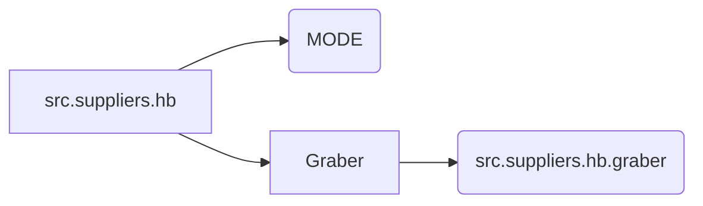

# <input code>

```python
## \file hypotez/src/suppliers/hb/__init__.py
# -*- coding: utf-8 -*-\
#! venv/Scripts/python.exe
#! venv/bin/python/python3.12

"""
.. module:: src.suppliers.hb 
	:platform: Windows, Unix
	:synopsis:

"""


from .graber import Graber
```

# <algorithm>

Этот код представляет собой инициализационный модуль для пакета `src.suppliers.hb`.  Он содержит константу `MODE` и импорт класса `Graber`.

**Шаг 1:**  Определение константы `MODE`.  Эта константа вероятно задаёт режим работы модуля (например, 'dev' для разработки, 'prod' для производства).  Это часто используется для выбора различных настроек и поведения кода в зависимости от окружения.

**Шаг 2:** Импорт класса `Graber`. Это указывает, что модуль `src.suppliers.hb` использует класс `Graber` из подмодуля `graber`.

**Пример:** Если в другом модуле проекта необходим доступ к классу `Graber`, он может быть импортирован из `src.suppliers.hb`.


# <mermaid>



**Объяснение диаграммы:**

*   `src.suppliers.hb` - текущий модуль.
*   `MODE` - константа, определяемая внутри модуля.
*   `Graber` - класс, импортируемый из модуля `src.suppliers.hb.graber`.  Стрелка от `Graber` к `src.suppliers.hb.graber` указывает на зависимость.

# <explanation>

* **Импорты:**
    * `from .graber import Graber`: Этот импорт подключает класс `Graber` из подмодуля `graber` текущего пакета (`src.suppliers.hb`).  Символ `.` в импорте указывает на поиск класса `Graber` внутри папки `graber` находящейся в директории с текущим файлом.  Это стандартная практика импорта связанных модулей.  Отсутствие `import` из других пакетов (`src.`) свидетельствует, что этот модуль, вероятно, содержит вспомогательные или служебные функции и классы, напрямую не использующие модули, расположенные в других пакетах.


* **Классы:**
    * `Graber`:  Класс, скорее всего, реализует логику работы с поставщиком данных (supplier) с именем `hb`.  Подробная функциональность не видна без просмотра исходного кода файла `graber.py`.


* **Функции:**
    *  Нет функций в данном файле.


* **Переменные:**
    * `MODE`:  Строковая переменная, скорее всего, используемая для настройки конфигурации или выбора стратегий поведения. Значение `'dev'` указывает на режим разработки.


* **Возможные ошибки или области для улучшений:**
    * Отсутствует  документация для переменной `MODE` в  `src.suppliers.hb/__init__.py`,  что снижает читаемость.
    * Не указаны типы переменной `MODE` или другие типы. Не указана область применения.  Более подробная информация об области применения (`MODE`) помогла бы в понимании. 
    *  Не указаны зависимости от других модулей.


* **Взаимосвязи с другими частями проекта:**
    *  Из данного кода не видно, как `src.suppliers.hb` взаимодействует с другими частями проекта.  Это можно понять только, проанализировав код `Graber`, импортируемый из `graber.py`, и как этот класс используется в других частях кода.


**Общий вывод:**
Файл `__init__.py` является инициализационным модулем, который предоставляет необходимые классы и константы для пакета `src.suppliers.hb`.  Для более полного понимания необходимо ознакомиться с содержанием модуля `graber.py` и других связанных файлов, чтобы узнать, как `Graber` используется в других частях кода.