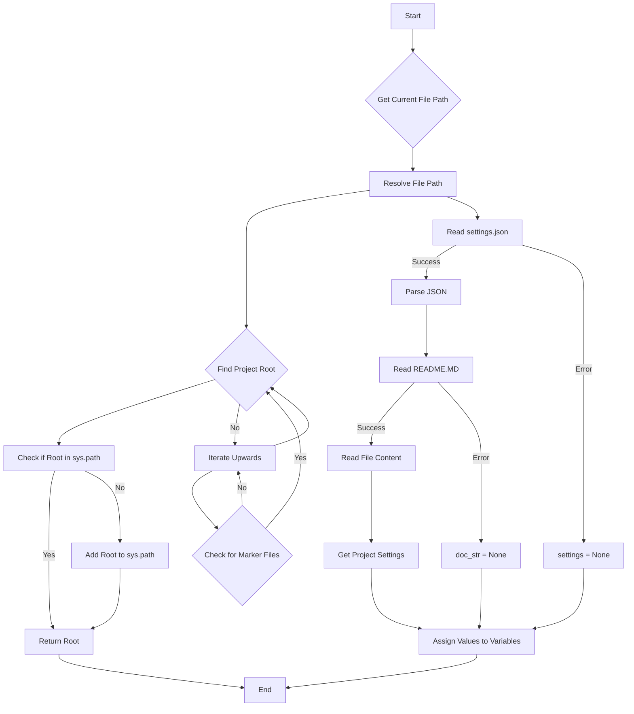
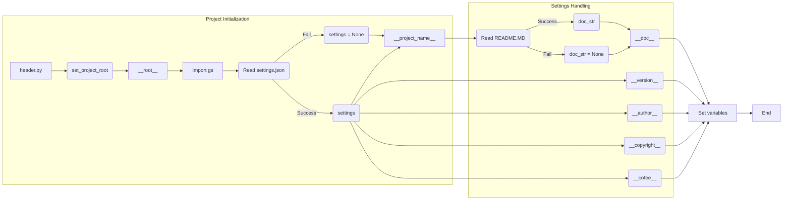

# <input code>

```python
## \file hypotez/src/suppliers/hb/header.py
# -*- coding: utf-8 -*-\
#! venv/Scripts/python.exe
#! venv/bin/python/python3.12

"""
.. module:: src.suppliers.hb 
	:platform: Windows, Unix
	:synopsis:

"""


import sys
import json
from packaging.version import Version

from pathlib import Path
def set_project_root(marker_files=('__root__')) -> Path:
    """
    Finds the root directory of the project starting from the current file's directory,
    searching upwards and stopping at the first directory containing any of the marker files.

    Args:
        marker_files (tuple): Filenames or directory names to identify the project root.
    
    Returns:
        Path: Path to the root directory if found, otherwise the directory where the script is located.
    """
    __root__:Path
    current_path:Path = Path(__file__).resolve().parent
    __root__ = current_path
    for parent in [current_path] + list(current_path.parents):
        if any((parent / marker).exists() for marker in marker_files):
            __root__ = parent
            break
    if __root__ not in sys.path:
        sys.path.insert(0, str(__root__))
    return __root__


# Get the root directory of the project
__root__ = set_project_root()
"""__root__ (Path): Path to the root directory of the project"""

from src import gs

settings:dict = None
try:
    with open(gs.path.root / 'src' /  'settings.json', 'r') as settings_file:
        settings = json.load(settings_file)
except (FileNotFoundError, json.JSONDecodeError):
    ...

doc_str:str = None
try:
    with open(gs.path.root / 'src' /  'README.MD', 'r') as settings_file:
        doc_str = settings_file.read()
except (FileNotFoundError, json.JSONDecodeError):
    ...


__project_name__ = settings.get("project_name", 'hypotez') if settings  else 'hypotez'
__version__: str = settings.get("version", '')  if settings  else ''
__doc__: str = doc_str if doc_str else ''
__details__: str = ''
__author__: str = settings.get("author", '')  if settings else ''
__copyright__: str = settings.get("copyrihgnt", '')  if settings else ''
__cofee__: str = settings.get("cofee", "Treat the developer to a cup of coffee for boosting enthusiasm in development: https://boosty.to/hypo69")  if settings else "Treat the developer to a cup of coffee for boosting enthusiasm in development: https://boosty.to/hypo69"
```

# <algorithm>



**Example:**

If `__file__` points to `hypotez/src/suppliers/hb/header.py`, the script traverses up the directory tree looking for `pyproject.toml`, `requirements.txt`, or `.git`. If it finds these files in the `hypotez` directory, it sets `__root__` to `hypotez`. Otherwise, `__root__` will remain as the current directory.

# <mermaid>



**Dependencies:**

*   `sys`: Used for accessing system-specific parameters and manipulating the Python path.
*   `json`: Used for loading and parsing JSON data from `settings.json`.
*   `packaging.version`: Used for version handling.
*   `pathlib`: Used for working with file paths.
*   `src.gs`: Implied dependency for `gs.path.root`, likely from a module within the `src` package. This module likely provides utilities related to file paths and project structure.

# <explanation>

**Imports:**

*   `sys`: Provides access to system-specific parameters and functions, including manipulating the Python path.
*   `json`: Used to work with JSON data, specifically to load `settings.json`.
*   `packaging.version`: Used for handling and comparing software versions.
*   `pathlib`: Used for working with file paths in an object-oriented way.
*   `src.gs`:  A crucial import from the `src` package, likely containing functions and/or variables related to the project's file system structure and initialization.


**Classes:**

There are no classes defined in the provided code.

**Functions:**

*   `set_project_root(marker_files)`: This function searches up the directory tree from the current file's location to find the project root directory.  It checks if directories contain specific marker files (like `pyproject.toml`, `requirements.txt`, or `.git`).  This is critical for locating the project's fundamental structure, ensuring correct imports and resource access. It also inserts the root directory into `sys.path` if it's not already there.

**Variables:**

*   `MODE`: A string variable set to 'dev'.
*   `__root__`: A `Path` object representing the root directory of the project.  Crucial for locating project resources and imports.
*   `settings`: A `dict` variable containing project settings loaded from `settings.json`.
*   `doc_str`: A `str` variable containing the content of `README.MD`.
*   `__project_name__`, `__version__`, `__doc__`, `__details__`, `__author__`, `__copyright__`, `__cofee__`:  These are strings containing information about the project. They are obtained from the `settings` dictionary or have default values if the `settings` dictionary is not loaded.
*   `current_path`: A `Path` object containing the current file's location.


**Possible Errors/Improvements:**

*   Error Handling: The `try...except` blocks for reading `settings.json` and `README.MD` are good practice.  However, consider more specific exceptions (e.g., `FileNotFoundError`, `json.JSONDecodeError`) to handle various potential issues.  Also, consider logging the error instead of simply using `...`.
*   Robustness: The code relies on the presence of `settings.json` and `README.MD` in the project root.  It could be improved by adding checks for their existence or providing default values if they are missing.
*   `__root__` assignment:  Setting `__root__` to the current path before the loop, potentially results in incorrect path evaluation.


**Relationships to Other Parts of the Project:**

The code relies heavily on `src.gs`.  Understanding the `gs` module is essential to understanding how the project structure is managed and how resources are located.  Specifically, `gs.path.root` is used to construct paths relative to the project root, which is a typical approach to making code more portable and maintainable within a larger project.