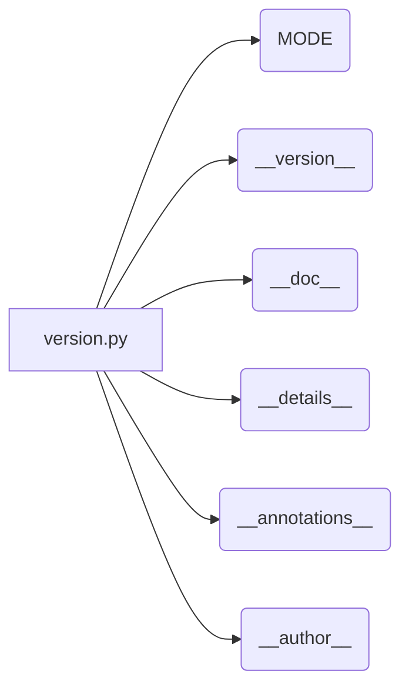

# <input code>

```python
## \file hypotez/src/suppliers/hb/locators/version.py
# -*- coding: utf-8 -*-
#! venv/Scripts/python.exe
#! venv/bin/python/python3.12

"""
.. module:: src.suppliers.hb.locators 
	:platform: Windows, Unix
	:synopsis:

"""


"""
	:platform: Windows, Unix
	:synopsis:

"""


"""
	:platform: Windows, Unix
	:synopsis:

"""


"""
  :platform: Windows, Unix

"""
"""
  :platform: Windows, Unix
  :platform: Windows, Unix
  :synopsis:
"""
  
""" module: src.suppliers.hb.locators """


"""
- `__version__`: This variable holds the version of the module or package.
- `__name__`: Contains the name of the module. If the script is being run directly, the value will be `"__main__"`.
- `__doc__`: The module's documentation string.
- `__details__`: This variable likely contains additional details about the module, but the exact purpose depends on the specific module or package.
- `__annotations__`: Contains type annotations for variables and functions in the module.
- `__author__`: The name(s) of the author(s) of the module.
"""
__name__:str
__version__="3.12.0.0.0.4"
__doc__:str
__details__:str="Details about version for module or class"
__annotations__

__author__='hypotez '
```

# <algorithm>

This code snippet defines a Python module (`hypotez/src/suppliers/hb/locators/version.py`).  It does not contain any executable logic that would be executed directly. Instead, it defines module-level variables, which set attributes of the module itself (e.g. version number). It is a configuration or metadata file.  There's no algorithm as such. The structure is defining the module.


# <mermaid>



# <explanation>

This Python file appears to be a module defining metadata for a package or module within the `hypotez` project. It doesn't contain executable code, but instead sets variables that define the module's properties.

* **``**: This variable likely defines the current operating mode (e.g., development, production). This is a very common variable in development or deployment.


* **`__version__ = "3.12.0.0.0.4"`**: This is a critical module attribute, it stores the version number of the module.


* **`__doc__`**: This string is used to document the module. The use of the reStructuredText formatting (`.. module::`) suggests this module is meant to be consumed or utilized by tools or frameworks that parse documentation strings.


* **`__details__`**: This variable would likely contain additional details specific to this module or version.

* **`__annotations__`**: Empty. This variable is ready to hold annotations about the code, such as types of variables or functions. If any were present, they would offer type checking or documentation support.


* **`__author__`**: This attribute stores the author or authors of the module.


* **Comments**: The comments in the file provide documentation and context, but are not part of the execution logic.

**Relationships to other parts of the project:**

The file `hypotez/src/suppliers/hb/locators/version.py` is part of a larger project, likely a software library or application. The version number and documentation would likely be utilized by build systems, deployment tools, or other modules to manage or interact with this specific module. For example, package managers might rely on this `version` module to determine which versions of this part of the codebase need to be deployed.

**Possible Errors or Improvements:**

* **Missing imports**:  The absence of import statements is expected in a metadata-only file like this.

* **Type hinting**: While the code uses the type hints (`__name__ : str`) they could be extended to other variables if the author wishes to enforce type checking.


In summary, this Python file is a metadata module within a larger project. It's important for version control, documentation, and integration with other tools.  It's not meant to be run directly.