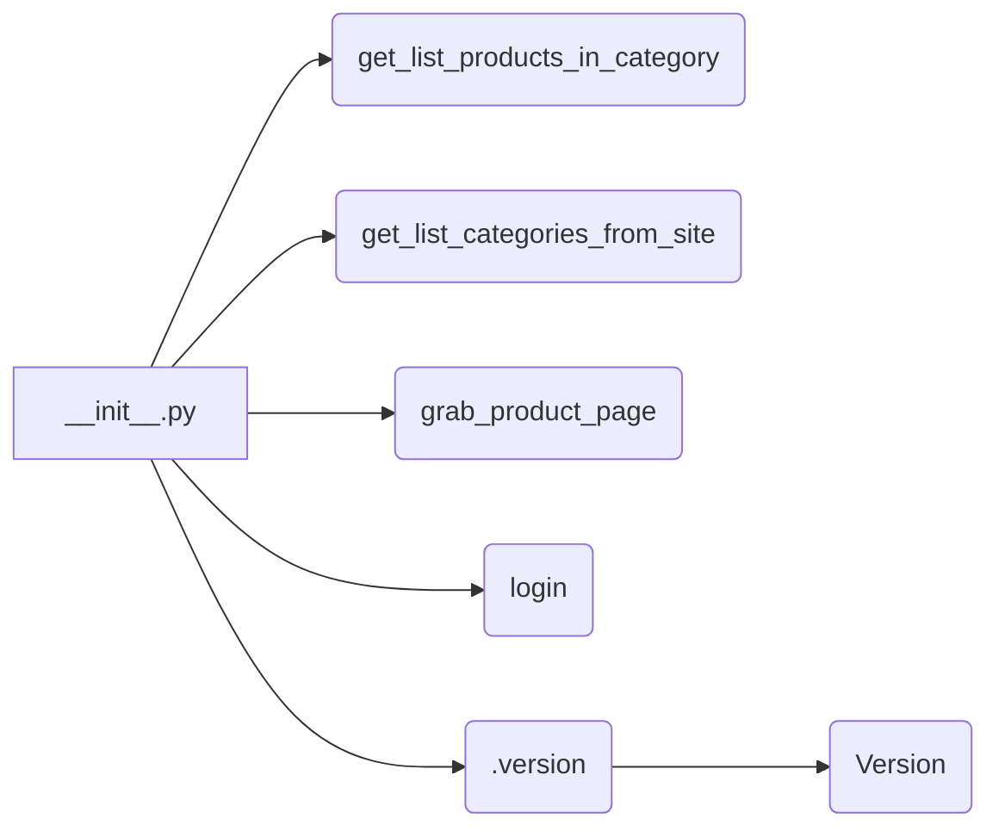

```MD
# <input code>

```python
## \file hypotez/src/suppliers/hb/scenarios/__init__.py
# -*- coding: utf-8 -*-\
#! venv/Scripts/python.exe
#! venv/bin/python/python3.12

"""
.. module:: src.suppliers.hb.scenarios 
	:platform: Windows, Unix
	:synopsis:

"""


"""
	:platform: Windows, Unix
	:synopsis:

"""


"""
	:platform: Windows, Unix
	:synopsis:

"""


"""
  :platform: Windows, Unix

"""
"""
  :platform: Windows, Unix
  :platform: Windows, Unix
  :synopsis:
"""
  
""" module: src.suppliers.hb.scenarios """


"""  Поставщик <I>hb.co.il</I> """
...

from packaging.version import Version
from .version import __version__, __doc__, __details__  

from .categories import get_list_products_in_category, get_list_categories_from_site
from .grabber import grab_product_page
from .login import login
```

# <algorithm>

В этом модуле инициализируется константа `MODE` со значением `'dev'`.  Далее происходит импорт необходимых модулей:

1. `packaging.version`: для работы с версиями.
2. `.version`: для доступа к информации о версии, документации и деталям.
3. `.categories`: для работы со списками категорий и продуктов в категориях.
4. `.grabber`: для скачивания страниц продуктов.
5. `.login`: для авторизации.

Внутри модуля не описаны собственные функции, а только импортированы функции из подмодулей (categories, grabber, login, version). Алгоритм работы зависит от функций внутри импортированных модулей, т.е. эта `__init__.py` просто обеспечивает доступ к ним.  По сути это точки входа в логику.

Пример:

Функция `get_list_categories_from_site()` из `categories.py` возвращает список категорий, который может использоваться другим кодом.


# <mermaid>



**Объяснение диаграммы:**

Модуль `__init__.py`  действует как точка входа, экспортируя функции из подмодулей (`categories`, `grabber`, `login`, `version`). Эти функции реализуют различные логические блоки сбора, обработки и авторизации данных для поставщика `hb.co.il`.  `Version` из `packaging`  используется для обработки версий.


# <explanation>

**Импорты:**

- `from packaging.version import Version`: Импортируется класс `Version` из пакета `packaging`, используемый для работы с версиями программного обеспечения. Он не является частью собственно проекта, но нужен для обработки версионных данных.  Находится в `hypotez/src/suppliers/hb/`
- `from .version import __version__, __doc__, __details__`: Импортирует информацию о версии, документации и других деталях из подмодуля `version` в текущем пакете `hypotez/src/suppliers/hb/scenarios/`. Это типичная практика для хранения метаданных проекта.
- `from .categories import get_list_products_in_category, get_list_categories_from_site`:  Импортирует функции, связанные с работой с категориями продуктов, из подмодуля `categories` в том же пакете.
- `from .grabber import grab_product_page`: Импортирует функцию `grab_product_page` из подмодуля `grabber`, отвечающую за скачивание страницы продукта.
- `from .login import login`: Импортирует функцию `login` из подмодуля `login`, предназначенную для входа в систему.

**Классы:**

В данном файле нет определений классов.  Все функции импортируются.

**Функции:**

Этот файл не содержит определения собственных функций. Он лишь импортирует функции из других модулей, предоставляя к ним доступ. Функциональность этих функций реализована в модулях `.categories`, `.grabber`, `.login` и `.version`

**Переменные:**

- ``:  Глобальная переменная, вероятно, определяющая режим работы (например, разработка, производство).

**Возможные ошибки и улучшения:**

- Отсутствует явная документация к функциям, импортируемым из подмодулей.  Необходимо документировать  функции в `.categories`, `.grabber`, `.login`  и `.version`, чтобы понять их аргументы и результаты.
- В коде присутствуют многострочные комментарии, которые могли бы быть улучшены с использованием Docstrings, более чётко описывая предназначение кода.
- Непонятно, как связаны `__init__.py`  и другие подмодули с точки зрения  логики. Необходима блок-схема или описание последовательности работы функций.

**Цепочка взаимосвязей:**

`__init__.py` является точкой входа для работы с поставщиком `hb.co.il`.  Он импортирует функции для:

1. получения списка категорий;
2. получения продуктов в категориях;
3. скачивания страниц продуктов;
4. входа в систему.

Эти функции, вероятно, находятся в модулях `hypotez/src/suppliers/hb/scenarios/categories.py`, `hypotez/src/suppliers/hb/scenarios/grabber.py`, `hypotez/src/suppliers/hb/scenarios/login.py`,  создавая связанную цепочку выполнения.