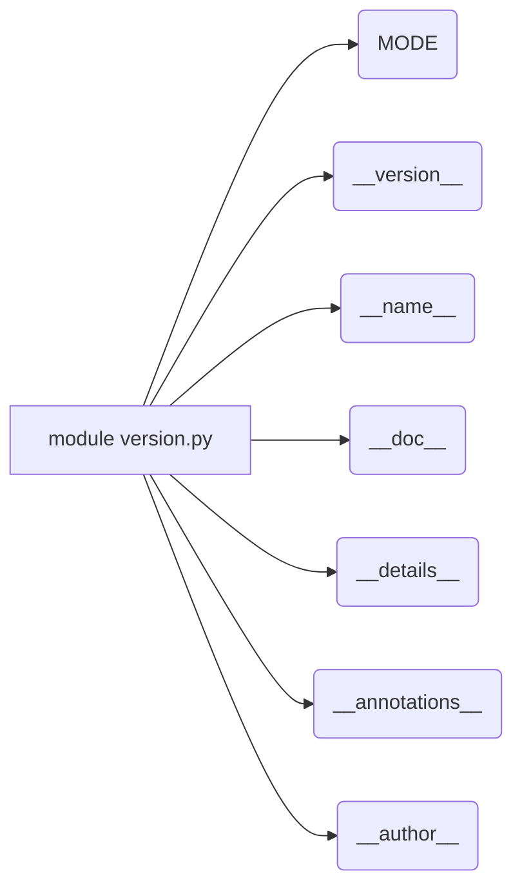

# <input code>

```python
## \file hypotez/src/suppliers/hb/scenarios/version.py
# -*- coding: utf-8 -*-\
#! venv/Scripts/python.exe
#! venv/bin/python/python3.12

"""
.. module:: src.suppliers.hb.scenarios 
	:platform: Windows, Unix
	:synopsis:

"""


"""
	:platform: Windows, Unix
	:synopsis:

"""


"""
	:platform: Windows, Unix
	:synopsis:

"""


"""
  :platform: Windows, Unix

"""
"""
  :platform: Windows, Unix
  :platform: Windows, Unix
  :synopsis:
"""
  
""" module: src.suppliers.hb.scenarios """


"""
- `__version__`: This variable holds the version of the module or package.
- `__name__`: Contains the name of the module. If the script is being run directly, the value will be `"__main__"`.
- `__doc__`: The module's documentation string.
- `__details__`: This variable likely contains additional details about the module, but the exact purpose depends on the specific module or package.
- `__annotations__`: Contains type annotations for variables and functions in the module.
- `__author__`: The name(s) of the author(s) of the module.
"""
__name__:str
__version__="3.12.0.0.0.4"
__doc__:str
__details__:str="Details about version for module or class"
__annotations__

__author__='hypotez '
```

# <algorithm>

Этот код не имеет алгоритма в традиционном понимании.  Он определяет константы, строки документации и метаданные для модуля `hypotez/src/suppliers/hb/scenarios`.  По сути, это файл описания модуля, а не исполняемый код.  Алгоритм - это последовательность шагов для решения задачи. Здесь нет задачи, а есть описание структуры и характеристик.  Данные не перемещаются между функциями или классами.

# <mermaid>



# <explanation>

Этот файл `version.py`  является метаданными для модуля `src.suppliers.hb.scenarios`.  Он не содержит логики выполнения, а скорее описывает его:

* **Импорты:**  Нет импортов.  Файл определяет внутренние переменные.
* **Классы:** Нет классов.
* **Функции:** Нет функций.
* **Переменные:**
    * ``:  Константа, вероятно, обозначает режим работы модуля (например, разработка, релиз).
    * `__version__ = "3.12.0.0.0.4"`:  Строковая переменная, содержащая версию модуля.
    * `__name__`:  Переменная, хранящая имя модуля. При запуске непосредственно как скрипт, будет `"__main__"`.
    * `__doc__`:  Строка документации для модуля.
    * `__details__`:  Строковая переменная, содержащая дополнительные детали о версии.
    * `__annotations__`:  Переменная, хранящая аннотации типов, если таковые имеются в коде.  В данном случае пуста.
    * `__author__ = 'hypotez'`:  Автор модуля.
* **Строки документации (docstrings):**  В файле присутствуют многострочные комментарии (docstrings), описывающие модуль и его функции. Это важная практика, позволяющая другим разработчикам понять назначение кода.
* **`#!`:**  Магические строки `#! venv/Scripts/python.exe` и `#! venv/bin/python/python3.12`  указывают интерпретатор Python, который нужно использовать для запуска файла, если он будет выполняться как скрипт.  В современном Python это обычно не нужно, но может быть полезно для определённых окружений.

**Возможные ошибки или улучшения:**

* **Непоследовательность в DocStrings:**  Наличие повторяющихся DocStrings (`:platform:` и `:synopsis:`).  Это лишнее.  Достаточно одного блока `:synopsis:`
* **Неиспользование `__annotations__`:**  Переменная `__annotations__` объявлена, но не используется. Возможно, в будущем она будет содержать информацию о типах данных переменных и аргументов функций.
* **Проверка версий:** При использовании файла с версией рекомендуется использовать  более удобный механизм хранения версий (например, `setuptools` или `packaging`), чтобы избежать подобного представления.

**Взаимосвязи с другими частями проекта:**

Этот файл является частью проекта `hypotez`.  Его предназначение – хранить метаданные для модуля `suppliers.hb.scenarios`.  Связь с другими частями проекта устанавливается через импорты (если таковые будут).  Без них связь косвенная - через общий проект `hypotez`.