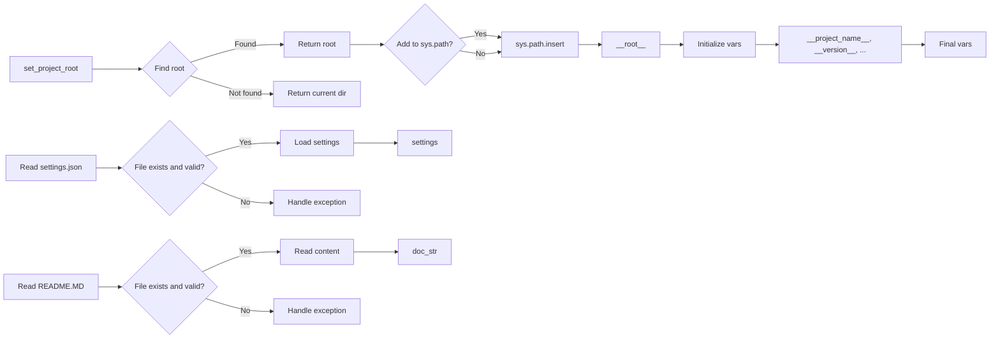

# <input code>

```python
## \file hypotez/src/suppliers/header.py
# -*- coding: utf-8 -*-\n#! venv/Scripts/python.exe
#! venv/bin/python/python3.12
"""
.. module: src.suppliers.header 
	:platform: Windows, Unix
	:synopsis:

"""


import sys
import json
from packaging.version import Version

from pathlib import Path
def set_project_root(marker_files=('__root__','.git')) -> Path:
    """
    Finds the root directory of the project starting from the current file's directory,
    searching upwards and stopping at the first directory containing any of the marker files.

    Args:
        marker_files (tuple): Filenames or directory names to identify the project root.
    
    Returns:
        Path: Path to the root directory if found, otherwise the directory where the script is located.
    """
    __root__:Path
    current_path:Path = Path(__file__).resolve().parent
    __root__ = current_path
    for parent in [current_path] + list(current_path.parents):
        if any((parent / marker).exists() for marker in marker_files):
            __root__ = parent
            break
    if __root__ not in sys.path:
        sys.path.insert(0, str(__root__))
    return __root__


# Get the root directory of the project
__root__ = set_project_root()
"""__root__ (Path): Path to the root directory of the project"""

from src import gs

settings:dict = None
try:
    with open(gs.path.root / 'src' /  'settings.json', 'r') as settings_file:
        settings = json.load(settings_file)
except (FileNotFoundError, json.JSONDecodeError):
    ...

doc_str:str = None
try:
    with open(gs.path.root / 'src' /  'README.MD', 'r') as settings_file:
        doc_str = settings_file.read()
except (FileNotFoundError, json.JSONDecodeError):
    ...


__project_name__ = settings.get("project_name", 'hypotez') if settings  else 'hypotez'
__version__: str = settings.get("version", '')  if settings  else ''
__doc__: str = doc_str if doc_str else ''
__details__: str = ''
__author__: str = settings.get("author", '')  if settings else ''
__copyright__: str = settings.get("copyrihgnt", '')  if settings else ''
__cofee__: str = settings.get("cofee", "Treat the developer to a cup of coffee for boosting enthusiasm in development: https://boosty.to/hypo69")  if settings else "Treat the developer to a cup of coffee for boosting enthusiasm in development: https://boosty.to/hypo69"
```

# <algorithm>

**Шаг 1:** `set_project_root(marker_files)`:
*   Получает текущую директорию.
*   Итеративно поднимается по дереву директорий, пока не найдёт директорию, содержащую один из файлов `marker_files`.
*   Если такая директория найдена, возвращает её путь. Иначе возвращает текущую директорию.
*   Если найденный путь не в `sys.path`, добавляет его в начало.

**Шаг 2:**  `__root__` = `set_project_root()`:
*   Вызывается функция `set_project_root()` для определения корневой директории проекта.


**Шаг 3:** Чтение `settings.json`:
*   Используется `gs.path.root` для определения пути к файлу настроек.
*   Файл `settings.json` читается, и его содержимое загружается в переменную `settings`.
*   Обрабатываются исключения `FileNotFoundError` и `json.JSONDecodeError`, если файл не найден или некорректный JSON.

**Шаг 4:** Чтение `README.MD`:
*   Используется `gs.path.root` для определения пути к файлу документации.
*   Файл `README.MD` читается, и его содержимое сохраняется в переменной `doc_str`.
*   Обрабатываются исключения `FileNotFoundError` и `json.JSONDecodeError`, если файл не найден или некорректный JSON.

**Шаг 5:** Инициализация переменных:
*   Переменные `__project_name__`, `__version__`, `__doc__`, `__details__`, `__author__`, `__copyright__`, `__cofee__` инициализируются значениями из `settings`, или стандартными значениями, если соответствующий ключ в `settings` отсутствует.

**Пример:**

Если файл `settings.json` содержит `{ "project_name": "MyProject", "version": "1.0.0" }`, то `__project_name__` примет значение "MyProject", а `__version__` - "1.0.0".


# <mermaid>



**Объяснение диаграммы:**

*   `set_project_root`: функция, которая находит корневую директорию проекта.
*   `Read settings.json` и `Read README.MD`: операции чтения файлов.
*   `Initialize vars`: процесс инициализации переменных, связанных с проектом.
*   `Final vars`: содержит результат инициализации.

# <explanation>

**Импорты:**

*   `sys`: предоставляет доступ к системным переменным, в том числе `sys.path`, что важно для поиска модулей.
*   `json`: используется для работы с файлами JSON (настройки).
*   `packaging.version`: для работы с версиями пакетов.
*   `pathlib`: для работы с путями к файлам (более современный способ).

**Классы:**

Нет определённых классов.

**Функции:**

*   `set_project_root(marker_files)`:  Находит корневую директорию проекта, поднимаясь по дереву директорий. Аргумент `marker_files` позволяет указать файлы, по наличию которых определяется корень. Функция возвращает `Path` к корневой директории, также добавляя её в `sys.path`, что важно для импорта модулей из подпапок проекта.


**Переменные:**

*   `MODE`: строковая переменная, определяющая режим работы (например, "dev" или "prod").
*   `__root__`:  переменная, содержащая `Path` к корневой директории проекта.
*   `settings`: словарь, загружаемый из `settings.json`, содержащий настройки проекта.
*   `doc_str`: содержимое файла `README.MD`.
*   `__project_name__`, `__version__`, `__doc__`, `__details__`, `__author__`, `__copyright__`, `__cofee__`:  строковые переменные, содержащие информацию о проекте (извлечённые из настроек).


**Возможные ошибки/улучшения:**

*   **Обработка ошибок:** Хотя есть обработка `FileNotFoundError` и `json.JSONDecodeError`, можно улучшить, добавив более подробные сообщения об ошибках, особенно в случаях, когда `settings.json` или `README.MD` не найдены или содержат некорректные данные.
*   **Типизация:** Возможно, стоит добавить аннотации типов для всех переменных, улучшая читаемость и поддерживая статический анализ.
*   **`gs.path.root`**:  Необходимо больше информации о модуле `gs`. Если `gs` - это часть проекта, его `path` должно быть описано в этом же модуле (или задокументированным другом способом). Если `gs` - внешний модуль, надо добавить ссылку, что это за модуль.


**Взаимосвязь с другими частями проекта:**

Код из `header.py` зависит от модуля `gs`, который необходим для получения пути к корню проекта.  `gs` по всей видимости является модулем, частью проекта (возможно, `utils`), который содержит вспомогательные функции для работы с путями.


**Рекомендации:**

Используйте более выразительные переменные для улучшения читаемости (например, `project_root` вместо `__root__`).  Более точное описание зависимости от `gs` и его расположение внутри проекта повысят качество кода.