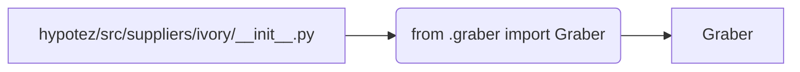

```MD
# <input code>

```python
## \file hypotez/src/suppliers/ivory/__init__.py
# -*- coding: utf-8 -*-\
#! venv/Scripts/python.exe
#! venv/bin/python/python3.12

"""
.. module:: src.suppliers.ivory 
	:platform: Windows, Unix
	:synopsis:

"""
MODE = 'dev'

from .graber import Graber
```

# <algorithm>

Этот код представляет собой инициализацию модуля `ivory` в пакете `suppliers` проекта `hypotez`.  Алгоритм работы весьма простой: он импортирует класс `Graber` из подпапки `graber`.

**Шаг 1:** Импорт `Graber`. Модуль импортирует класс `Graber` из подпапки `.graber` текущего каталога.  


**Пример:**

Предположим, что файл `graber.py` находится в `hypotez/src/suppliers/ivory/graber.py`.  Команда `from .graber import Graber` обеспечит доступ к классу `Graber` в данном модуле.

**Данные:** Данные не передаются или не обрабатываются на этом этапе.


# <mermaid>



**Объяснение диаграммы:**

Модуль `hypotez/src/suppliers/ivory/__init__.py` импортирует класс `Graber` из модуля `hypotez/src/suppliers/ivory/graber.py`.  Стрелки показывают направление импорта.


# <explanation>

* **Импорты:**
    `from .graber import Graber`: Этот импорт позволяет использовать класс `Graber` из модуля `graber.py`, который находится в той же директории, что и `__init__.py`. Символ `.` указывает на текущую директорию (`ivory`).  Это типичный способ импортировать элементы из подпапок в Python.  Связь с другими пакетами - через импорт.

* **Классы:**
    `Graber`:  Это класс, определенный в файле `graber.py`.  Без просмотра `graber.py` невозможно точно сказать, что представляет этот класс, но его название предполагает, что он отвечает за сбор данных (grabbing).  Это ключевой класс, вероятно, содержащий логику получения данных из внешних источников (например, веб-сайтов).

* **Функции:**
    Нет функций в данном `__init__.py`. Все логика скрыта в `Graber`, который подключается к этому файлу.

* **Переменные:**
    `MODE = 'dev'`:  Переменная, хранящая строковое значение, скорее всего, используется для определения режима работы (например, 'dev', 'prod').  В данном контексте это просто константа, которая определяет режим (разработка или производство).

* **Возможные ошибки и улучшения:**

    * **Отсутствие документации:**  В файле `__init__.py` есть описание, но оно не полное и не детализирует функции `Graber`.  Добавление более подробных документаций к классам и функциям улучшит читабельность и поддержку кода.
    * **Зависимости:**  Для работы требуется модуль `graber.py` с классом `Graber`.
    * **Более сложные логические блоки:** Если `Graber` выполняет сложную задачу, логика импорта может быть более сложной.


**Цепочка взаимосвязей:**

Этот модуль (`__init__.py`) служит для инициализации класса `Graber`.  `Graber` вероятно, использует функции или классы из других модулей (например, для работы с API или базой данных), которые импортируются в файле `graber.py`.

В конечном итоге, `Graber` отвечает за выполнение какой-либо задачи (например, сбор информации из интернет-источников), которую может использовать какой-то другой код.  Эта цепочка взаимосвязей будет продолжаться дальше, в зависимости от того, как используется `Graber` в других частях приложения.