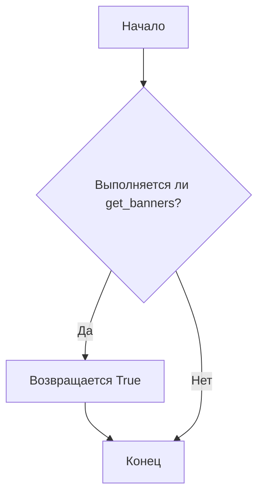

```MD
# Анализ кода файла hypotez/src/suppliers/ksp/banners_grabber.py

## <input code>

```python
## \file hypotez/src/suppliers/ksp/banners_grabber.py
# -*- coding: utf-8 -*-\

#! venv/bin/python/python3.12

"""
.. module:: src.suppliers.ksp 
	:platform: Windows, Unix
	:synopsis:

"""


"""
	:platform: Windows, Unix
	:synopsis:

"""


"""
	:platform: Windows, Unix
	:synopsis:

"""


"""
  :platform: Windows, Unix

"""
"""
  :platform: Windows, Unix
  :platform: Windows, Unix
  :synopsis:
"""
  
""" module: src.suppliers.ksp """


"""   Собираю баннеры ksp


 @section libs imports:
Author(s):
  - Created by [Name] [Last Name] on 08.11.2023 .
"""


def get_banners():
    return True
```

## <algorithm>

Этот код определяет функцию `get_banners()`, которая, судя по имени, отвечает за загрузку баннеров от поставщика KSP.  Однако, текущая реализация просто возвращает `True`.  Более подробный алгоритм работы будет зависеть от того, как будет реализована эта функция в будущем.  Пример блок-схемы, отражающий текущую ситуацию:



Данные в данном случае не перемещаются никуда.


## <mermaid>


В данном случае диаграмма показывает только вызов функции `get_banners` и возврат значения `True`.  Более сложная диаграмма появится, если функция будет содержать сложную логику.


## <explanation>

**Импорты:**

В коде нет импортов.  Отсутствие импортов говорит о том, что функция не использует какие-либо внешние модули или классы, за исключением стандартных библиотек Python.

**Классы:**

В коде нет определений классов.

**Функции:**

* `get_banners()`:  Эта функция, судя по имени, должна загружать баннеры от поставщика KSP.  Сейчас она просто возвращает `True`, что не отражает реальной функциональности.  В будущем эта функция должна:
    * Подключаться к API или другому источнику данных KSP.
    * Обрабатывать полученные данные.
    * Возвращать результат (например, список баннеров или их данные).
    * Обрабатывать ошибки (например, сетевые ошибки, ошибки доступа к API).

**Переменные:**

* `MODE`: Эта переменная имеет значение `'dev'`.  Она, скорее всего, предназначена для переключения между режимами разработки (`dev`) и производства (`prod`), но сейчас не используется.

**Возможные ошибки и улучшения:**

* **Отсутствие функциональности:**  Функция `get_banners` в текущем виде не выполняет никаких действий, связанных с загрузкой баннеров.  Необходимо добавить логику взаимодействия с сервером KSP.
* **Отсутствие обработки ошибок:**  В коде нет проверок на ошибки, которые могут произойти во время выполнения функции. Это может привести к проблемам в работе программы.  Нужно обрабатывать возможные исключения (например, исключения, связанные с подключением к серверу или с ошибочным форматом данных).
* **Неопределённая логика:** Непонятно, как будет происходить взаимодействие с сервером KSP и как будут обрабатываться полученные данные.


**Взаимосвязи с другими частями проекта:**

Функция `get_banners()` скорее всего будет вызываться из другого модуля или класса, который отвечает за отображение баннеров на странице.  Этот вызов будет отправлять запрос на загрузку баннеров и обрабатывать ответ (если ответ будет содержать новые баннеры).  Например, функция может быть частью класса `KspBannerProvider` в другом модуле.