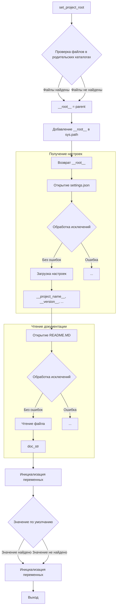

# <input code>

```python
## \file hypotez/src/suppliers/ksp/header.py
# -*- coding: utf-8 -*-
#! venv/Scripts/python.exe
#! venv/bin/python/python3.12

"""
.. module:: src.suppliers.ksp 
	:platform: Windows, Unix
	:synopsis:

"""
MODE = 'dev'


import sys
import json
from packaging.version import Version

from pathlib import Path
def set_project_root(marker_files=('__root__')) -> Path:
    """
    Finds the root directory of the project starting from the current file's directory,
    searching upwards and stopping at the first directory containing any of the marker files.

    Args:
        marker_files (tuple): Filenames or directory names to identify the project root.
    
    Returns:
        Path: Path to the root directory if found, otherwise the directory where the script is located.
    """
    __root__:Path
    current_path:Path = Path(__file__).resolve().parent
    __root__ = current_path
    for parent in [current_path] + list(current_path.parents):
        if any((parent / marker).exists() for marker in marker_files):
            __root__ = parent
            break
    if __root__ not in sys.path:
        sys.path.insert(0, str(__root__))
    return __root__


# Get the root directory of the project
__root__ = set_project_root()
"""__root__ (Path): Path to the root directory of the project"""

from src import gs

settings:dict = None
try:
    with open(gs.path.root / 'src' /  'settings.json', 'r') as settings_file:
        settings = json.load(settings_file)
except (FileNotFoundError, json.JSONDecodeError):
    ...

doc_str:str = None
try:
    with open(gs.path.root / 'src' /  'README.MD', 'r') as settings_file:
        doc_str = settings_file.read()
except (FileNotFoundError, json.JSONDecodeError):
    ...


__project_name__ = settings.get("project_name", 'hypotez') if settings  else 'hypotez'
__version__: str = settings.get("version", '')  if settings  else ''
__doc__: str = doc_str if doc_str else ''
__details__: str = ''
__author__: str = settings.get("author", '')  if settings else ''
__copyright__: str = settings.get("copyrihgnt", '')  if settings else ''
__cofee__: str = settings.get("cofee", "Treat the developer to a cup of coffee for boosting enthusiasm in development: https://boosty.to/hypo69")  if settings else "Treat the developer to a cup of coffee for boosting enthusiasm in development: https://boosty.to/hypo69"
```

# <algorithm>

**Алгоритм работы файла:**

1. **Настройка корневого каталога проекта:**
    - Функция `set_project_root` получает корневой каталог проекта, начиная от текущего файла и ища вверх по директориям.
    - Она проверяет, существуют ли файлы, указанные в `marker_files` в родительских директориях.
    - Если корневой каталог найден, он добавляется в `sys.path`.
    - Возвращает путь к корневому каталогу.
    - Пример: `set_project_root` ищется в `hypotez/src/suppliers/ksp` ищет `pyproject.toml`, `requirements.txt`, `.git` и поднимается по дереву каталогов. Если `pyproject.toml` найден в `hypotez`, возвращает `hypotez`.

2. **Получение настроек проекта:**
    - Извлекает данные из `settings.json`, находящегося в корневом каталоге проекта.
    - Обрабатывает исключения (`FileNotFoundError`, `json.JSONDecodeError`), если файл не найден или некорректно отформатирован.
    - Пример: если файл `settings.json` содержит ключ `"project_name": "MyProject"` , значение `__project_name__` будет `MyProject`.

3. **Чтение документации проекта:**
    - Читает файл `README.MD`, находящийся в корневом каталоге проекта.
    - Обрабатывает исключения (`FileNotFoundError`, `json.JSONDecodeError`).
    - Пример: если `README.MD` существует, его содержимое присваивается `doc_str`.

4. **Инициализация переменных:**
    - Извлекает значения параметров из `settings`, используя `settings.get()`, с предустановленными значениями по умолчанию.
    - Пример: если `settings` содержит поле `version` значение 1.0.0 , `__version__` будет `1.0.0`. Если `settings` не содержит поля `version`, `__version__` будет пустой строкой.


# <mermaid>




# <explanation>

**Импорты:**

- `sys`: Предоставляет доступ к системным переменным, в частности `sys.path`, используется для добавления корневого каталога проекта в путь поиска модулей.
- `json`:  Для работы с JSON-файлами, используется для загрузки настроек из `settings.json`.
- `packaging.version`:  Возможно, используется для работы с версиями пакетов, но пока не ясно из контекста.
- `pathlib`: Для работы с путями файлов в системе. `Path` используется для построения путей к файлам.
- `src.gs`:  Ссылаясь на модуль `gs`, который находится в подпапке `src`. Без определения  `gs` тяжело сказать точнее. Возможно, это модуль для работы с файловой системой проекта.


**Классы:**

- Нет явных определений классов.


**Функции:**

- `set_project_root(marker_files)`: Функция находит корневой каталог проекта, используя заданные маркерные файлы.
  - Аргументы: `marker_files` (кортеж строк) — имена файлов, по которым ищется корневой каталог.
  - Возвращаемое значение: `Path` — путь к корневому каталогу проекта.
  - Пример использования: `__root__ = set_project_root()` находит корень проекта.


**Переменные:**

- `__root__`:  `Path` - путь к корневому каталогу проекта.
- `settings`: `dict` - словарь настроек проекта, загруженный из `settings.json`.
- `doc_str`: `str` - содержимое файла `README.MD`.
- `__project_name__`, `__version__`, `__doc__`, `__details__`, `__author__`, `__copyright__`, `__cofee__`: `str` - переменные, содержащие информацию о проекте, полученную из настроек.


**Возможные ошибки и улучшения:**

- **Обработка ошибок:**  Обработка `FileNotFoundError` и `json.JSONDecodeError` в блоках `try...except` – хороший подход. Однако, можно добавить более детальную информацию об ошибке в случае её возникновения (например,  `logging` для записи в лог).
- **Документация:**  Документация (docstrings) к функциям написана хорошо. Однако, можно дополнить её примерами использования и более детально описать назначение каждой переменной.
- **Использование `logging`:** Добавление `logging` позволит отслеживать ход выполнения программы и производить дебаг.


**Взаимосвязи с другими частями проекта:**

- Функция `set_project_root` жизненно важна для работы проекта, так как устанавливает контекст для поиска необходимых файлов и модулей.
-  `gs.path.root` показывает зависимость от модуля `gs` из пакета `src`, что указывает на общую структуру проекта.
- `settings.json` и `README.MD` служат источником данных для конфигурации проекта.
- `sys.path` - это системная переменная, которая влияет на то, как Python находит другие модули.


В целом, код написан хорошо и читаем.  Добавление более подробной документации и логгирования сделает его ещё более понятным и  удобным для сопровождения.