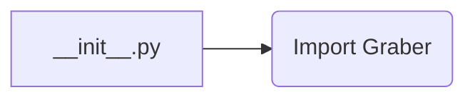
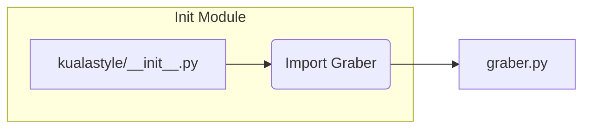

```MD
1. **<input code>**:

```python
## \file hypotez/src/suppliers/kualastyle/__init__.py
# -*- coding: utf-8 -*-
#! venv/Scripts/python.exe
#! venv/bin/python/python3.12

"""
.. module:: src.suppliers.kualastyle 
	:platform: Windows, Unix
	:synopsis:

"""
MODE = 'dev'

from .graber import Graber
```

2. **<algorithm>**:

Этот код представляет собой модуль инициализации для пакета `kualastyle` в проекте `hypotez`.  Он не содержит алгоритма в том смысле, что он не выполняет последовательность вычислений.  Вместо этого он импортирует класс `Graber` из подпапки `graber`.  Логика работы `Graber` описана в файле `graber.py`.  Блок-схема в данном случае тривиальна:



Пример:  Если в другом месте проекта требуется использовать класс `Graber`, импортируется он именно из этого файла.

3. **<mermaid>**:


В этой диаграмме `kualastyle/__init__.py` (A) импортирует `Graber` (B) из модуля `graber.py` (C).  Это показывает простую зависимость.


4. **<explanation>**:

* **Импорты**:
    `from .graber import Graber`: Импортирует класс `Graber` из подпапки `graber` текущего модуля (`kualastyle`).  Символ `.` указывает на поиск файла в текущей подпапке. Это стандартная импортная операция в Python для работы с модулями.  Связь с другими пакетами через импорт `graber` происходит в файле `graber.py` в подпапке `src/suppliers/kualastyle`.  Этот импорт позволяет использовать `Graber` внутри этого модуля.


* **Классы**:
    Класс `Graber` (определён в `graber.py`) -  не указан в этом файле, и его описание необходимо искать в `graber.py`.  Его роль должна быть связана с получением/обработкой данных, возможно, из определённого источника.


* **Функции**:
    Нет функций в этом файле.


* **Переменные**:
    `MODE = 'dev'`:  Переменная, вероятно, определяет режим работы (например, 'dev', 'prod').  Это часто используется для настройки поведения кода в разных средах.  Этот параметр может использоваться другими частями кода для определения того, как вести себя.

* **Возможные ошибки/улучшения**:
    - Отсутствует документация для переменной `MODE`.  Желательно добавить пояснение, например, комментарий, что она определяет режим работы.
    -  `graber.py` не показан, что мешает полному пониманию функциональности этого модуля.  Необходимо проанализировать `graber.py` для более полной картины.
    - Нет информации о том, какие данные или объекты получает `Graber` или что он возвращает.  Это критично для понимания взаимодействия с другими частями системы.


**Цепочка взаимосвязей**:
Этот модуль инициализирует доступ к классу `Graber`, который, вероятно, выполняет какие-то действия с данными.  Взаимодействия с другими частями проекта зависят от того, как `Graber` взаимодействует с другими модулями.  Чтобы полностью проанализировать эти взаимодействия, необходим код из `graber.py` и контекст использования этого модуля в других частях проекта.