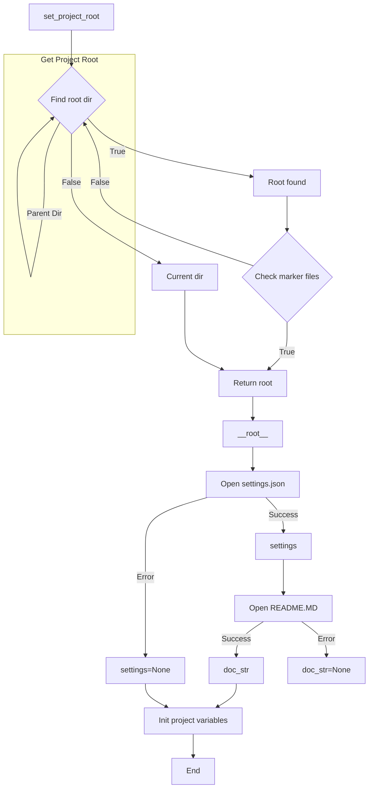

```MD
# <input code>

```python
## \file hypotez/src/suppliers/kualastyle/header.py
# -*- coding: utf-8 -*-\

#! venv/bin/python/python3.12

"""
.. module:: src.suppliers.kualastyle 
	:platform: Windows, Unix
	:synopsis:

"""


import sys
import json
from packaging.version import Version

from pathlib import Path
def set_project_root(marker_files=('__root__','.git')) -> Path:
    """
    Finds the root directory of the project starting from the current file's directory,
    searching upwards and stopping at the first directory containing any of the marker files.

    Args:
        marker_files (tuple): Filenames or directory names to identify the project root.
    
    Returns:
        Path: Path to the root directory if found, otherwise the directory where the script is located.
    """
    __root__:Path
    current_path:Path = Path(__file__).resolve().parent
    __root__ = current_path
    for parent in [current_path] + list(current_path.parents):
        if any((parent / marker).exists() for marker in marker_files):
            __root__ = parent
            break
    if __root__ not in sys.path:
        sys.path.insert(0, str(__root__))
    return __root__


# Get the root directory of the project
__root__ = set_project_root()
"""__root__ (Path): Path to the root directory of the project"""

from src import gs

settings:dict = None
try:
    with open(gs.path.root / 'src' / 'settings.json', 'r') as settings_file:
        settings = json.load(settings_file)
except (FileNotFoundError, json.JSONDecodeError):
    ...

doc_str:str = None
try:
    with open(gs.path.root / 'src' / 'README.MD', 'r') as settings_file:
        doc_str = settings_file.read()
except (FileNotFoundError, json.JSONDecodeError):
    ...


__project_name__ = settings.get("project_name", 'hypotez') if settings  else 'hypotez'
__version__: str = settings.get("version", '')  if settings  else ''
__doc__: str = doc_str if doc_str else ''
__details__: str = ''
__author__: str = settings.get("author", '')  if settings else ''
__copyright__: str = settings.get("copyrihgnt", '')  if settings else ''
__cofee__: str = settings.get("cofee", "Treat the developer to a cup of coffee for boosting enthusiasm in development: https://boosty.to/hypo69")  if settings else "Treat the developer to a cup of coffee for boosting enthusiasm in development: https://boosty.to/hypo69"
```

# <algorithm>

**Шаг 1:** Функция `set_project_root` ищет корневую директорию проекта.

* **Вход:** Кортеж `marker_files` с именами файлов/папок, которые указывают на корневую директорию.
* **Логика:** Функция начинает поиск с текущей директории, и поднимается по дереву директорий к родительским директориям, проверяя существование указанных файлов/папок.
* **Выход:** Объект `Path` к корневой директории проекта или текущей директории, если не найдено.
* **Пример:** Если `marker_files = ('pyproject.toml', '.git')`, то функция найдет директорию, содержащую эти файлы. Если нет, то возвращает директорию, в которой находится скрипт.


**Шаг 2:** Получение корневой директории проекта.

* **Вход:** Вызов функции `set_project_root()`.
* **Выход:** Объект `Path` `__root__` к корневой директории проекта.
* **Пример:** `__root__` будет содержать путь к директории проекта.


**Шаг 3:**  Чтение настроек из `settings.json`.

* **Вход:** Путь к файлу `settings.json` в корне проекта.
* **Логика:** Функция пытается открыть файл, загрузить данные в формате JSON и сохраняет их в переменную `settings`.
* **Выход:** Словарь `settings` с данными из файла или `None`, если файл не найден или некорректно отформатирован.
* **Пример:** Если файл `settings.json` содержит `{"project_name": "MyProject"}`, то `settings` будет содержать этот словарь.


**Шаг 4:** Чтение документации из `README.MD`.

* **Вход:** Путь к файлу `README.MD` в корне проекта.
* **Логика:**  Функция пытается открыть файл и прочитать содержимое в переменную `doc_str`.
* **Выход:** Строка `doc_str` с содержимым файла или `None`, если файл не найден или возникла ошибка.
* **Пример:** Если `README.MD` содержит "Моя документация", то `doc_str` будет содержать эту строку.


**Шаг 5:**  Инициализация переменных, связанных с проектом.

* **Вход:**  Значения из переменной `settings` и `doc_str`.
* **Логика:** Переменные, такие как `__project_name__`, `__version__`, `__doc__`, инициализируются с использованием полученных данных из настроек или с использованием значений по умолчанию, если соответствующие поля отсутствуют или файл не найден.
* **Выход:**  Инициализированные переменные.


# <mermaid>



**Объяснение диаграммы:**

* `set_project_root`: Функция ищет корневой каталог проекта.
* `Open settings.json`, `Open README.MD`: Функции, которые открывают файлы для чтения.
* `Init project variables`: Функция инициализирует переменные проекта на основе полученных данных.
* `settings`, `doc_str`: Переменные, хранящие данные из файлов настроек и README.


# <explanation>

**Импорты:**

* `sys`:  Предоставляет доступ к системным переменным, включая `sys.path`, что позволяет импортировать модули из различных каталогов.
* `json`: Для работы с JSON-файлами.
* `packaging.version`: Для работы с версиями пакетов.
* `pathlib`: Для работы с путями к файлам.
* `src.gs`:  Модуль, предположительно, предоставляющий функции для работы с основными директориями проекта (`gs.path.root`).

**Классы:**

В этом коде нет классов.

**Функции:**

* `set_project_root(marker_files)`:  Ищет корневой каталог проекта, поднимаясь по дереву каталогов от текущего файла, пока не найдет один из указанных `marker_files` (например, `pyproject.toml`, `requirements.txt`, `.git`).  Если корневой каталог найден, он добавляется в `sys.path`, чтобы сделать его доступным для импорта.  Это важная функция, потому что она находит корень проекта, даже если текущий файл находится в подпапке.

**Переменные:**

* `MODE`: Строковая константа, вероятно, для обозначения режима работы.
* `__root__`: Переменная типа `Path`, содержащая путь к корневому каталогу проекта.
* `settings`: Словарь, содержащий настройки проекта из `settings.json`.
* `doc_str`: Строка, содержащая содержимое файла `README.MD`.
* `__project_name__`, `__version__`, `__doc__`, `__details__`, `__author__`, `__copyright__`, `__cofee__`: Переменные, содержащие информацию о проекте, полученные из файла `settings.json`.

**Возможные ошибки и улучшения:**

* **Обработка ошибок:** Использование `try...except` для обработки `FileNotFoundError` и `json.JSONDecodeError` — хороший подход. Но можно добавить более подробные сообщения об ошибках для лучшей диагностики.
* **Обработка пустого файла `settings.json`:** Если `settings.json` пуст, то `settings` будет `None`.  В этом случае `settings.get(...)` вызовет ошибку. Надо добавить проверку на `settings is not None`
* **Ошибки в пути:** Может возникнуть ошибка, если путь к `settings.json` или `README.MD` некорректен (например, неправильно указан или не существует).  В коде нет проверки, что полученный путь является валидным.
* **Зависимости:**  Код сильно зависит от `src.gs`.  В коде должно быть четкое указание, что этот модуль используется и какую функциональность он предоставляет.


**Взаимосвязи с другими частями проекта:**

Код тесно связан с модулем `src.gs`, который предоставляет функции для работы с путями к файлам проекта. `src.gs` играет важную роль, позволяя коду независимо от положения файла в структуре проекта находить и обрабатывать необходимые данные. Код из этой папки также, вероятно, будет импортироваться другими модулями приложения.