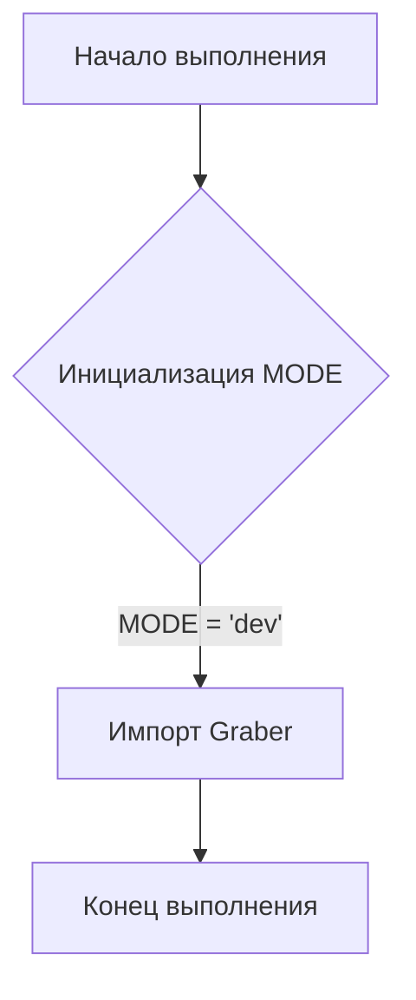
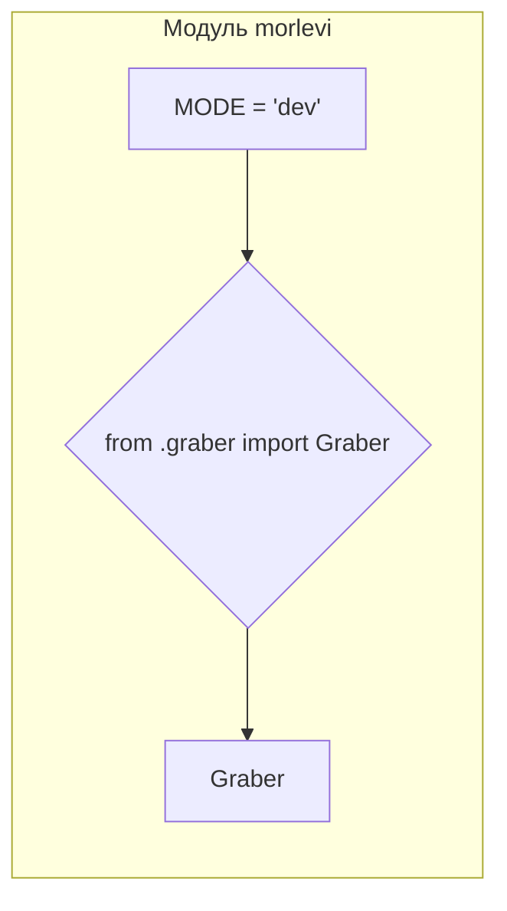

```MD
# <input code>

```python
## \file hypotez/src/suppliers/morlevi/__init__.py
# -*- coding: utf-8 -*-
#! venv/Scripts/python.exe
#! venv/bin/python/python3.12

"""
.. module:: src.suppliers.morlevi 
	:platform: Windows, Unix
	:synopsis:

"""
MODE = 'dev'

from .graber import Graber
```

# <algorithm>

Этот код представляет собой инициализационный модуль для пакета `morlevi` в проекте `hypotez`.  Он содержит всего две строки кода, которые не описывают сложный алгоритм.  

1. **`MODE = 'dev'`:** Устанавливает переменную `MODE` со значением `'dev'`.  Это, скорее всего, конфигурационная переменная, определяющая режим работы (например, разработка, продакшен).

2. **`from .graber import Graber`:** Импортирует класс `Graber` из файла `graber.py` в том же каталоге (`./graber.py`).  Этот импорт делает класс `Graber` доступным для использования в текущем модуле.

**Пример:**

В другом файле этого пакета, можно использовать класс `Graber` так:

```python
from hypotez.src.suppliers.morlevi import Graber
graber_instance = Graber()
# дальнейшее использование graber_instance
```

**Пошаговая блок-схема:**




# <mermaid>



**Объяснение к диаграмме:**

Диаграмма отображает единственный модуль `morlevi`. Внутри него выделены две ключевые операции: установка переменной `MODE` и импорт класса `Graber` из подмодуля `graber`.  Зависимость между модулями явно показана импортом.


# <explanation>

* **Импорты:**
    * `from .graber import Graber`: Этот импорт подключает класс `Graber` из файла `graber.py`, который, предположительно, находится в той же директории (`./graber.py`). Символ `.` указывает на поиск модуля в текущем каталоге. Это типичная практика для организации кода по модулям и пакетам.

* **Классы:**
    * `Graber`: Класс, который не определен в данном файле, но импортируется из `graber.py` .  Этот класс, скорее всего, отвечает за взаимодействие с каким-то источником данных (например, API или базой данных), и  его детали описаны в `graber.py`.

* **Функции:**
    * Нет функций, только импорт и переменная.

* **Переменные:**
    * `MODE`:  Строковая переменная, вероятно, служащая для определения режима работы модуля. Значение `'dev'` указывает на режим разработки.

* **Возможные ошибки и улучшения:**

    * Отсутствие документации для переменной `MODE`. Необходима документация (например, docstring) для явного объяснения назначения переменной `MODE` и возможных значений.
    * Необходимо объяснить функциональность `Graber` в `graber.py`. Необходимо подробно прокомментировать код `graber.py`.

* **Взаимосвязи с другими частями проекта:**

    * Данный `__init__.py` модуль определяет точку входа для взаимодействия с классом `Graber`.  `Graber`, вероятно, взаимодействует с другими частями приложения для получения или обработки данных.  Это взаимодействие будет детально описано в `graber.py`.


**Вывод:**

Данный файл `__init__.py` является частью структуры пакета `morlevi`, импортирующего функциональность класса `Graber` из файла `graber.py`.  Это важный файл, который обеспечивает доступ к функциональности `Graber` в других частях проекта `hypotez`.  Для полного понимания необходимо изучить `graber.py`.