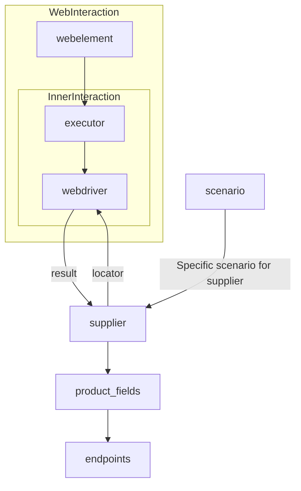

# <codeblock>

```python
# **Класс** `Supplier`
### **Базовый класс для всех поставщиков**
*В контексте кода `Supplier` - поставщик информации.
Поставщиком может быть производитель какого-либо тавара, данных или информации
Источники потавщика - целевая страница сайта, документ, база данных, таблица.
Класс сводит разных поставщиков к одинаковому алгоритму действий внутри класса.
У каждого поставщика есть свой уникальный префикс. ([подробно о префиксах](prefixes.md))
*


Класс `Supplier` служит основой для управления взаимодействиями с поставщиками. 
Он выполняет инициализацию, настройку, аутентификацию и запуск сценариев для различных источников данных, таких как `amazon.com`, `walmart.com`, `mouser.com` и `digikey.com`. Клиент может определить дополнительные поставщики.


---
## Список реализованныx поставщиков:

[aliexpress](aliexpress/README.RU.MD)  - Реализован в двух варианах сценариев: `webriver` и `api` 

[amazon](amazon/README.RU.MD) - `webdriver` 

[bangood](bangood/README.RU.MD)  - `webdriver` 

[cdata](cdata/README.RU.MD)  - `webdriver` 

[chat_gpt](chat_gpt/README.RU.MD)  - Работа с чатом chatgpt (НЕ С МОДЕЛЬЮ!) 

[ebay](ebay/README.RU.MD)  - `webdriver` 

[etzmaleh](etzmaleh/README.RU.MD)  - `webdriver` 

[gearbest](gearbest/README.RU.MD)  - `webdriver` 

[grandadvance](grandadvance/README.RU.MD)  - `webdriver` 

[hb](hb/README.RU.MD)  - `webdriver` 

[ivory](ivory/README.RU.MD) - `webdriver` 

[ksp](ksp/README.RU.MD) - `webdriver`
[kualastyle](kualastyle/README.RU.MD) `webdriver` 

[morlevi](morlevi/README.RU.MD) `webdriver` 

[visualdg](visualdg/README.RU.MD) `webdriver` 

[wallashop](wallashop/README.RU.MD) `webdriver`  
[wallmart](wallmart/README.RU.MD) `webdriver` 

[подробно о вебдрайвере :class: `Driver`](../webdriver/README.RU.MD)    
[подробно о сценариях :class: `Scenario`](../scenarios/README.RU.MD)
---

## **Атрибуты**
- **`supplier_id`** *(int)*: Уникальный идентификатор поставщика.
- **`supplier_prefix`** *(str)*: Префикс поставщика, например, `'amazon'`, `'aliexpress'`.
- **`supplier_settings`** *(dict)*: Настройки поставщика, загружаемые из JSON-файла.
- **`locale`** *(str)*: Код локализации (по умолчанию: `'en'`).
- **`price_rule`** *(str)*: Правила расчета цен (например, правила НДС).
- **`related_modules`** *(module)*: Модули-помощники для работы с конкретным поставщиком.
- **`scenario_files`** *(list)*: Список файлов сценариев для выполнения.
- **`current_scenario`** *(dict)*: Выполняемый в текущий момент сценарий.
- **`login_data`** *(dict)*: Данные для аутентификации.
- **`locators`** *(dict)*: Словарь локаторов веб-элементов.
- **`driver`** *(Driver)*: Экземпляр WebDriver для взаимодействия с сайтом поставщика.
- **`parsing_method`** *(str)*: Метод парсинга данных (например, `'webdriver'`, `'api'`, `'xls'`, `'csv'`).


## **Методы**


### **`__init__`**
**Конструктор класса `Supplier`.**


```python
def __init__(self, supplier_prefix: str, locale: str = 'en', webdriver: str | Driver | bool = 'default', *attrs, **kwargs):
    """Инициализация экземпляра Supplier.

    Args:
        supplier_prefix (str): Префикс поставщика.
        locale (str, optional): Код локализации. По умолчанию 'en'.
        webdriver (str | Driver | bool, optional): Тип WebDriver. По умолчанию 'default'.

    Raises:
        DefaultSettingsException: Если настройки по умолчанию не настроены корректно.
    """
```


### **`_payload`**
**Загружает настройки поставщика и инициализирует WebDriver.**


```python
def _payload(self, webdriver: str | Driver | bool, *attrs, **kwargs) -> bool:
    """Загружает настройки, локаторы и инициализирует WebDriver.

    Args:
        webdriver (str | Driver | bool): Тип WebDriver.

    Returns:
        bool: Возвращает `True`, если загрузка выполнена успешно.
    """
```


### **`login`**
**Обрабатывает аутентификацию на сайте поставщика.**


```python
def login(self) -> bool:
    """Производит аутентификацию пользователя на сайте поставщика.

    Returns:
        bool: Возвращает `True`, если вход выполнен успешно.
    """
```


### **`run_scenario_files`**
**Выполняет один или несколько файлов сценариев.**


```python
def run_scenario_files(self, scenario_files: str | List[str] = None) -> bool:
    """Запускает предоставленные файлы сценариев.

    Args:
        scenario_files (str | List[str], optional): Список или путь к файлам сценариев.

    Returns:
        bool: Возвращает `True`, если сценарии выполнены успешно.
    """
```


### **`run_scenarios`**
**Выполняет указанные сценарии.**


```python
def run_scenarios(self, scenarios: dict | list[dict]) -> bool:
    """Запускает указанные сценарии.

    Args:
        scenarios (dict | list[dict]): Сценарии для выполнения.

    Returns:
        bool: Возвращает `True`, если все сценарии выполнены успешно.
    """
```

## <explanation>

**Импорты:**  
Код не содержит импортов, но предполагается, что он использует классы и модули из других файлов (например, `Driver`, `Scenario`).  Эти импорты находятся в других файлах, указанных в списках.  Для корректной работы необходимы импорты из файлов `prefixes.md`, `amazon/README.RU.MD`, `aliexpress/README.RU.MD`, etc., которые должны содержать определения соответствующих классов и функций.


**Классы:**
Класс `Supplier` является абстрактным классом, определяющим общий интерфейс для работы с различными поставщиками данных.  Он  предоставляет методы для инициализации, аутентификации, и запуска сценариев.  Подклассы `Supplier` (например, `AliExpressSupplier`, `AmazonSupplier`) будут реализовывать специфические действия для каждого поставщика.

**Функции:**
- `__init__`: Инициализирует объект `Supplier`, принимая префикс поставщика, локаль и (опционально) WebDriver.
- `_payload`: Загружает настройки для конкретного поставщика и инициализирует драйвер.
- `login`: Производит аутентификацию на сайте поставщика.
- `run_scenario_files`: Выполняет сценарии, заданные в файлах.
- `run_scenarios`: Выполняет сценарии, заданные в списке словарей.  

**Переменные:**
Переменные, такие как `supplier_prefix`, `locale`, `webdriver`, `scenario_files`, хранят информацию о поставщике, локали, драйвере, и сценариях.

**Возможные ошибки и улучшения:**
- Не указаны конкретные типы исключений, которые могут быть выброшены методами.  Добавление обработки исключений (`try...except`) улучшит надежность кода.
- Отсутствуют проверки корректности входных данных.
- Не указано, как происходит загрузка настроек (`supplier_settings`) из файла.  Необходимо добавить код для загрузки настроек.
- Отсутствуют  описания того, что представляют собой `scenario_files`.
- Диаграмма  mermaid не отображает зависимость от файлов сценариев, их формата и структуры.   


**Взаимосвязи с другими частями проекта:**
Класс `Supplier` взаимодействует с `Driver` для управления веб-драйвером, а также с модулями, которые содержат реализацию конкретных сценариев.  Структура проекта предполагает существование файлов сценариев, определяющих действия, которые нужно выполнить на сайте поставщика.