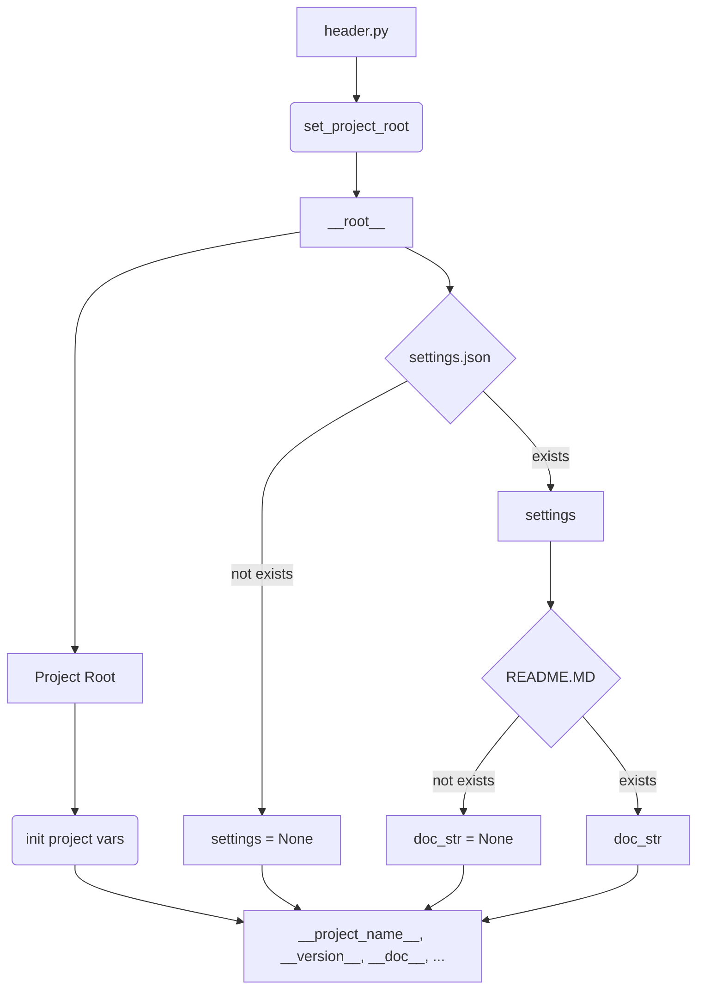

# <input code>

```python
## \file hypotez/src/suppliers/visualdg/header.py
# -*- coding: utf-8 -*-\n#! venv/Scripts/python.exe
#! venv/bin/python/python3.12

"""
.. module:: src.suppliers.visualdg 
	:platform: Windows, Unix
	:synopsis:

"""


import sys
import json
from packaging.version import Version

from pathlib import Path
def set_project_root(marker_files=('__root__')) -> Path:
    """
    Finds the root directory of the project starting from the current file's directory,
    searching upwards and stopping at the first directory containing any of the marker files.

    Args:
        marker_files (tuple): Filenames or directory names to identify the project root.
    
    Returns:
        Path: Path to the root directory if found, otherwise the directory where the script is located.
    """
    __root__:Path
    current_path:Path = Path(__file__).resolve().parent
    __root__ = current_path
    for parent in [current_path] + list(current_path.parents):
        if any((parent / marker).exists() for marker in marker_files):
            __root__ = parent
            break
    if __root__ not in sys.path:
        sys.path.insert(0, str(__root__))
    return __root__


# Get the root directory of the project
__root__ = set_project_root()
"""__root__ (Path): Path to the root directory of the project"""

from src import gs

settings:dict = None
try:
    with open(gs.path.root / 'src' /  'settings.json', 'r') as settings_file:
        settings = json.load(settings_file)
except (FileNotFoundError, json.JSONDecodeError):
    ...

doc_str:str = None
try:
    with open(gs.path.root / 'src' /  'README.MD', 'r') as settings_file:
        doc_str = settings_file.read()
except (FileNotFoundError, json.JSONDecodeError):
    ...


__project_name__ = settings.get("project_name", 'hypotez') if settings  else 'hypotez'
__version__: str = settings.get("version", '')  if settings  else ''
__doc__: str = doc_str if doc_str else ''
__details__: str = ''
__author__: str = settings.get("author", '')  if settings  else ''
__copyright__: str = settings.get("copyrihgnt", '')  if settings  else ''
__cofee__: str = settings.get("cofee", "Treat the developer to a cup of coffee for boosting enthusiasm in development: https://boosty.to/hypo69")  if settings else "Treat the developer to a cup of coffee for boosting enthusiasm in development: https://boosty.to/hypo69"
```

# <algorithm>

1. **`set_project_root`:**
    - Принимает кортеж `marker_files` с именами файлов/папок, которые должны присутствовать в проекте.
    - Начинает поиск с текущей директории файла `header.py`.
    - Проверяет каждый родительский каталог, начиная с текущего и вверх по иерархии.
    - Если в родительском каталоге обнаружен любой из файлов/папок из `marker_files`, то возвращает эту директорию.
    - Если корень проекта не найден, возвращает директорию текущего файла.
    - Добавляет путь к корню проекта в `sys.path`.
    - **Пример:** Если `marker_files` = `('pyproject.toml', 'requirements.txt')` и в папке `parent_folder` есть `pyproject.toml`, то `__root__` будет равен `parent_folder`.


2. **Получение данных проекта:**
    - Вызывается функция `set_project_root()`, возвращающая путь к корню проекта (`__root__`).
    - Попытка открыть `settings.json` в корне проекта и загрузить данные в `settings`. Если файл не найден или невалиден, то `settings` остается `None`.
    - Попытка открыть `README.MD` и получить строку документации в `doc_str`.  Если файл не найден или невалиден, то `doc_str` остается `None`.
    - Инициализация переменных `__project_name__`, `__version__`, `__doc__`, `__details__`, `__author__`, `__copyright__`, `__cofee__` на основе данных из `settings` или на значение по умолчанию, если `settings` отсутствует или не содержит нужные поля.
    - **Пример:** Если в `settings.json` есть поле `project_name` со значением `"MyProject"`, то `__project_name__` будет равно `"MyProject"`.

# <mermaid>



# <explanation>

**Импорты:**

- `sys`: предоставляет доступ к системным параметрам, включая `sys.path`.
- `json`: используется для работы с JSON-файлами, в частности для загрузки `settings.json`.
- `packaging.version`: необходим для работы с версиями пакетов (хотя в данном примере, он не используется).
- `pathlib`: используется для работы с путями к файлам в системе, предоставляя удобный способ работы с файловой системой.
- `gs`: предположительно, это модуль из собственного проекта, содержащий информацию о путях к файлам.


**Классы:**

- Нет определенных классов.


**Функции:**

- `set_project_root(marker_files)`:  Находит корневую директорию проекта, начиная с текущего файла. Аргумент `marker_files` позволяет указывать специфические файлы (или папки), которые должны находиться в корне, чтобы гарантировать корректный поиск. Возвращает `Path` к найденной директории. 


**Переменные:**

- `MODE`: Строковая константа, вероятно, для обозначения режима работы (например, "dev", "prod").
- `__root__`: `Path` объект, содержащий путь к корневой директории проекта.
- `settings`: `dict`, содержащий данные из файла `settings.json`.  Инициализируется `None`, если файл не найден или имеет неверный формат.
- `doc_str`: `str`, содержащий текст документации из файла `README.MD`.  Инициализируется `None`, если файл не найден или невалиден.
- `__project_name__`, `__version__`, `__doc__`, `__details__`, `__author__`, `__copyright__`, `__cofee__`:  Переменные, содержащие информацию о проекте, полученную из файла `settings.json` или значение по умолчанию.
- `gs.path.root`:  Предполагаемый атрибут из `gs` модуля, вероятно, представляющий путь к корневой директории проекта.

**Возможные ошибки и улучшения:**

- Обработка исключений `FileNotFoundError` и `json.JSONDecodeError`  достаточно надежно.
- Переменная `__cofee__` имеет слишком длинное имя, можно сократить.
- При работе с файлами рекомендуется использовать `with open(...)` для гарантированного закрытия файлов.
- В коде отсутствуют комментарии, объясняющие, для чего используется `MODE`.


**Взаимосвязь с другими частями проекта:**

Модуль `gs` играет критическую роль, предоставляя доступ к системным ресурсам.  Функционал `set_project_root` и работа с `settings.json` и `README.MD` напрямую зависит от того, как именно определена структура проекта и как организована работа с файлами в данном проекте.  Без понимания `gs` невозможно точно сказать, как этот код взаимодействует с остальной частью проекта.