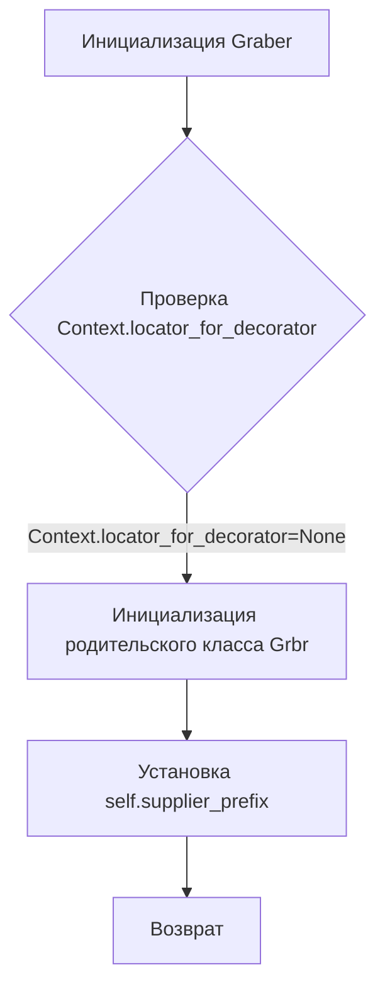
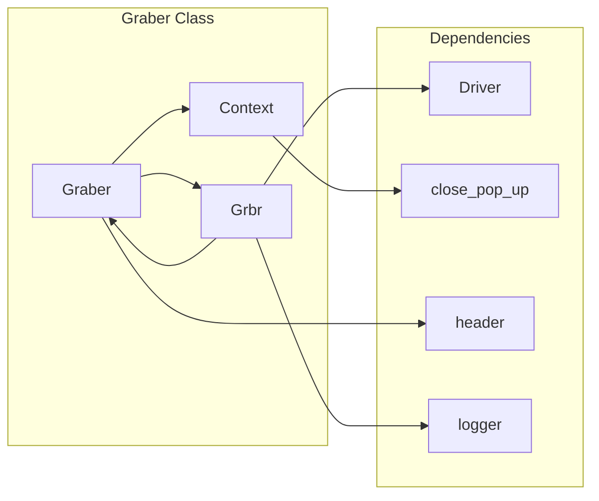

# <input code>

```python
## \file hypotez/src/suppliers/wallashop/graber.py
# -*- coding: utf-8 -*-\
#! venv/Scripts/python.exe
#! venv/bin/python/python3.12

"""
.. module:: src.suppliers.wallashop 
	:platform: Windows, Unix
	:synopsis: Класс собирает значение полей на странице  товара `wallashop.co.il`. 
    Для каждого поля страницы товара сделана функция обработки поля в родительском классе.
    Если нужна нестандертная обработка, функция перегружается в этом классе.
    ------------------
    Перед отправкой запроса к вебдрайверу можно совершить предварительные действия через декоратор. 
    Декоратор по умолчанию находится в родительском классе. Для того, чтобы декоратор сработал надо передать значение 
    в `Context.locator`, Если надо реализовать свой декоратор - раскоментируйте строки с декоратором и переопределите его поведение

"""
MODE = 'dev'

from typing import Any
import header
from src.suppliers.graber import Graber as Grbr, Context, close_pop_up
from src.webdriver.driver import Driver
from src.logger import logger


# # Определение декоратора для закрытия всплывающих окон
# # В каждом отдельном поставщике (`Supplier`) декоратор может использоваться в индивидуальных целях
# # Общее название декоратора `@close_pop_up` можно изменить 


# def close_pop_up(value: Any = None) -> Callable:
#     """Создает декоратор для закрытия всплывающих окон перед выполнением основной логики функции.

#     Args:
#         value (Any): Дополнительное значение для декоратора.

#     Returns:
#         Callable: Декоратор, оборачивающий функцию.
#     """
#     def decorator(func: Callable) -> Callable:
#         @wraps(func)
#         async def wrapper(*args, **kwargs):
#             try:
#                 # await Context.driver.execute_locator(Context.locator.close_pop_up)  # Await async pop-up close  
#                 ... 
#             except ExecuteLocatorException as e:
#                 logger.debug(f'Ошибка выполнения локатора: {e}')
#             return await func(*args, **kwargs)  # Await the main function
#         return wrapper
#     return decorator


class Graber(Grbr):
    """Класс для операций захвата Morlevi."""
    supplier_prefix: str

    def __init__(self, driver: Driver):
        """Инициализация класса сбора полей товара."""
        self.supplier_prefix = 'wallashop'
        super().__init__(supplier_prefix=self.supplier_prefix, driver=driver)
        # Устанавливаем глобальные настройки через Context
        
        Context.locator_for_decorator = None # <- если будет уастановлено значение - то оно выполнится в декораторе `@close_pop_up`

```

# <algorithm>



**Описание алгоритма:**

Класс `Graber` отвечает за сбор данных с сайта wallashop.  Алгоритм инициализации состоит из:

1. **Инициализация `Graber`:** Принимает `driver` (объект управления браузером) и устанавливает `self.supplier_prefix`.
2. **Проверка декоратора:** Проверяет, задан ли `Context.locator_for_decorator`. Если не задан, то переходит к инициализации родительского класса.
3. **Инициализация родительского класса:** Вызывается конструктор родительского класса `Grbr`, которому передается `self.supplier_prefix` и `driver`.
4. **Установка `supplier_prefix`:** Устанавливает значение для `self.supplier_prefix`
5. **Установка глобальных настроек:** Устанавливает значение `Context.locator_for_decorator` в `None`.
6. **Возврат:** Возвращает объект `Graber`.


# <mermaid>



# <explanation>

**Импорты:**

- `header`: Вероятно, содержит вспомогательные функции или константы, специфичные для проекта.  Необходимые для работы компоненты, не описаны в файле.
- `src.suppliers.graber`:  Содержит базовый класс `Graber` для сбора данных с разных поставщиков. `Context`, `close_pop_up` - это сущности из этого же модуля, вероятно, обеспечивающие контекст и инструменты для обработки веб-драйвера и управления всплывающими окнами.
- `src.webdriver.driver`:  Включает класс `Driver`, предназначенный для взаимодействия с веб-драйвером (Selenium, Playwright или др.).
- `src.logger`:  Модуль для ведения логов проекта.  Он используется для вывода сообщений об ошибках или других событий.

**Классы:**

- `Graber`:  Наследуется от `Grbr` (из `src.suppliers.graber`) и отвечает за сбор данных с сайта wallashop.  Атрибут `supplier_prefix` указывает на конкретного поставщика.  Метод `__init__` инициализирует объект, устанавливая `supplier_prefix` и вызывая конструктор родительского класса.

- `Grbr`: Родительский класс, вероятно, содержит общие методы для работы с веб-драйвером, обработки данных и т.д.  В данном файле не представлено его реализация.

- `Context`: Представляет собой, скорее всего, глобальный контекст или хранилище данных, доступное разным частям приложения. `Context.locator_for_decorator` хранит настройки для декоратора.


**Функции:**

- `__init__`: Инициализирует класс `Graber`, устанавливает `supplier_prefix` и вызывает конструктор родительского класса.

**Переменные:**

- `supplier_prefix`: Строковая переменная, определяющая название поставщика данных ('wallashop' в данном случае).
- `Context.locator_for_decorator`:  Переменная, используемая для настройки работы декоратора `close_pop_up`.


**Возможные ошибки и улучшения:**

- Комментарии в коде могут быть более подробными и информативными, особенно в отношении декоратора `close_pop_up`.
- Нет информации о том, как работают методы `Grbr` или о каких-либо атрибутах родительского класса, что усложняет понимание кода.
- Отсутствует реализация декоратора `close_pop_up`, что не позволяет оценить его функциональность в текущем виде.  Желательно его реализовать или объяснить, зачем он нужен и как он будет использоваться.
- Необходимо указать, какой класс `Driver` используется.
- Отсутствует информация об используемых фреймворках (например, фреймворк асинхронного программирования).

**Цепочка взаимосвязей:**

Класс `Graber` использует класс `Grbr` для общих функциональностей, `Driver` для взаимодействия с веб-драйвером, а также `Context` для управления некоторыми настройками. Модуль `logger` используется для вывода сообщений об ошибках или других событиях. `header` содержит дополнительные функции или константы. Взаимосвязь между компонентами `Graber` и `Grbr` обеспечивают родительские классы.