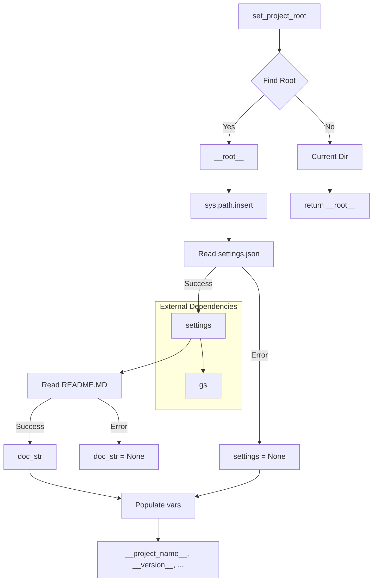

# <input code>

```python
## \file hypotez/src/suppliers/wallmart/header.py
# -*- coding: utf-8 -*-
#! venv/Scripts/python.exe
#! venv/bin/python/python3.12

"""
.. module:: src.suppliers.wallmart 
	:platform: Windows, Unix
	:synopsis:

"""


import sys
import json
from packaging.version import Version

from pathlib import Path
def set_project_root(marker_files=('__root__','.git')) -> Path:
    """
    Finds the root directory of the project starting from the current file's directory,
    searching upwards and stopping at the first directory containing any of the marker files.

    Args:
        marker_files (tuple): Filenames or directory names to identify the project root.
    
    Returns:
        Path: Path to the root directory if found, otherwise the directory where the script is located.
    """
    __root__:Path
    current_path:Path = Path(__file__).resolve().parent
    __root__ = current_path
    for parent in [current_path] + list(current_path.parents):
        if any((parent / marker).exists() for marker in marker_files):
            __root__ = parent
            break
    if __root__ not in sys.path:
        sys.path.insert(0, str(__root__))
    return __root__


# Get the root directory of the project
__root__ = set_project_root()
"""__root__ (Path): Path to the root directory of the project"""

from src import gs

settings:dict = None
try:
    with open(gs.path.root / 'src' /  'settings.json', 'r') as settings_file:
        settings = json.load(settings_file)
except (FileNotFoundError, json.JSONDecodeError):
    ...

doc_str:str = None
try:
    with open(gs.path.root / 'src' /  'README.MD', 'r') as settings_file:
        doc_str = settings_file.read()
except (FileNotFoundError, json.JSONDecodeError):
    ...


__project_name__ = settings.get("project_name", 'hypotez') if settings  else 'hypotez'
__version__: str = settings.get("version", '')  if settings  else ''
__doc__: str = doc_str if doc_str else ''
__details__: str = ''
__author__: str = settings.get("author", '')  if settings else ''
__copyright__: str = settings.get("copyrihgnt", '')  if settings else ''
__cofee__: str = settings.get("cofee", "Treat the developer to a cup of coffee for boosting enthusiasm in development: https://boosty.to/hypo69")  if settings else "Treat the developer to a cup of coffee for boosting enthusiasm in development: https://boosty.to/hypo69"
```

# <algorithm>

**Шаг 1:** Функция `set_project_root` ищет корневую директорию проекта.

* **Вход:** Кортеж `marker_files` с именами файлов, указывающих на корень проекта.
* **Выход:** Путь (`Path`) до корневой директории проекта.
* **Логика:**
    1. Начинает поиск с текущей директории файла.
    2. Переходит к родительским директориям.
    3. Останавливается на первой директории, содержащей любой из файлов или папок в `marker_files`.
    4. Если корень проекта найден, добавляет его в `sys.path`.

**Шаг 2:** Получение корневого пути проекта.
  * Вызывается функция `set_project_root()`.
  * Результат (путь до корня) записывается в переменную `__root__`.


**Шаг 3:** Чтение настроек из `settings.json`.

* **Вход:** Путь до `settings.json`.
* **Выход:** Словарь `settings` с настройками.
* **Логика:**
    1. Попытка открыть `settings.json`.
    2. Если файл существует и корректный JSON, загрузить данные в `settings`.
    3. Если файл не найден или некорректный JSON, пропустить ошибку.

**Шаг 4:** Чтение документации из `README.MD`.

* **Вход:** Путь до `README.MD`.
* **Выход:** Строка `doc_str` с содержимым файла.
* **Логика:**
    1. Попытка открыть `README.MD`.
    2. Если файл существует, прочитать данные в `doc_str`.
    3. Если файл не найден или возникла ошибка, пропустить ошибку.

**Шаг 5:** Обработка настроек (заполнение переменных).

* **Вход:** Словарь `settings` и строка `doc_str`.
* **Выход:** Различные переменные, содержащие значения из настроек.
* **Логика:**
    1. Заполняет переменные `__project_name__`, `__version__`, `__doc__`, `__author__`, `__copyright__`, `__cofee__` данными из словаря `settings` или использует значения по умолчанию.


**Пример:** Если `settings.json` содержит `{"project_name": "MyProject", "version": "1.0.0"}`, то переменные будут заполнены соответствующими значениями.


# <mermaid>


**Описание зависимостей:**
* **`sys`:** Стандартный модуль Python для доступа к переменным окружения.
* **`json`:** Библиотека для работы с JSON-данными.
* **`packaging.version`:**  Для работы с версиями пакетов.
* **`pathlib`:** Библиотека для работы с путями к файлам.
* **`src.gs`:**  Внутренний модуль проекта (вероятно, содержит функции работы с файловой системой или конфигурацией).  

# <explanation>

**Импорты:**

* `sys`:  Стандартный модуль Python для доступа к системным переменным, в данном случае используется для добавления пути к проекту в `sys.path`.
* `json`: Модуль для работы с JSON-данными, используется для чтения файла `settings.json`.
* `packaging.version`: Модуль для работы с версиями пакетов. Необходим, вероятно, для проверки версий.
* `pathlib`: Модуль для работы с путями к файлам, что делает код более переносимым и менее зависимым от операционной системы.
* `src.gs`:  Внутренний модуль проекта, скорее всего, содержит вспомогательные функции для работы с файлами и ресурсами, связанными с проектом.

**Классы:**

Нет явно определенных классов.

**Функции:**

* `set_project_root(marker_files)`: Находит корень проекта, начиная с текущего файла.
    * `marker_files`: Кортеж из файлов или папок, используемых для определения корня проекта.
    * `return`: Путь до корня проекта. Очень важная функция, гарантирующая корректную работу проекта, независимо от того, из какой подпапки он запускается.
**Переменные:**

* `__root__`: Путь до корня проекта.
* `settings`: Словарь с настройками проекта из `settings.json`.
* `doc_str`: Содержимое файла `README.MD`.
* `__project_name__`, `__version__`, `__doc__`, `__details__`, `__author__`, `__copyright__`, `__cofee__`:  Переменные, содержащие информацию о проекте, полученную из `settings.json` или установленные по умолчанию.


**Возможные ошибки и улучшения:**

* **Обработка ошибок:** Обработка `FileNotFoundError` и `json.JSONDecodeError` в блоках `try-except` очень важна для предотвращения аварийного завершения программы при отсутствии или некорректном формате файлов.
* **Документация:** Документация функций (`set_project_root`) написана хорошо. Можно добавить более подробное описание `gs.path.root` в комментариях.
* **Использование `__root__`**: Переменная `__root__` используется в коде как глобальная, что немного уменьшает читаемость.  Можно было бы сделать переменную `root_dir` локальной, не используя `__` префикс в имени.
* **Возможное дублирование кода:** Повторяющиеся блоки try-except для чтения настроек и README можно обернуть в общую функцию.


**Взаимосвязь с другими частями проекта:**

Код напрямую использует модуль `gs` из пакета `src`, который, вероятно, отвечает за работу с файлами проекта.  Зависимость от `gs` указывает на существование других модулей в `src`, которые используют эти файлы.