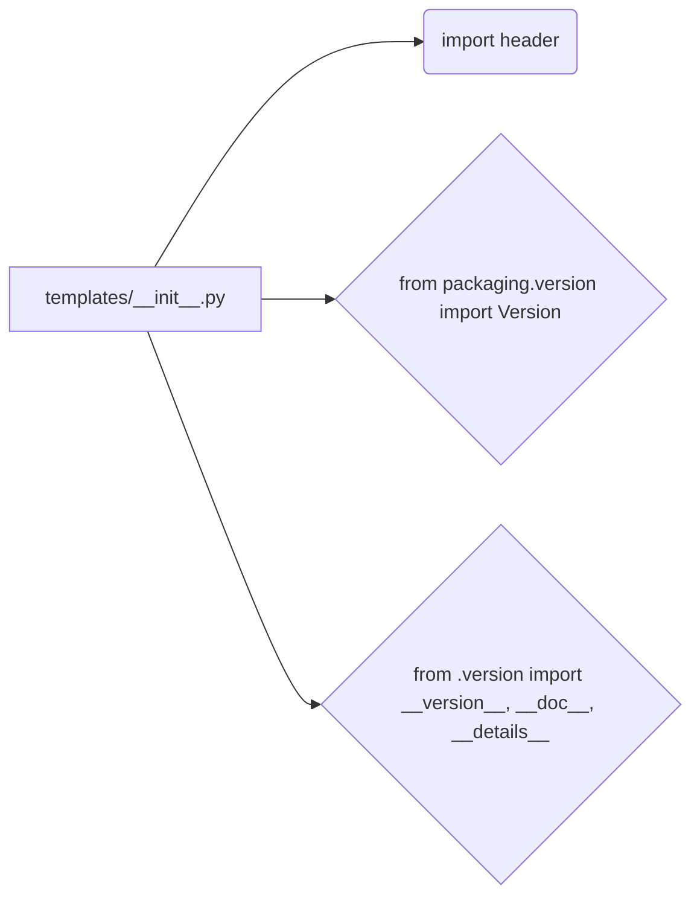

## <input code>

```python
## \file hypotez/src/templates/__init__.py
# -*- coding: utf-8 -*-

#! venv/bin/python/python3.12

"""
.. module: src.templates 
	:platform: Windows, Unix
	:synopsis:

"""


"""
	:platform: Windows, Unix
	:synopsis:

"""


"""
	:platform: Windows, Unix
	:synopsis:

"""


"""
  :platform: Windows, Unix

"""
"""
  :platform: Windows, Unix
  :platform: Windows, Unix
  :synopsis:
"""
  
""" module: src.templates """


""" HERE SHOULD BE A DESCRIPTION OF THE MODULE OPERATION ! """

import header 
...

from packaging.version import Version
from .version import __version__, __doc__, __details__ 
```

## <algorithm>

Этот код представляет собой инициализацию модуля `src.templates`.  Пошаговая блок-схема невозможна, так как код не содержит функций или классов, имеющих сложную логику.

## <mermaid>



## <explanation>

**Импорты:**

* `import header`:  Импортирует модуль `header`.  Важно понимать, что `header` - это *другой* модуль в этой же структуре пакета `hypotez/src`. Отсутствие детальной информации о `header` затрудняет понимание полной функциональности.
* `from packaging.version import Version`: Импортирует класс `Version` из пакета `packaging`.  Это полезно для работы с версиями пакетов. Это импорт из сторонней библиотеки `packaging`, которая, скорее всего, нужна для работы с версиями программного обеспечения.
* `from .version import __version__, __doc__, __details__`: Импортирует переменные `__version__`, `__doc__`, `__details__` из модуля `.version` (вероятно, из этого же каталога, `templates`).  Эти переменные, вероятно, содержат метаданные о версии, документацию и дополнительные детали о модуле.

**Классы:**

Код не определяет классы.

**Функции:**

Код не содержит функций.

**Переменные:**

* ``:  Глобальная переменная, которая, вероятно, определяет режим работы (например, `dev` для разработки, `prod` для производства). В данном случае имеет мало смысла без контекста.

**Возможные ошибки и улучшения:**

* **Отсутствие документации:**  Комментарии в стиле Sphinx (`"""Docstrings"""`) не содержат полезной информации о том, что делает данный модуль.  Необходимо добавить подробное описание функциональности, в том числе что делает `header` и как взаимодействуют импортированные компоненты.
* **Неполный импорт:**  Строка `...` в коде указывает на то, что есть невидимые части.  Это затрудняет анализ. Необходимо видеть весь исходный код, чтобы понять как импортированные компоненты взаимодействуют.
* **Неясное назначение `MODE`:** Без контекста, значение `MODE='dev'` сложно интерпретировать.  Необходимо добавить информацию о том, как эта переменная используется в других частях проекта, или что происходит при разных значениях.
* **Цепочка взаимосвязей:** Без кода других модулей ("header" и ".version") невозможно построить полную цепочку взаимосвязей.


**Цепочка взаимосвязей (частично):**

`hypotez/src/templates/__init__.py` импортирует `header` и `.version`. Это означает, что `header` и `.version` являются частью проекта `hypotez`.  Подробная схема взаимосвязей будет зависеть от того, как используются импортированные компоненты в различных частях проекта.