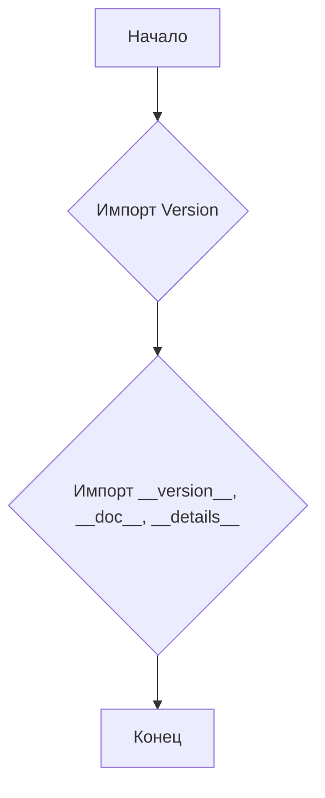

```MD
# Анализ кода hypotez/src/templates/_examples/__init__.py

1. **<input code>**

```python
## \file hypotez/src/templates/_examples/__init__.py
# -*- coding: utf-8 -*-
#! venv/Scripts/python.exe
#! venv/bin/python/python3.12

"""
.. module:: src.templates._examples 
	:platform: Windows, Unix
	:synopsis:

"""
MODE = 'dev'

"""
	:platform: Windows, Unix
	:synopsis:

"""


"""
	:platform: Windows, Unix
	:synopsis:

"""


"""
  :platform: Windows, Unix

"""
"""
  :platform: Windows, Unix
  :platform: Windows, Unix
  :synopsis:
"""MODE = 'dev'
  
""" module: src.templates._examples """


from packaging.version import Version
from .version import __version__, __doc__, __details__
```

2. **<algorithm>**

Код представляет собой модуль Python, содержащий импорты.  Алгоритм работы сводится к импорту необходимых библиотек и переменных.  Нет каких-либо циклов или сложных вычислений. Все действия сводятся к импорту.

**Пример:**
```
[Начало] -> [Импорт Version] -> [Импорт __version__, __doc__, __details__] -> [Конец]
```

3. **<mermaid>**



4. **<explanation>**

* **Импорты:**
    * `from packaging.version import Version`: Импортирует класс `Version` из пакета `packaging`. Этот пакет используется для работы с версиями программного обеспечения.  Он необходим для потенциальной проверки версий в `hypotez/src/templates/_examples`.  В данном случае он не используется непосредственно в этом файле.
    * `from .version import __version__, __doc__, __details__`: Импортирует переменные `__version__`, `__doc__`, `__details__` из модуля `version.py` в текущем каталоге (`.`) или подкаталоге (в данном случае, внутри `hypotez/src/templates/_examples`).  Скорее всего, этот модуль содержит метаданные (версия, описание, дополнительные детали) о модуле `_examples`.

* **Классы:**  Нет объявленных классов.

* **Функции:** Нет объявленных функций.

* **Переменные:**
    * `MODE = 'dev'`:  Переменная, вероятно, задаёт режим работы (например, 'dev' для разработки, 'prod' для производства). Она  используется для настройки поведения, связанного с тем, как используется этот модуль или в каких контекстах он используется в дальнейшем.   Повторение определения этой переменной в коде (дважды) может быть ошибкой.


* **Возможные ошибки или области для улучшений:**
    * **Повторение определения `MODE`**: Определять одну и ту же переменную несколько раз - не лучшая практика.  Рекомендуется оставить только одно определение `MODE = 'dev'`.
    * **Отсутствующая логика:** Файл `__init__.py` часто содержит логику инициализации модуля.  В данном случае, это лишь импорты, и  не выполняет какой-либо значимой обработки. Это может быть недостатком, если ожидается дальнейшее расширение функциональности.


* **Взаимосвязи с другими частями проекта:**  Файл импортирует метаданные из `hypotez/src/templates/_examples/version.py`.  Это указывает на то, что данный файл (`_examples/__init__.py`) является частью пакета/модуля, который содержит информацию о своей версии и описании.
```
hypotez/src/templates/_examples/version.py --> hypotez/src/templates/_examples/__init__.py
```

**Вывод:**  Данный файл `__init__.py` выполняет простую роль инициализации модуля `_examples`, импортируя необходимые переменные из другого файла (`version.py`), скорее всего, содержащего метаданные о версии.  Из-за повторяющегося определения переменной `MODE`, код можно улучшить.